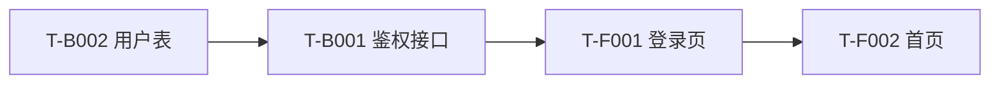

# {项目名称} 工作时长评估

> 规则来源：`.cursor/rules/06-工作时长评估.mdc`
> 用途：基于 `tech-plan.md` 的任务拆分，给出三点估计、关键路径与里程碑建议。
> 维护规则：v1.0 是基线评估；每次 `change-log.md` 完成一条变更，追加一份评估增量 v1.x。

---

## 0. 评估版本

| 字段 | 内容 |
|------|------|
| 当前版本 | `v1.0` |
| 生成日期 | `YYYY-MM-DD` |
| 触发原因 | 初始基线评估 |
| 关联技术方案 | `../02-技术方案/tech-plan.md` |
| 关联设计计划 | `../01-需求/figma-design-plan.md` |

---

## 1. 评估前提与假设

- 团队配置：N 名 Flutter + N 名 Kotlin + N 名设计 + N 名 QA
- 每日有效工时：6 小时
- 并行度：前后端并行 / 单人串行
- 估算单位：人天（最小颗粒 0.5 人天）
- 工作日：周一 ~ 周五，节假日跳过

---

## 2. 任务粒度

任务来源：`tech-plan.md` 第 6 章「开发任务拆分」。

| 任务 ID | 名称 | 负责方向 | 备注 |
|---------|------|----------|------|
| T-F001 | | Flutter | |
| T-F002 | | Flutter | |
| T-B001 | | Kotlin | |
| T-B002 | | Kotlin | |

---

## 3. 三点估计表

| 任务 ID | 名称 | 乐观 O | 最可能 M | 悲观 P | 期望 E=(O+4M+P)/6 | 标准差 σ=(P-O)/6 | 备注 |
|---------|------|--------|----------|--------|-------------------|-------------------|------|
| T-F001 | | | | | | | |
| T-F002 | | | | | | | |
| T-B001 | | | | | | | |
| T-B002 | | | | | | | |

---

## 4. 阶段汇总

| 阶段 | 任务范围 | 期望工时合计（人天） | 日历时长（天） | 关键里程碑 |
|------|----------|----------------------|----------------|------------|
| 前端编码 | T-F001 ~ T-Fxxx | | | Alpha |
| 后端编码 | T-B001 ~ T-Bxxx | | | Alpha |
| 联调测试 | QA-001 ~ | | | Beta |
| 构建打包 | | | | RC |
| 上架发布 | | | | GA |

---

## 5. 关键路径与并行度分析

关键路径：

1. `T-B002 → T-B001 → T-F001 → T-F002`
2. （列出真实关键路径）

并行起止点：

- `T-F003` 与 `T-B003` 在 Sprint 2 内可并行
- （列出真实并行项）

---

## 6. 里程碑与日期建议

| 里程碑 | 含义 | 目标日期区间 | 验收标准 |
|--------|------|--------------|----------|
| Alpha | 主链路打通，内部可用 | YYYY-MM-DD ~ YYYY-MM-DD | 核心 5 条主路径可点通 |
| Beta | 功能完整，内部回归 | | 13/14 编码任务全部 done |
| RC | 候选发布，外部小范围 | | 15 QA PASS |
| GA | 正式上架 | | 17 上架审核通过 |

---

## 7. 风险缓冲

- 标准缓冲：总工时 +20%
- 强不确定性缓冲：+40%（适用于含外部依赖、未验证 SDK、复杂算法的任务）
- 本项目采用策略：`{选择并说明}`

---

## 8. 资源/人力变化敏感性

| 调整 | 对总日历时长的影响 |
|------|---------------------|
| +1 名 Flutter | 缩短 X 天 |
| -1 名 Kotlin | 延长 Y 天 |
| QA 并行度 +1 | 联调阶段缩短 Z 天 |

---

## 9. 评估版本与历史

| 版本 | 日期 | 触发原因 | 总工时（人天） | GA 目标日期变化 |
|------|------|----------|----------------|-----------------|
| v1.0 | YYYY-MM-DD | 初始基线 | | - |

---

## 10. 待确认项

- [ ] 团队配置假设是否成立
- [ ] 是否有外部资源依赖未排期
- [ ] 是否存在尚未拆分到 T-Fxxx / T-Bxxx 的灰色任务
- [ ] 缓冲策略是否被产品 / 团队负责人确认

---

## 评估增量历史（v1.x）

> 后续每次 `change-log.md` 完成一条变更后，在此追加增量评估。
> 不覆盖 v1.0 基线，按版本号追加。

### v1.1 - YYYY-MM-DD

- 触发原因：CHG-0001 新增夜间模式
- 增量任务：
  | 任务 ID | O | M | P | E | σ |
  |---------|---|---|---|---|---|
  | T-F091 | | | | | |
- 对里程碑的位移：
  - Alpha 不变
  - Beta 延后 X 天
  - GA 延后 Y 天
- 是否触及关键路径：是 / 否
