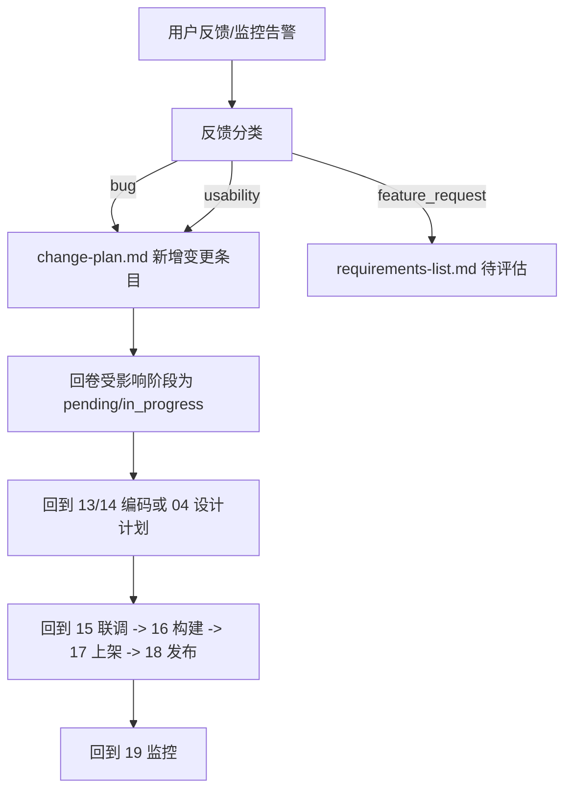

# {项目名称} 上线监控与反馈计划

> 规则来源：`.cursor/rules/19-上线监控与迭代.mdc`
> 用途：定义监控接入、基线指标、反馈渠道与反馈回流机制。
> 维护规则：每个迭代结束更新基线；告警触发后必须生成「变更条目草稿」。

---

## 1. 监控维度

| 维度 | 监控内容 | SDK / 平台 | 接入位置 | 数据保留 |
|------|----------|-----------|----------|----------|
| 崩溃（iOS / Android） | crash / OOM | Crashlytics / Bugly / Sentry | `main.dart` 入口 | 90 天 |
| 性能 | 启动时长、FPS、内存峰值、卡顿、ANR | Sentry Performance / Firebase | 同上 | 30 天 |
| 网络 | 接口成功率、P95/P99、错误码分布 | 自研 + Sentry | HTTP 拦截器 | 30 天 |
| 业务 | 关键路径漏斗、付费、注册、留存 | GA4 / 神策 / 自研埋点 | 业务关键节点 | 90 天 |
| 后端 | 服务可用性、错误日志、慢查询 | Sentry / ELK / Prometheus | 服务入口 | 90 天 |

---

## 2. 关键基线指标

| 指标 | 当前基线 | 警戒线 | 告警阈值 |
|------|----------|--------|----------|
| 崩溃率 | | < 0.3% | > 0.5% |
| ANR 率 | | < 0.2% | > 0.4% |
| 启动时长 P50 | | < 1.5s | > 3s |
| 启动时长 P95 | | < 3s | > 5s |
| 关键接口成功率 | | > 99.5% | < 99% |
| 服务 5xx 率 | | < 0.1% | > 1% |
| DAU / MAU | | | |
| 7 日留存 | | | |
| 30 日留存 | | | |

---

## 3. 告警通道与值班

| 严重度 | 通道 | 响应 SLA | 值班人 |
|--------|------|----------|--------|
| P0（线上崩溃 / 数据损坏 / 安全） | 电话 + 飞书 + 短信 | 15 分钟内响应 | |
| P1（关键功能不可用） | 飞书 / Slack | 1 小时 | |
| P2（边缘场景异常） | 邮件 | 24 小时 | |

---

## 4. 符号 / 源码地图上传

- iOS：dSYM 自动上传到 Crashlytics / Sentry（CI 脚本）
- Android：Mapping 文件自动上传
- Web/JS（如有）：source map 上传

---

## 5. 数据隐私

- 不在监控数据中带入个人信息（手机号、邮箱、身份证）
- 错误堆栈中的用户路径要脱敏
- 用户拒绝隐私协议时禁止上报
- 监控 SDK 必须在用户同意隐私政策后才初始化

---

## 6. 反馈通道

| 通道 | 入口 | 责任人 | 处理 SLA |
|------|------|--------|----------|
| 应用内反馈 | 我的 > 意见反馈 | | 24h 内首次响应 |
| 商店评论 | AppStore / Google Play | | 48h |
| 客服邮件 / 工单 | support@example.com | | 24h |
| 社群（微信 / Discord） | | | 12h |

---

## 7. 反馈分类规则

| 类型 | 定义 | 回流到 |
|------|------|--------|
| bug | 复现路径明确，影响功能 | `change-plan.md`（feature_modify） |
| feature_request | 用户提出新功能或改进 | `01-需求/requirements-list.md` 待评估 |
| usability | 体验问题，不影响功能 | `change-plan.md`（feature_modify） |
| praise | 好评、感谢 | 归档保留 |
| spam | 广告 / 灌水 | 过滤 |

---

## 8. 异常自动告警 → 变更入口

监控告警触发后，必须自动生成「变更条目草稿」放入 `change-plan.md` 顶部：

```markdown
### [CHG-{auto}] {告警标题：xxx 崩溃率突增}

- 版本号: vX.Y.Z+1 (热修候选)
- 提出时间: YYYY-MM-DD HH:mm (告警触发时间)
- 类型: feature_modify
- 触发原因: 监控告警（崩溃率从 0.2% 升至 1.5%）
- 关联日志: `{Sentry / Crashlytics 链接}`
- 状态: pending (待值班人决定是否升级为正式变更)
```

由值班人在 1 小时内决定：

- 升级为正式变更条目并立即执行（参考第十节流程）
- 标为 `skipped` 并说明原因（如误报）

---

## 9. 迭代规划

- 每周回顾一次反馈与告警，决定下个迭代的优先级
- 每个版本发布前回看上个版本的「未解决反馈」与「未达成基线」
- 基线指标随版本演进，必须定期更新

---

## 10. 反馈回流流程



---

## 11. 监控基线历史

| 版本 | 日期 | 崩溃率 | ANR | 启动 P95 | 关键接口成功率 | DAU |
|------|------|--------|-----|----------|----------------|-----|
| vX.Y.Z | YYYY-MM-DD | | | | | |
