# 执行力 产品需求文档（PRD）

> 版本：v1.4  
> 创建日期：2026-04-01  
> 更新日期：2026-04-02  
> 状态：已通过  
> 交付形态：Flutter App + Kotlin 后端  
> 参考资料：
> - `01-需求/references/docs/执行力-产品文档-v1.1-2026-03-31.md`
> - `01-需求/references/docs/执行力-颜色文档-v1.1.md`
> - `01-需求/references/images/`

---

## 1. 产品概述

### 1.1 产品名称

当前工作名：执行力  
正式产品名：待定

说明：

- “执行力”适合作为当前阶段以计划执行为核心的项目代号。
- 由于产品未来会扩展到笔记、资料整理、想法沉淀、AI 自动归类与多端个人助理能力，正式名称需要保留调整空间。

### 1.2 产品定位

当前阶段，本产品是一款以“计划创建、计划管理、当前执行”为核心切入点的个人效率产品。

长期来看，它不是单一的计划 App，而是一个多端通用的个人助理型产品，负责承载用户的：

- 计划
- 笔记
- 想法
- 资料
- 个人知识与内容整理

当前版本的核心价值仍然是帮助用户在当前时刻快速判断“我现在最应该做什么”，并在执行失败时给出清晰的处理路径；但长期目标是进一步帮助用户完成“记录、整理、规划、执行、复盘”的完整个人管理闭环。

产品强调以下三件事：

- 计划可视化：把目标、计划、阶段、任务串成明确结构。
- 当前时刻可执行：把复杂计划收敛成此刻可做的动作。
- 结果有闭环：完成、推迟、放弃都要影响后续计划，而不是留下一堆失真的待办。

同时，产品坚持一条重要原则：

- 离线优先：即使没有网络，用户仍然可以创建、编辑、查看和执行计划；后端接口主要承担同步、备份、更新与跨端扩展职责，而不是本地计划能力的前置条件。

再补充一条长期原则：

- AI 辅助整理：用户不应长期依赖手动创建大量分类、子分类和资料目录，产品未来需要借助 AI 帮助用户自动理解、归类、整理和沉淀内容。

### 1.3 目标用户

- 有明确年度或中期目标，但容易在日常执行中失焦的用户。
- 同时管理多条计划线，需要“全局视图 + 当前执行视图”的用户。
- 愿意通过对话或编辑器来整理计划，但不希望被复杂项目管理工具压垮的用户。
- 有持续记录习惯，积累了笔记、清单、资料、灵感，但不愿再用大量手动文件夹维护结构的用户。
- 希望用 AI 代替部分整理劳动，让内容管理从“手动分类”转向“自动理解与归纳”的用户。

### 1.4 产品核心主张

当前版本的核心主张是：

> 输入计划 -> 规划计划 -> 执行计划 -> 结果处理

相比普通待办类产品，执行力更强调：

- 计划的结构化表达。
- 时间驱动的执行入口。
- 执行失败后的处理机制。
- 从整体目标到当前任务的完整链路。

长期版本的核心主张将扩展为：

> 记录信息 -> AI 理解与整理 -> 形成计划与知识结构 -> 执行与追踪 -> 沉淀与复盘

也就是说，计划执行只是产品进入用户工作流的第一步，而不是终点。

---

## 2. 当前版本范围

### 2.1 本期范围（MVP）

本期聚焦“无登录前提下的个人计划执行体验”，用户默认以单设备、本地身份使用产品。

包含模块：

- 开屏页
- 主框架页
- Now 页
- Chat 页
- Plan 页
- Profile 页
- BattleMap 计划总体介绍页
- TrackDetail 计划详情页
- PlanEditor 计划编辑页
- UserProfile 个人信息页

本期同时要求：

- 无网络可正常创建计划。
- 无网络可查看和编辑已有本地计划。
- 无网络可完成 Now、Plan、TrackDetail、PlanEditor 等核心流程。
- 网络恢复后，前端与后端执行数据同步或补偿更新。

### 2.1.1 当前版本定位

当前版本是长期产品中的“计划与执行核心模块”。

这意味着：

- 当前先把“计划创建、执行、反馈、调整”做好。
- 当前不要求一次性覆盖完整的个人助理能力。
- 但架构、命名和产品描述不能把未来能力锁死在“单纯计划工具”上。

### 2.2 明确不做

- 不做登录系统。
- 不做注册、登录、登出、刷新令牌等账号体系能力。
- 不做多设备同步。
- 不做团队协作。

### 2.3 后续可扩展能力

以下能力保留为后续扩展模块，不纳入当前版本验收：

- 登录系统
- 云端同步
- 推送提醒
- 真正的 LLM 联网接入
- 深色模式
- PC 版本
- 笔记模块
- 想法记录模块
- 资料整理模块
- AI 自动归类与整理
- 复盘与知识沉淀模块

---

## 3. 整体 App 描述

### 3.0 长期产品形态

长期来看，本产品将是一个支持移动端与 PC 端的多端个人助理产品。

长期产品能力可分为 4 个层次：

1. 记录层：记录计划、笔记、想法、资料、清单。
2. 整理层：通过 AI 帮助用户理解内容、生成分类、自动归档与组织。
3. 规划层：把记录内容转化为计划、任务、主题研究或长期目标。
4. 执行层：将计划推进到日常行动、反馈、复盘与沉淀。

当前 PRD 重点描述的是第 3 层与第 4 层中的“计划与执行模块”，但后续扩展需要始终以整体产品方向为前提。

### 3.1 整体交互链路

整体交互可概括为以下主路径：

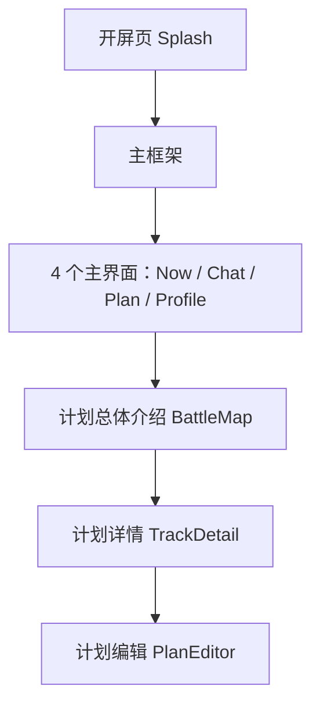
```mermaid
flowchart TD
    A["开屏页 Splash"] --> B["主框架"]
    B --> C["4 个主界面：Now / Chat / Plan / Profile"]
    C --> D["计划总体介绍 BattleMap"]
    D --> E["计划详情 TrackDetail"]
    E --> F["计划编辑 PlanEditor"]
```

在长期形态中，这条链路未来还会向前和向后扩展：

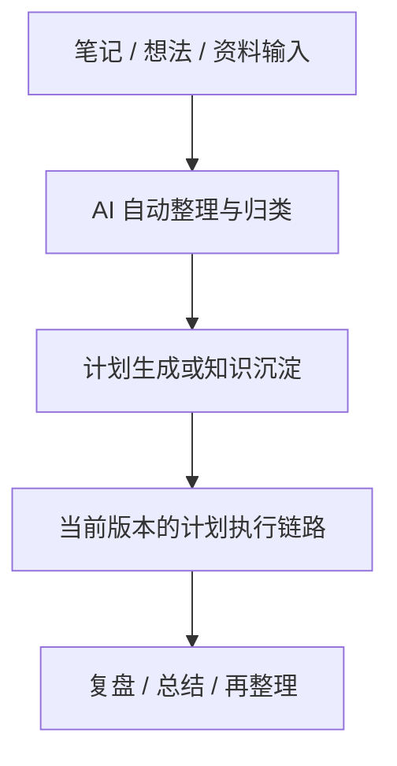
```mermaid
flowchart TD
    A["笔记 / 想法 / 资料输入"] --> B["AI 自动整理与归类"]
    B --> C["计划生成或知识沉淀"]
    C --> D["当前版本的计划执行链路"]
    D --> E["复盘 / 总结 / 再整理"]
```

### 3.2 主流程说明

#### 流程一：启动与进入主框架

- 用户打开 App 后先进入开屏页。
- 开屏页展示品牌视觉、产品名与轻量动画。
- 动画结束后直接进入主页面框架。
- 当前版本无登录页阻断。

#### 流程二：主框架中的四个主界面

主框架底部固定 4 个 Tab：

- Now：查看当前时刻最应该执行的任务。
- Chat：通过对话生成或修改计划草稿。
- Plan：查看计划列表、日程与进入计划体系。
- Profile：查看个人状态、偏好与个人资料入口。

#### 流程三：从计划总览到计划执行细节

- 用户从 Plan 页进入 BattleMap。
- BattleMap 展示用户计划总体结构与多条主线概览。
- 用户点击某一条计划后进入 TrackDetail。
- TrackDetail 查看该计划的阶段、任务与时间线。
- 用户需要新建或修改计划时进入 PlanEditor。

#### 流程四：从计划创建到执行闭环

- 用户可在 Chat 或 PlanEditor 中生成计划。
- 计划经确认后进入 Plan / BattleMap / TrackDetail 展示。
- Now 页基于当前时间展示应该执行的任务。
- 用户完成、推迟或放弃任务后，影响对应计划的执行状态。

### 3.3 核心交互全流程

以下内容用于描述一个普通用户从首次打开产品到完成一次计划执行闭环的完整体验。

#### 阶段一：进入产品

1. 用户点击 App 图标，进入开屏页。
2. 开屏页展示品牌名称、品牌图形和短暂启动动效。
3. 用户无需额外操作，系统自动进入主框架。
4. 默认落在 Now 页，让用户第一眼看到“当前该做什么”。

#### 阶段二：首次理解产品结构

1. 用户进入主框架后，底部可见 4 个一级入口：Now、Chat、Plan、Profile。
2. 用户可以通过页面名称、图标和内容差异理解四个入口的职责：
   - Now 负责当前执行。
   - Chat 负责对话生成计划。
   - Plan 负责查看和管理计划。
   - Profile 负责个人状态与资料。
3. 如果用户当前还没有计划，Now 或 Plan 页会提供明显的新建引导。

#### 阶段三：创建计划

用户有两种主要方式创建计划。

路径 A：通过 Chat 创建

1. 用户进入 Chat 页。
2. 在输入框中用自然语言描述目标，例如“我要准备三个月后的雅思考试”。
3. 系统返回一个结构化计划草稿，包含计划名称、阶段、任务建议和时间安排雏形。
4. 用户阅读草稿后有两个主要选择：
   - 继续对话修改草稿。
   - 确认采用草稿，进入 PlanEditor 进一步核对和完善。
5. 用户在 PlanEditor 中补全信息并保存，计划正式进入产品体系。

路径 B：通过 PlanEditor 直接创建

1. 用户进入 Plan 页。
2. 点击“新建计划”按钮。
3. 系统进入 PlanEditor。
4. 用户填写计划名称、时间范围、计划类型，并逐步添加阶段与任务。
5. 用户保存后，系统返回 Plan 或 TrackDetail，并可在 BattleMap 中看到该计划。
6. 如果此时无网络，计划仍然保存在本地，并正常进入本地计划体系。

#### 阶段四：查看整体计划

1. 用户在 Plan 页查看已有计划列表或日/周安排。
2. 当用户想从更高层级理解自己的整体目标时，进入 BattleMap。
3. BattleMap 会同时展示多条计划主线，让用户快速知道：
   - 自己当前有哪些主要计划。
   - 每条计划处于什么阶段。
   - 哪些计划推进顺利，哪些计划出现阻塞。
4. 用户点击任意一条计划，进入 TrackDetail 查看更细的执行结构。

#### 阶段五：查看单条计划详情

1. 用户在 TrackDetail 中看到该计划的整体信息、阶段时间线和当前阶段任务。
2. 用户可以理解该计划“从哪里开始、目前进行到哪一步、下一步是什么”。
3. 若发现计划需要调整，用户点击“编辑计划”进入 PlanEditor。
4. 用户完成修改后保存，详情页内容同步更新。

#### 阶段六：回到当前执行

1. 当用户从计划层回到执行层时，进入 Now 页。
2. Now 页基于当前时间、计划安排和任务实例，收敛出此刻最应执行的任务。
3. 页面应让用户快速判断：
   - 当前任务是什么。
   - 为什么是它。
   - 我现在可以做什么操作。

#### 阶段七：处理执行结果

1. 用户开始执行任务后，可以对任务给出结果反馈。
2. 结果反馈至少包括：
   - 完成
   - 推迟
   - 放弃
3. 系统收到反馈后，会更新任务实例状态，并影响：
   - Now 页当前推荐内容
   - Plan 页日程表现
   - TrackDetail 中的任务与阶段状态
4. 用户因此形成“计划 -> 执行 -> 反馈 -> 调整”的闭环，而不是只做一次性记录。

#### 阶段八：离线与恢复联网

1. 当用户处于无网络状态时，系统仍允许其继续查看、创建、编辑计划以及进行任务执行反馈。
2. 此时用户产生的计划数据、编辑行为和执行结果优先写入本地存储。
3. 页面应明确保持可用，而不是因为接口不可达直接阻断操作。
4. 当网络恢复后，系统再将本地待同步数据与后端进行更新对齐。
5. 用户无需先理解技术上的“同步机制”，只需要感受到产品在弱网或离线时仍然可靠可用。

### 3.4 关键用户路径

#### 路径一：第一次打开 App 的用户

开屏页 -> Now -> 理解底部 4 Tab -> 进入 Plan 或 Chat -> 创建第一条计划 -> 回到 Now 查看当前任务

#### 路径二：已有计划、只想知道现在做什么的用户

开屏页 -> Now -> 查看当前任务 -> 完成 / 推迟 / 放弃 -> 系统更新状态

#### 路径三：需要系统性整理目标的用户

Plan -> BattleMap -> TrackDetail -> PlanEditor -> 保存 -> 回到 BattleMap / Now

#### 路径四：倾向用自然语言输入的用户

Chat -> 输入目标与约束 -> 生成计划草稿 -> 修改草稿 -> 应用草稿 -> PlanEditor 确认 -> 保存

---

## 4. 信息架构与导航

### 4.1 页面结构

| 层级 | 页面 | 路径建议 | 说明 |
|------|------|---------|------|
| 一级 | Splash | `/splash` | 启动过渡页 |
| 一级 | Now | `/` | 当前执行入口 |
| 一级 | Chat | `/chat` | 对话式计划入口 |
| 一级 | Plan | `/plan` | 计划列表与调度入口 |
| 一级 | Profile | `/profile` | 个人中心 |
| 二级 | BattleMap | `/plan/battle` | 计划总体介绍 |
| 二级 | TrackDetail | `/plan/battle/:id` | 单条计划详情 |
| 二级 | PlanEditor | `/plan/editor` `/plan/editor/:id` | 新建/编辑计划 |
| 二级 | UserProfile | `/profile/me` | 个人信息编辑 |

说明：

- 上表是当前版本页面结构，不代表长期产品的全部信息架构。
- 长期版本将增加笔记、资料、分类整理、复盘等模块入口。

### 4.2 底部导航

| Tab | 图标建议 | 页面 | 说明 |
|-----|---------|------|------|
| Now | `Zap` | Now | 突出即时行动 |
| Chat | `MessageCircle` | Chat | 突出对话输入 |
| Plan | `Calendar` | Plan | 突出计划与日程 |
| Profile | `User` | Profile | 突出个人设置 |

### 4.3 隐藏底部导航的页面

以下页面进入后隐藏底部 Tab，避免操作干扰：

- Chat 全屏对话模式
- BattleMap
- TrackDetail
- PlanEditor
- UserProfile

---

## 5. 视觉与设计方向

### 5.1 设计关键词

- 冷静
- 明确
- 有执行感
- 不拖沓
- 有轻度未来感

### 5.2 色彩策略

整体采用偏靛蓝、紫蓝体系，营造“理性计划 + 专注执行”的视觉氛围。

建议基础色：

- 主色：靛蓝紫，用于主按钮、重点高亮、品牌识别。
- 辅色：紫色，用于渐变、强调块、图表点缀。
- 成功色：绿色，用于完成、可执行、正向反馈。
- 警告色：橙色，用于推迟、提醒、注意事项。
- 危险色：红色，用于放弃、删除、不可逆操作。
- 背景色：浅紫白或浅灰白，用于提升内容层次。

### 5.3 图标策略

图标应选择简洁、识别快、线性风格统一的方案，避免过于卡通或复杂的装饰图标。

建议原则：

- 一级导航图标直接表达功能。
- 状态图标用于辅助理解，而非替代文字。
- 行为图标尽量与结果绑定，例如完成、推迟、放弃要有明显差异。

### 5.4 动效策略

- 开屏页可有品牌动效，但时长应克制。
- 页面切换动效以轻量平移、淡入为主。
- 按钮点击要有即时反馈。
- 执行状态变化要有明确视觉回执。

---

## 6. 功能模块总表

| 模块 | 说明 | 优先级 |
|------|------|--------|
| 开屏页 Splash | 品牌启动与进入主框架 | 高 |
| Now | 当前时刻执行入口 | 高 |
| Chat | 对话生成/修改计划 | 高 |
| Plan | 计划列表与日/周视图 | 高 |
| BattleMap | 计划总体介绍 | 高 |
| TrackDetail | 单条计划详情 | 高 |
| PlanEditor | 创建/编辑计划 | 高 |
| 执行反馈 | 完成、推迟、放弃处理 | 高 |
| Profile | 个人中心与偏好设置 | 高 |
| UserProfile | 个人信息维护 | 中高 |

---

## 7. 页面级详细需求

## 7.1 开屏页 Splash

### 页面定位

用于完成品牌露出、启动状态过渡与进入主框架前的短暂停留，是用户每次打开 App 时看到的第一个页面。

### 参考素材

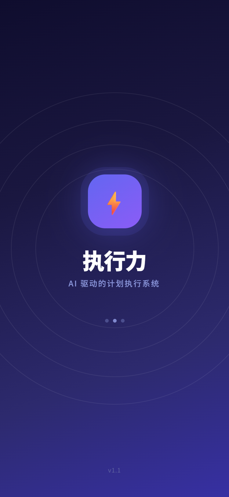

### 页面结构（从上到下）

1. 全屏背景层：深色渐变或品牌氛围背景。
2. 中央品牌区：品牌名、Logo 或品牌符号。
3. 副文案区：一句简短标语或当前版本定位说明。
4. 启动反馈层：轻量动画、淡入淡出或加载状态。

### 区块说明

- 全屏背景层：负责建立第一印象，不承载业务信息，不允许出现复杂操作。
- 中央品牌区：是视觉焦点，需保证在 1 秒内可识别品牌。
- 副文案区：补充产品气质，文案长度控制在一行或两行内。
- 启动反馈层：向用户传达“正在进入应用”，避免误判为卡死。

### 主要功能

- 展示品牌识别信息。
- 告知用户应用已成功启动。
- 自动进入主框架首页。

### 交互流程图

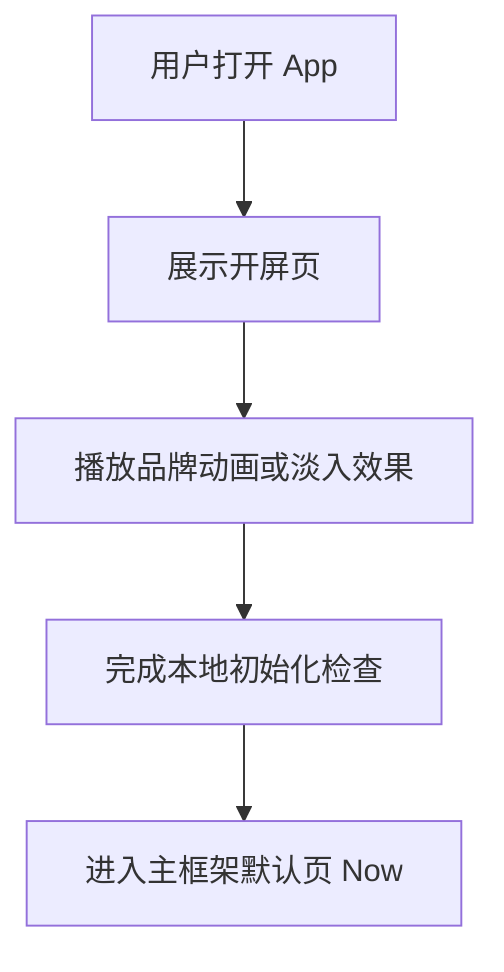
```mermaid
flowchart TD
    A["用户打开 App"] --> B["展示开屏页"]
    B --> C["播放品牌动画或淡入效果"]
    C --> D["完成本地初始化检查"]
    D --> E["进入主框架默认页 Now"]
```

### 详细交互说明

1. 用户从系统桌面或应用列表打开 App 后，首先进入 Splash。
2. 首屏先看到品牌名、Logo 和一句简短标语，不出现登录、选择器或多余按钮。
3. 页面停留期间系统完成本地数据与主题资源准备。
4. 若初始化顺利，页面自动进入主框架默认页 `Now`。
5. 若初始化耗时略长，页面可延续轻量动效，但不能跳出额外交互打断主流程。

### 关键状态/异常情况

- 默认态：品牌与标语完整展示，约 1.5 至 2 秒后自动跳转。
- 加载稍慢：继续展示轻量加载反馈，但不额外弹框。
- 本地数据恢复中：允许在开屏页多停留短时间，不展示技术术语。

### 验收标准

- 用户能够明确感知 App 已成功启动。
- 开屏页不承载额外业务决策。
- 页面能够平滑进入主框架，不出现闪屏或白屏。

## 7.2 主框架页

### 页面定位

作为整个 App 的基础容器，承载 `Now`、`Chat`、`Plan`、`Profile` 四个一级页面，并提供统一导航关系。

### 参考素材

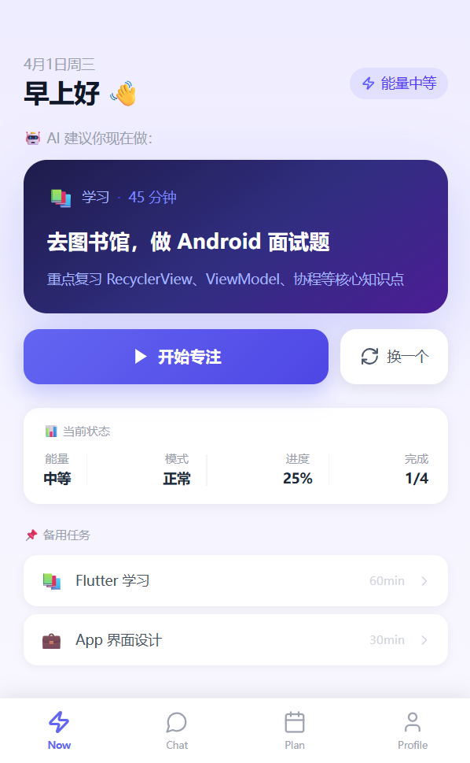

### 页面结构（从上到下）

1. 页面内容承载区：显示当前选中的一级页面内容。
2. 底部导航栏：四个主 Tab 与当前高亮状态。
3. 系统安全区：处理底部手势区、设备圆角与沉浸式边缘。

### 区块说明

- 页面内容承载区：随当前 Tab 切换而更新，但主框架本身不引入业务逻辑。
- 底部导航栏：负责一级页面切换，图标与文字都需能表达页面含义。
- 系统安全区：保证在不同设备上导航栏都不被遮挡。

### 主要功能

- 统一承载四个一级页面。
- 提供底部 Tab 切换能力。
- 维持一级与二级页面的返回关系。

### 交互流程图

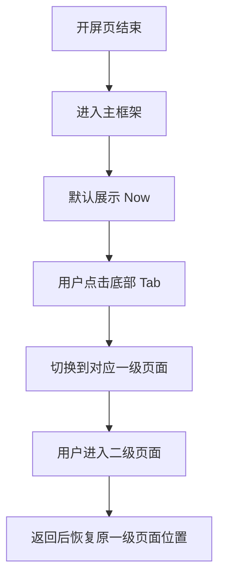
```mermaid
flowchart TD
    A["开屏页结束"] --> B["进入主框架"]
    B --> C["默认展示 Now"]
    C --> D["用户点击底部 Tab"]
    D --> E["切换到对应一级页面"]
    E --> F["用户进入二级页面"]
    F --> G["返回后恢复原一级页面位置"]
```

### 详细交互说明

1. 用户从 Splash 进入应用后，首先落在主框架默认页 `Now`。
2. 首屏先看到当前一级页面内容，以及底部四个主 Tab。
3. 用户点击任意 Tab 后，内容区切换为对应页面，同时当前 Tab 变为高亮态。
4. 用户从某个一级页面进入二级页面后，主框架不消失，但导航关系需保持清晰。
5. 用户从二级页面返回时，应回到离开前的一级页面，而不是被重置到其他页面。

### 关键状态/异常情况

- 默认态：`Now` 为默认高亮项。
- 切换态：点击后立即响应，避免连续点击无反馈。
- 返回态：二级页面返回后保留原页面滚动位置和上下文。

### 验收标准

- 四个 Tab 的意义清晰且可快速识别。
- Tab 切换流畅，无明显闪烁。
- 返回关系稳定，不让用户迷路。

## 7.3 Now 页

### 页面定位

`Now` 是当前版本最核心的执行页，用于在任意时刻给出“现在最适合做什么”的明确答案，并承接专注开始、任务切换与执行反馈。

### 参考素材

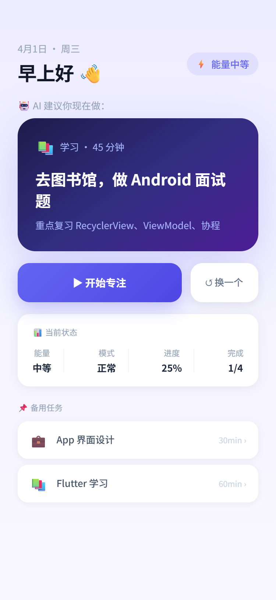

### 页面结构（从上到下）

1. 顶部状态行：左侧为时间与欢迎语，右侧为当前状态标签。
2. AI 建议卡片区：展示系统给出的当前建议或提示文案。
3. 核心操作区：`开始专注` 主按钮与 `换一个` 次按钮。
4. 当前推荐任务卡片：展示当前建议执行的任务与所属计划信息。
5. 备用任务列表区：展示可替换的其他任务或备选行动。
6. 页面底部留白与滚动结束区：确保整页可滑动、不会因卡片过多被截断。

### 区块说明

- 顶部状态行：用于建立时间语境。左侧时间和欢迎语告诉用户“现在是什么状态”，右侧状态标签告诉用户当前能量或节奏判断。
- AI 建议卡片区：负责把复杂计划压缩成一句当前建议，是页面的解释层，不直接承担执行动作。
- 核心操作区：`开始专注` 是主路径入口，`换一个` 是不接受当前任务时的快速分流入口。
- 当前推荐任务卡片：展示当前推荐任务名称、所属计划、阶段或时间说明，是用户理解推荐理由的关键内容区。
- 备用任务列表区：用于在当前推荐不合适时提供替代选项，避免用户被迫退出页面重新找任务。
- 页面滚动区：保证页面自上而下阅读顺序稳定，内容过长时可滑动查看。

### 主要功能

- 根据本地计划与当前时间生成当前推荐任务。
- 展示推荐原因、所属计划与当前状态。
- 支持用户开始专注、切换任务、查看备用任务。
- 在无网络情况下照常读取本地计划并给出推荐结果。

### 交互流程图

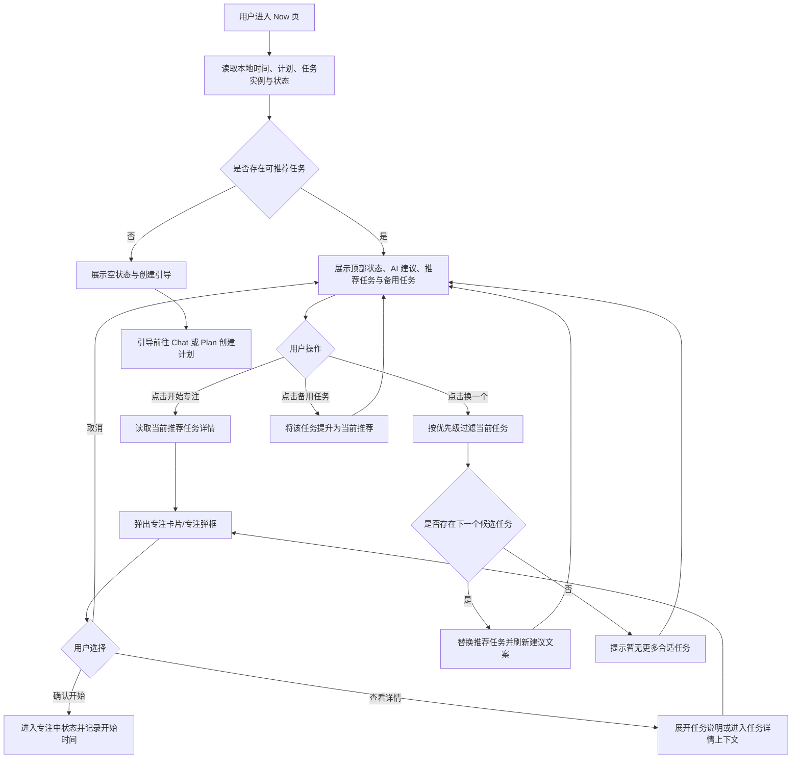
```mermaid
flowchart TD
    A["用户进入 Now 页"] --> B["读取本地时间、计划、任务实例与状态"]
    B --> C{"是否存在可推荐任务"}
    C -->|是| D["展示顶部状态、AI 建议、推荐任务与备用任务"]
    C -->|否| E["展示空状态与创建引导"]
    D --> F{"用户操作"}
    F -->|点击开始专注| G["读取当前推荐任务详情"]
    G --> H["弹出专注卡片/专注弹框"]
    H --> I{"用户选择"}
    I -->|确认开始| J["进入专注中状态并记录开始时间"]
    I -->|取消| D
    I -->|查看详情| K["展开任务说明或进入任务详情上下文"]
    K --> H
    F -->|点击换一个| L["按优先级过滤当前任务"]
    L --> M{"是否存在下一个候选任务"}
    M -->|是| N["替换推荐任务并刷新建议文案"]
    M -->|否| O["提示暂无更多合适任务"]
    N --> D
    O --> D
    F -->|点击备用任务| P["将该任务提升为当前推荐"]
    P --> D
    E --> Q["引导前往 Chat 或 Plan 创建计划"]
```

### 详细交互说明

1. 页面首次进入：
用户从主框架切到 `Now` 后，首先看到顶部时间、欢迎语和状态标签。系统同步读取本地计划、任务实例、延后状态与最近执行记录，再决定当前推荐任务。

2. 有推荐任务时：
页面展示 AI 建议卡片、当前推荐任务卡片和备用任务列表。用户不需要先进入计划详情，就能直接理解“现在为什么推荐这件事”。

3. 无推荐任务时：
若本地没有可执行计划、当前时段没有可执行任务，或全部任务已完成，页面进入空状态。空状态需说明原因，并提供去 `Chat` 生成计划或去 `Plan` 新建计划的入口。

4. 点击 `开始专注`：
系统先读取当前推荐任务的标题、所属计划、阶段、预估时长、执行备注与最近状态，然后弹出专注卡片或专注弹框。弹框至少展示本次要做的任务、建议专注时长、可执行动作和退出方式。用户确认后进入专注中状态，并立即在本地记录开始时间；若联网可同时准备同步，但同步失败不能阻断进入专注。

5. 点击 `换一个`：
系统将当前推荐任务暂时降权，并在当前候选集中重新筛选下一个合适任务。切换后需同步刷新 AI 建议文案、当前推荐任务卡片和备用任务列表；若没有可切换对象，则保留当前任务并给出“暂无更多推荐”的轻提示。

6. 点击备用任务：
用户点击某个备用任务后，该任务被提升为当前推荐任务，页面重新渲染推荐卡片与建议说明。原推荐项可退回备用列表或被暂时隐藏。

7. 专注弹框中的确认 / 取消 / 返回：
用户在专注弹框中点击确认，则开始专注；点击取消则关闭弹框，页面停留在 `Now`；点击任务说明或展开入口，则在弹框内补充显示更多上下文，关闭后仍回到 `Now` 当前状态。

8. 专注结束后的返回：
用户从专注过程回到 `Now` 时，页面需能看到本次任务的最新状态，如进行中、已完成或待继续，不能让用户怀疑操作是否生效。

### 关键状态/异常情况

- 默认态：有推荐任务，展示完整顶部信息、建议卡片、核心按钮和备用任务。
- 空状态：无推荐任务，展示解释文案与创建引导。
- 专注弹框态：由 `开始专注` 触发，展示任务摘要、时长与确认动作。
- 切换中态：点击 `换一个` 后出现短暂加载或骨架反馈，再展示新任务。
- 离线态：页面照常使用本地数据推荐任务，并标记后续同步不影响当前操作。
- 同步失败：本地状态已经更新，页面展示轻量“待同步”提示，不回滚用户操作。

### 验收标准

- 用户进入页面后 3 秒内能够知道当前建议做什么。
- `开始专注` 与 `换一个` 的结果都能在当前页看到明确反馈。
- 页面结构与 UI 一致，能够从上到下解释每一块内容。
- 离线情况下仍能正常推荐、开始专注和切换任务。

## 7.4 Chat 页

### 页面定位

`Chat` 是当前版本的自然语言输入入口，用于让用户快速表达目标、限制条件或想法，并生成可继续编辑的计划草稿。

### 参考素材

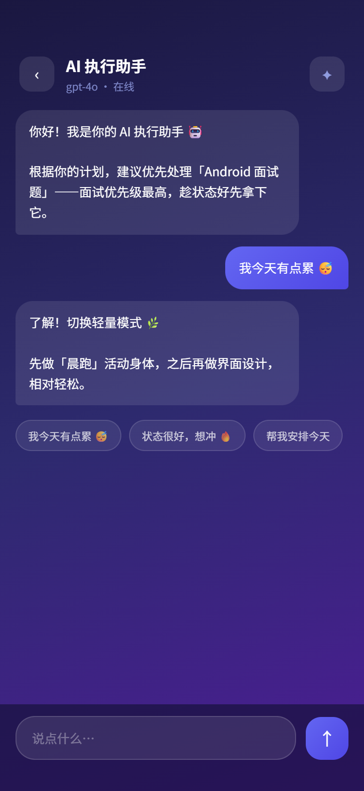

### 页面结构（从上到下）

1. 顶部标题区：页面标题、上下文提示或返回逻辑。
2. 对话消息流区：展示用户消息、系统回复与草稿结果。
3. 草稿动作区：出现在可应用草稿下方，包含继续修改、应用草稿等动作。
4. 底部输入区：输入框、发送按钮与可能的快捷提示。

### 区块说明

- 顶部标题区：用于让用户明确当前在 AI 对话环境中，不与普通聊天工具混淆。
- 对话消息流区：是页面主体，需清楚区分用户消息与 AI 输出。
- 草稿动作区：只在存在可应用结果时出现，用于把对话转为后续结构化编辑。
- 底部输入区：用于持续提问、补充约束和修正结果。

### 主要功能

- 接收用户自然语言输入。
- 生成计划草稿、阶段建议和任务建议。
- 支持追问、重写、补充条件。
- 将草稿带入 `PlanEditor` 做进一步确认。

### 交互流程图

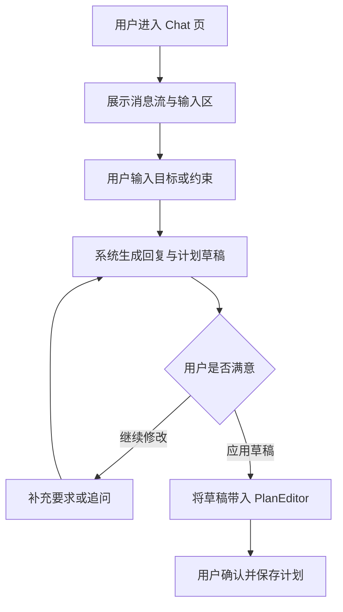
```mermaid
flowchart TD
    A["用户进入 Chat 页"] --> B["展示消息流与输入区"]
    B --> C["用户输入目标或约束"]
    C --> D["系统生成回复与计划草稿"]
    D --> E{"用户是否满意"}
    E -->|继续修改| F["补充要求或追问"]
    F --> D
    E -->|应用草稿| G["将草稿带入 PlanEditor"]
    G --> H["用户确认并保存计划"]
```

### 详细交互说明

1. 用户从主框架进入 `Chat` 后，先看到消息流和底部输入区，页面默认可直接输入，无需额外初始化操作。
2. 首次进入时，消息流上方或输入区上方可出现一条轻提示，告诉用户可以描述目标、时间、频率或约束。
3. 用户点击发送后，本次输入立即作为用户消息加入消息流，再由系统生成结构化回复。
4. 若系统已形成草稿，则在回复中展示计划名、阶段建议、任务建议等结构化内容，并出现 `继续修改` 或 `应用草稿` 操作。
5. 用户选择继续修改时，仍停留在当前页，新的约束条件会在上下文中持续生效。
6. 用户选择应用草稿时，系统将草稿写入本地临时草稿，并进入 `PlanEditor` 进行最终确认。

### 关键状态/异常情况

- 默认态：展示空消息流或最近对话内容。
- 生成中态：系统回复前显示加载反馈，避免用户误判未发送成功。
- 草稿可用态：出现应用草稿按钮和草稿摘要。
- 离线态：若本地不支持当前 AI 能力，需明确说明无法实时生成，但不能影响已存在草稿的查看。

### 验收标准

- 用户能区分“聊天内容”和“可应用草稿”。
- 草稿从 Chat 进入 PlanEditor 的路径明确。
- 页面不会让用户产生“生成结果丢失”的感受。

## 7.5 Plan 页

### 页面定位

`Plan` 是计划体系的总入口，用于查看计划列表、切换视角、进入作战地图和进入具体计划详情。

### 参考素材

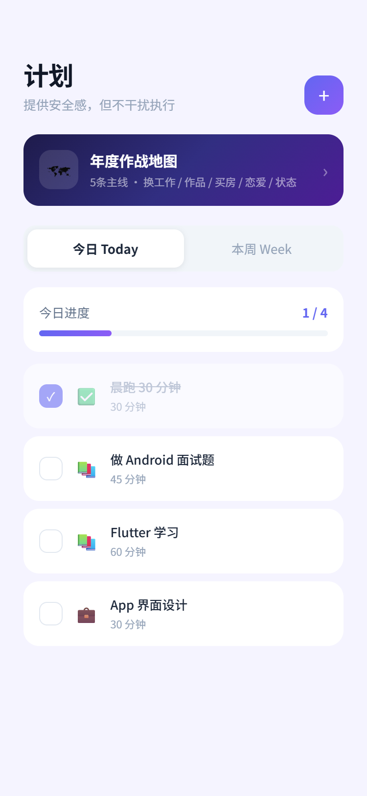

### 页面结构（从上到下）

1. 顶部概览区：标题、当前筛选状态、可能的时间视图切换。
2. 计划总览卡片区：展示计划数量、活跃状态或摘要信息。
3. 计划列表区：逐条展示已有计划卡片。
4. 快捷入口区：进入 `BattleMap`、新建计划或查看更多。
5. 底部浮动入口或主按钮：用于快速新建计划。

### 区块说明

- 顶部概览区：告诉用户当前看到的是哪类计划或哪段时间内的计划。
- 计划总览卡片区：提供概览信息，不替代具体列表。
- 计划列表区：是页面主要内容区，承担进入详情的主要入口。
- 快捷入口区：将“看整体”和“新建计划”两个动作提到更高优先级。
- 底部主按钮：保证用户在滚动较长列表时仍能快速发起新建。

### 主要功能

- 浏览本地已有计划。
- 进入单条计划详情。
- 进入 `BattleMap` 查看整体计划布局。
- 进入 `PlanEditor` 新建计划。

### 交互流程图

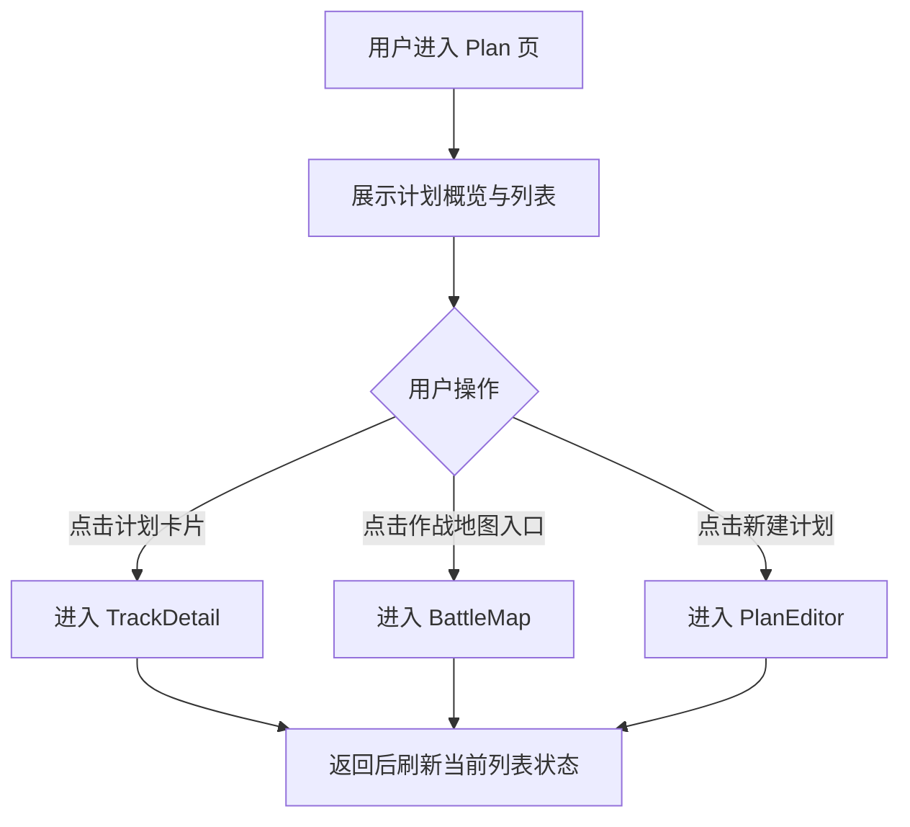
```mermaid
flowchart TD
    A["用户进入 Plan 页"] --> B["展示计划概览与列表"]
    B --> C{"用户操作"}
    C -->|点击计划卡片| D["进入 TrackDetail"]
    C -->|点击作战地图入口| E["进入 BattleMap"]
    C -->|点击新建计划| F["进入 PlanEditor"]
    D --> G["返回后刷新当前列表状态"]
    E --> G
    F --> G
```

### 详细交互说明

1. 用户进入 `Plan` 后，先看到计划概览和计划列表，页面优先回答“我现在有哪些计划”。
2. 每张计划卡片至少展示计划名称、阶段或进度摘要、时间信息和进入详情的入口。
3. 用户点击某条计划卡片后，进入 `TrackDetail` 查看该计划的完整结构。
4. 用户点击作战地图入口后，进入 `BattleMap` 以整体视角查看多个计划。
5. 用户点击新建计划入口后，进入 `PlanEditor`，新建完成返回本页时应能立即看到新增结果。

### 关键状态/异常情况

- 默认态：存在多个计划，展示列表与概览。
- 空状态：当前没有任何计划，突出 `Chat` 生成和 `PlanEditor` 新建两个入口。
- 返回刷新态：从编辑器或详情返回后更新本地列表，不要求依赖后端接口才显示结果。

### 验收标准

- 用户能快速区分“看整体”“看单条”“新建计划”三种入口。
- 计划列表信息完整但不过载。
- 本地新建或编辑后，页面能即时体现变化。

## 7.6 BattleMap 页

### 页面定位

`BattleMap` 是计划整体视图页面，用于让用户从全局层面理解多条计划主线、阶段状态与推进节奏。

### 参考素材

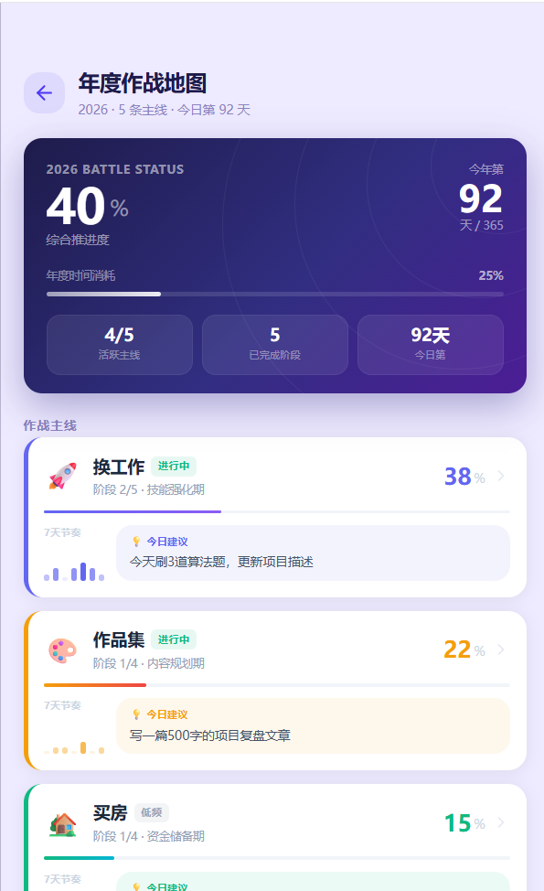

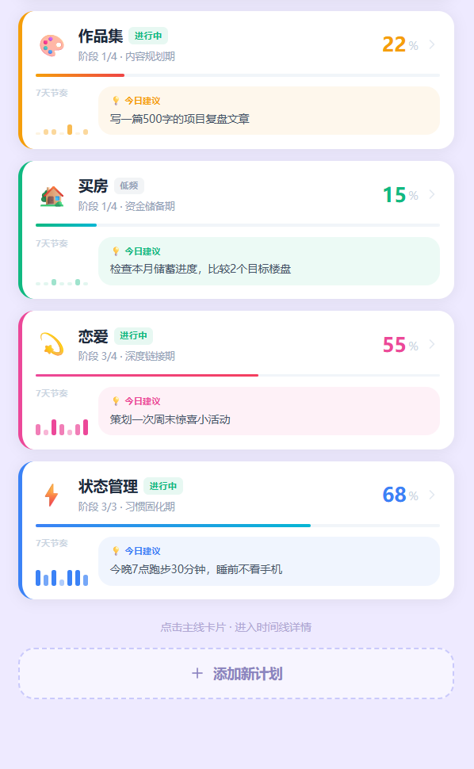

### 页面结构（从上到下）

1. 顶部标题与概览区：标题、总览说明、整体状态摘要。
2. 主线分布区：按主线或卡片展示多个计划。
3. 进度表达区：展示每条计划的阶段位置、进度或趋势。
4. 深入入口区：点击某条主线后进入具体详情。

### 区块说明

- 顶部概览区：建立“这里看的是整体，不是单条任务”的认知。
- 主线分布区：通过视觉分组表达多个计划并行存在。
- 进度表达区：帮助用户快速比较不同计划的推进状态。
- 深入入口区：将整体视图和单条计划详情连接起来。

### 主要功能

- 展示多个计划的整体布局。
- 对比不同计划的当前阶段与推进状态。
- 从整体视角进入单条计划详情。

### 交互流程图

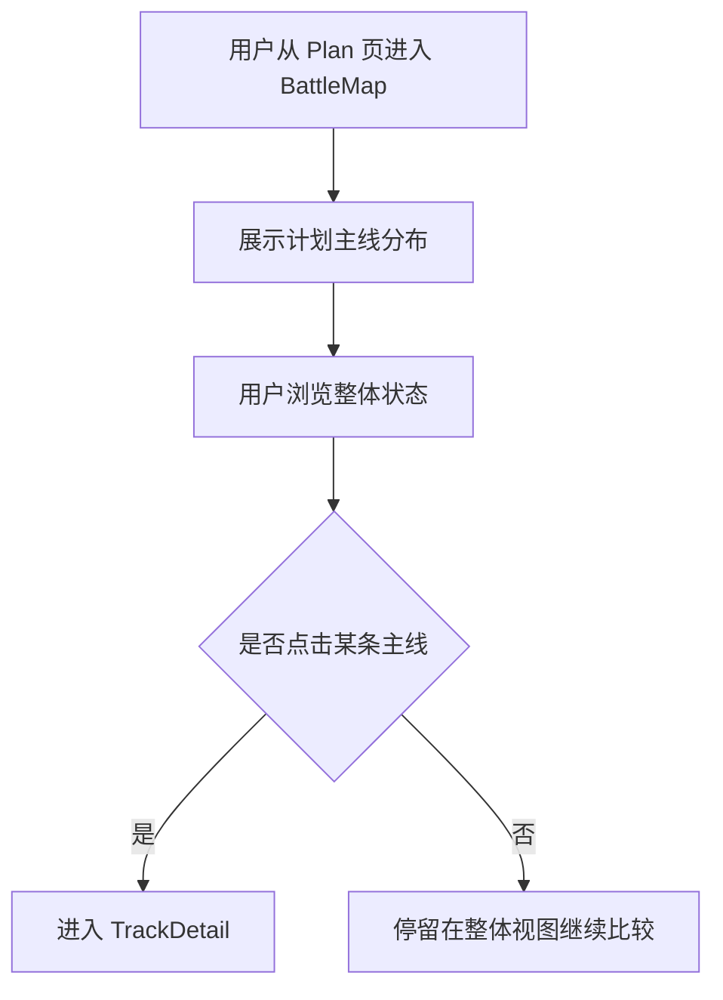
```mermaid
flowchart TD
    A["用户从 Plan 页进入 BattleMap"] --> B["展示计划主线分布"]
    B --> C["用户浏览整体状态"]
    C --> D{"是否点击某条主线"}
    D -->|是| E["进入 TrackDetail"]
    D -->|否| F["停留在整体视图继续比较"]
```

### 详细交互说明

1. 用户从 `Plan` 进入 `BattleMap` 后，先看到多条计划的整体分布，不先进入任何单条详情。
2. 页面从上到下展示总览信息、各计划主线卡片和进度表达，让用户快速比较哪些计划正在推进、哪些计划停滞、哪些计划需要关注。
3. 用户点击任意一条主线后，进入对应的 `TrackDetail`。
4. 用户若只是浏览整体状态，则可以停留在本页完成判断，不应被强制跳入详情页才能理解信息。

### 关键状态/异常情况

- 默认态：存在多条计划主线，信息密度较高但结构清晰。
- 计划较少态：仅一条或两条主线时，页面仍保留整体视角，不退化成详情页。
- 空状态：无计划时提示先去 `PlanEditor` 或 `Chat` 创建计划。

### 验收标准

- 用户能一眼看出自己当前有哪些核心计划。
- 不同计划的状态差异能够清楚比较。
- 从整体页进入单条详情的动作自然明确。

## 7.7 TrackDetail 页

### 页面定位

`TrackDetail` 用于查看单条计划的完整结构，包括计划概览、阶段时间线、当前阶段重点任务与编辑入口。

### 参考素材

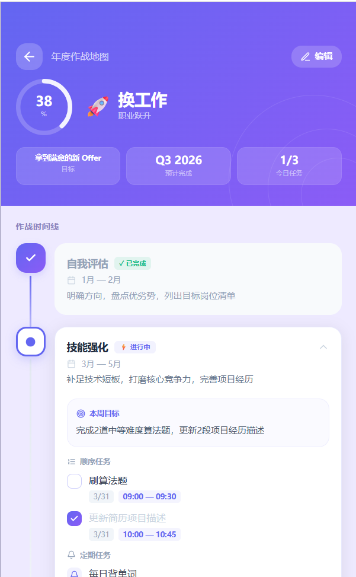

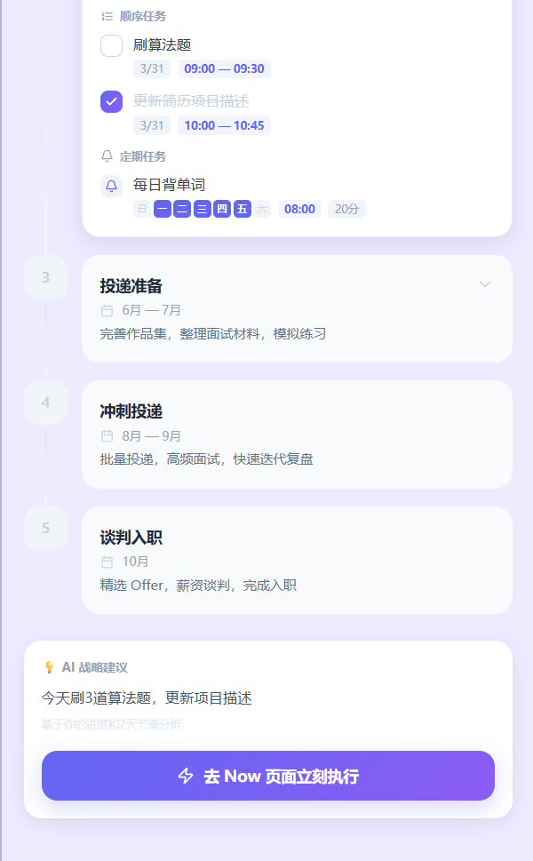

### 页面结构（从上到下）

1. 顶部计划概览区：计划名称、时间范围、进度摘要。
2. 阶段时间线区：按阶段展示推进路径。
3. 当前阶段重点区：突出当前阶段目标与重点任务。
4. 任务列表区：列出当前阶段或近期任务。
5. 底部编辑入口区：进入 `PlanEditor` 的主入口。

### 区块说明

- 顶部计划概览区：用于建立“我正在看哪条计划”的整体认知。
- 阶段时间线区：让用户理解整个计划如何分段推进。
- 当前阶段重点区：帮助用户聚焦当前最重要的阶段目标。
- 任务列表区：承接下一步可执行内容。
- 编辑入口区：让用户发现问题后能直接调整计划结构。

### 主要功能

- 展示单条计划完整结构。
- 显示阶段进度与当前阶段内容。
- 提供进入编辑器的入口。

### 交互流程图

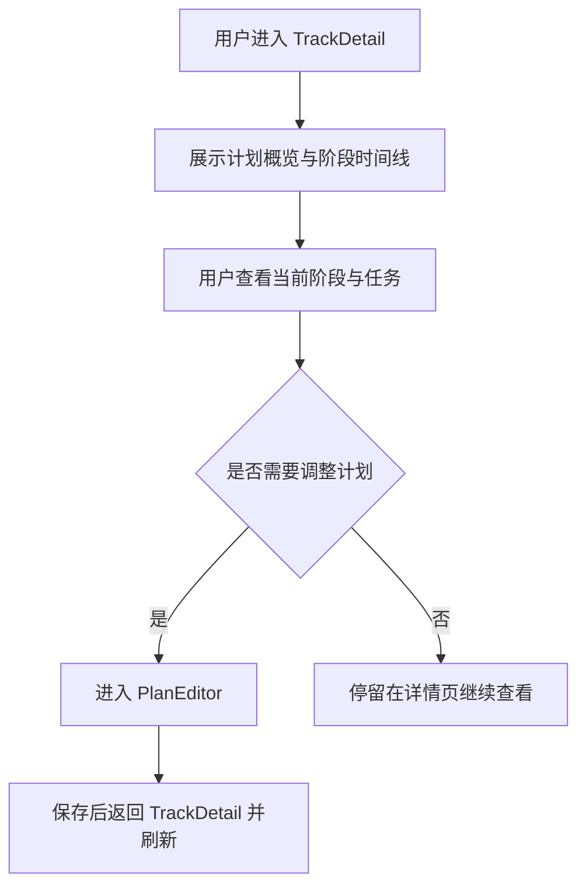
```mermaid
flowchart TD
    A["用户进入 TrackDetail"] --> B["展示计划概览与阶段时间线"]
    B --> C["用户查看当前阶段与任务"]
    C --> D{"是否需要调整计划"}
    D -->|是| E["进入 PlanEditor"]
    D -->|否| F["停留在详情页继续查看"]
    E --> G["保存后返回 TrackDetail 并刷新"]
```

### 详细交互说明

1. 用户从 `Plan` 或 `BattleMap` 进入 `TrackDetail` 后，先看到计划概览和阶段进度。
2. 页面中段用时间线或阶段块把整个计划拆开，让用户理解当前在哪个阶段、后续还有哪些阶段。
3. 当前阶段应被明确高亮，并向下承接当前阶段的重点任务列表。
4. 用户阅读过程中若发现阶段设置不合理、任务缺失或需要增删内容，可点击编辑入口进入 `PlanEditor`。
5. 编辑保存后返回本页，需立即反映最新结构，不依赖服务端响应才更新。

### 关键状态/异常情况

- 默认态：存在阶段与任务，完整展示时间线。
- 阶段为空态：计划存在但尚未拆分阶段，需提示去编辑器补全。
- 返回刷新态：从 `PlanEditor` 返回后更新本地结构。

### 验收标准

- 用户能够清楚理解单条计划的阶段结构。
- 当前阶段与后续阶段具有明显区分。
- 编辑入口明显但不破坏阅读连贯性。

## 7.8 PlanEditor 页

### 页面定位

`PlanEditor` 是计划创建与编辑的核心页面，用于填写计划基础信息、维护阶段结构、添加任务，并接收来自 `Chat` 的草稿预填充。

### 参考素材

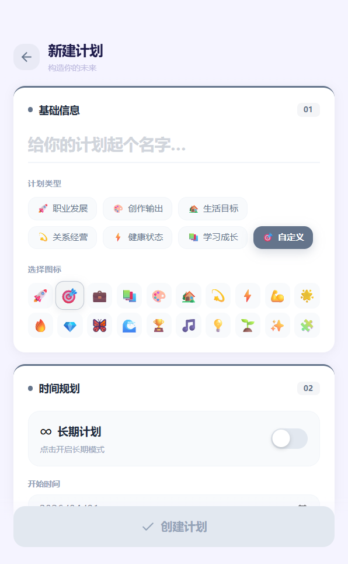

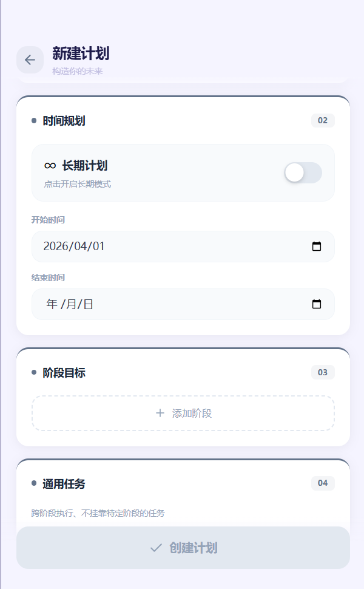

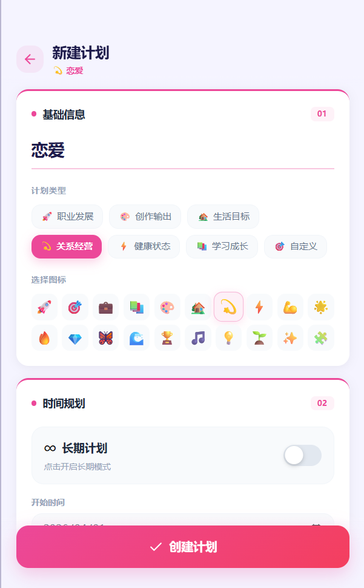

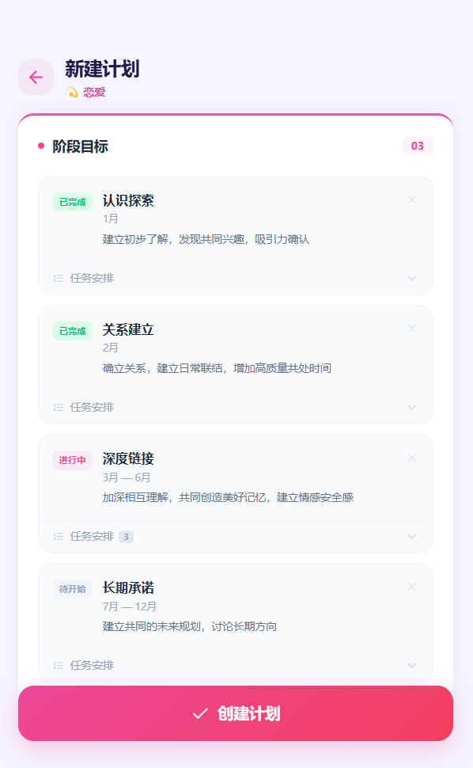

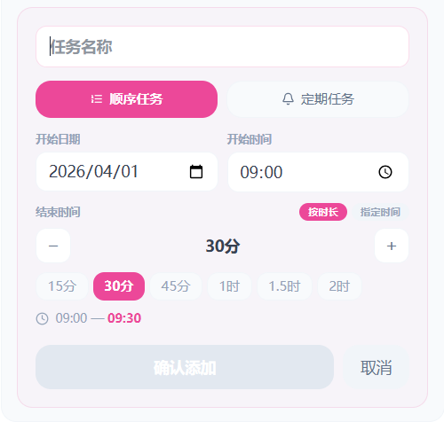

### 页面结构（从上到下）

1. 顶部标题与操作区：页面标题、返回、保存等关键动作。
2. 计划基础信息区：计划名称、类型、起止时间、说明等字段。
3. 阶段列表区：展示已有阶段并支持新增、编辑、删除。
4. 阶段目标与任务区：编辑当前阶段目标、任务和排序。
5. 任务弹框或浮层区：新增任务时的补充录入区域。
6. 底部保存区：保存计划并返回上一流程。

### 区块说明

- 顶部操作区：用于告知当前是新建还是编辑，并提供保存出口。
- 计划基础信息区：决定一条计划的基本轮廓，是进入阶段编辑前的前置区域。
- 阶段列表区：帮助用户按阶段组织计划，不让任务直接堆成平铺列表。
- 阶段目标与任务区：是页面主体，需要清楚区分“阶段目标”和“具体任务”。
- 任务弹框区：用于录入任务细节，避免主页面一次性承载过多字段。
- 底部保存区：将所有编辑结果一次提交到本地存储，并准备后续同步。

### 主要功能

- 新建计划。
- 编辑计划基础信息。
- 增删改阶段与任务。
- 接收 `Chat` 草稿并继续完善。
- 将结果保存到本地并回写上游页面。

### 交互流程图

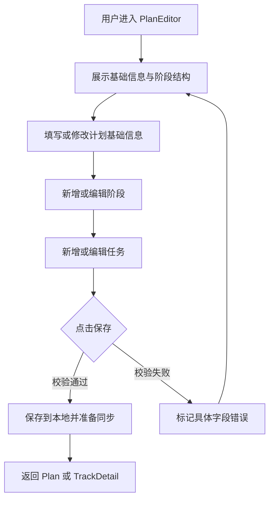
```mermaid
flowchart TD
    A["用户进入 PlanEditor"] --> B["展示基础信息与阶段结构"]
    B --> C["填写或修改计划基础信息"]
    C --> D["新增或编辑阶段"]
    D --> E["新增或编辑任务"]
    E --> F{"点击保存"}
    F -->|校验通过| G["保存到本地并准备同步"]
    F -->|校验失败| H["标记具体字段错误"]
    G --> I["返回 Plan 或 TrackDetail"]
    H --> B
```

### 详细交互说明

1. 用户从 `Plan`、`TrackDetail` 或 `Chat` 草稿进入 `PlanEditor` 后，先看到顶部操作区和计划基础信息区。
2. 用户先填写计划名称、时间范围、类型等基础字段，再继续进入阶段编辑区。
3. 用户在阶段列表区新增阶段后，可继续填写阶段目标，并在该阶段下添加具体任务。
4. 用户点击新增任务时，页面弹出任务录入弹框或浮层，在其中补充任务标题、类型、时间和说明。
5. 若本次来自 `Chat`，则基础字段、阶段和任务应尽量预填充，用户以校对和微调为主。
6. 用户点击保存后，系统先做本地字段校验；校验通过则写入本地计划数据，并回写到 `Plan`、`BattleMap`、`TrackDetail` 等页面；若校验失败，则在具体字段附近显示错误提示。

### 关键状态/异常情况

- 新建态：字段为空，突出从零开始填写。
- 编辑态：展示已有计划结构，重点是修改与补充。
- 草稿预填充态：来自 `Chat`，字段已有初始内容，用户做确认和调整。
- 任务弹框态：用于新增或编辑单个任务。
- 离线保存态：保存到本地立即成功，不等待接口返回。
- 同步失败态：计划已本地保存，仅显示待同步提示，不丢失编辑结果。

### 验收标准

- 新建、编辑、草稿预填充三种场景都可用。
- 页面结构清楚区分基础信息、阶段和任务。
- 保存失败时能明确指出出错字段，不出现静默失败。
- 本地保存结果能即时回写到相关页面。

## 7.9 Profile 页

### 页面定位

`Profile` 是个人中心入口页，用于展示个人概览、当前偏好设置摘要和进入更完整资料页的入口。

### 参考素材

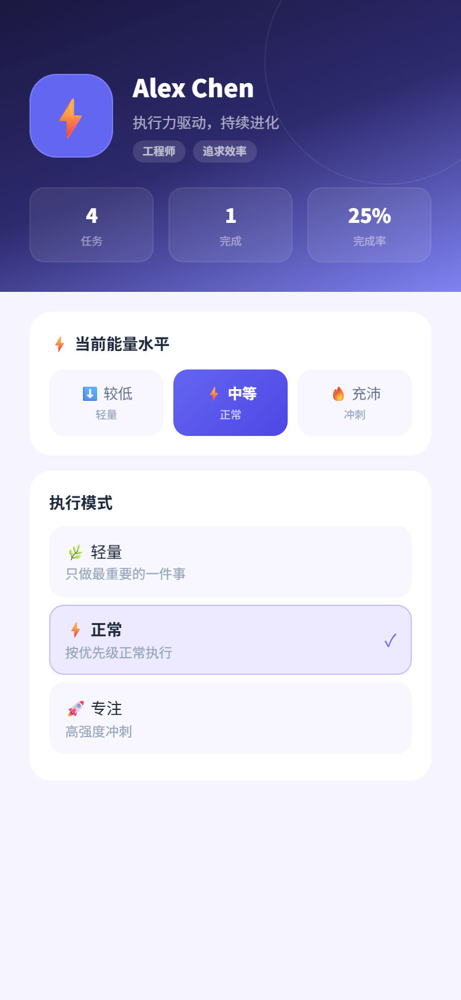

### 页面结构（从上到下）

1. 顶部个人概览区：头像、昵称、基础身份信息。
2. 状态与偏好区：能量、模式、偏好等摘要卡片。
3. 统计或成果区：展示轻量执行数据。
4. 资料入口区：进入 `UserProfile` 的主入口。

### 区块说明

- 顶部个人概览区：让用户确认这是自己的个人中心。
- 状态与偏好区：承载对当前执行风格和使用习惯的轻量表达。
- 统计区：给用户一定成果感，但不做复杂分析页。
- 资料入口区：作为深入编辑资料的明确出口。

### 主要功能

- 展示个人概览。
- 承载执行相关偏好摘要。
- 进入 `UserProfile` 做详细资料编辑。

### 交互流程图

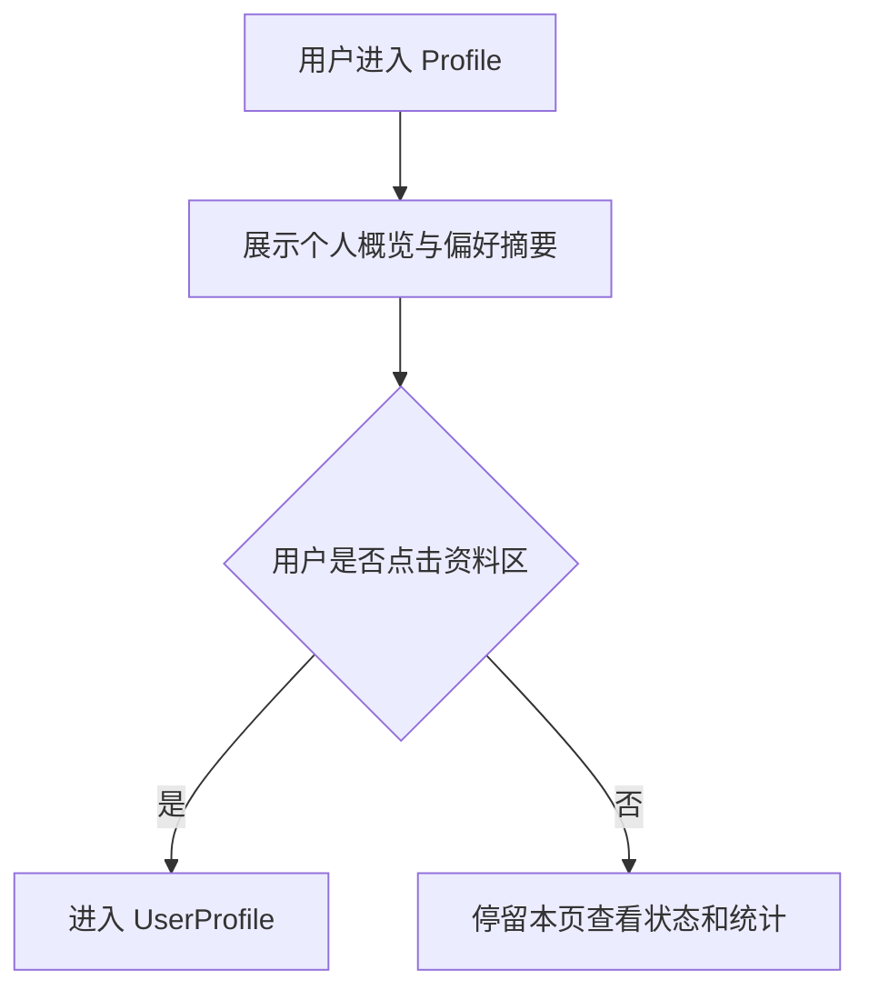
```mermaid
flowchart TD
    A["用户进入 Profile"] --> B["展示个人概览与偏好摘要"]
    B --> C{"用户是否点击资料区"}
    C -->|是| D["进入 UserProfile"]
    C -->|否| E["停留本页查看状态和统计"]
```

### 详细交互说明

1. 用户进入 `Profile` 后，先看到头像、昵称和个人概览卡片。
2. 页面向下展示偏好、状态和轻量统计，用于告诉用户当前处于什么执行状态。
3. 用户点击资料入口后，进入 `UserProfile` 进行更完整的编辑。
4. 用户从 `UserProfile` 返回时，本页应即时展示最新资料。

### 关键状态/异常情况

- 默认态：展示个人资料摘要与偏好。
- 信息较少态：缺少部分资料时仍显示结构，但突出补全入口。
- 返回刷新态：从 `UserProfile` 返回后刷新显示。

### 验收标准

- 页面一眼可识别为个人中心。
- 用户能快速找到资料编辑入口。
- 信息量适中，不堆砌无关设置。

## 7.10 UserProfile 页

### 页面定位

`UserProfile` 是更完整的个人资料页，用于编辑头像、昵称、简介、标签等信息，并展示轻量成果摘要。

### 参考素材

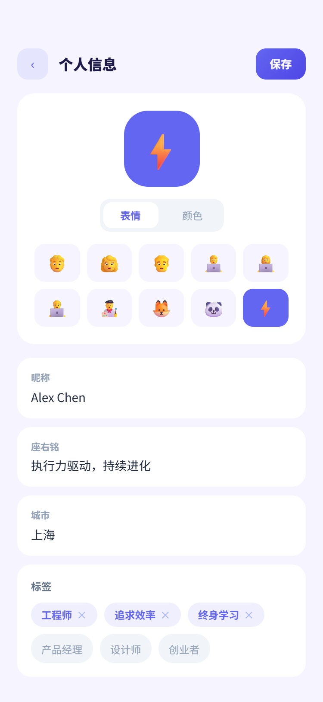

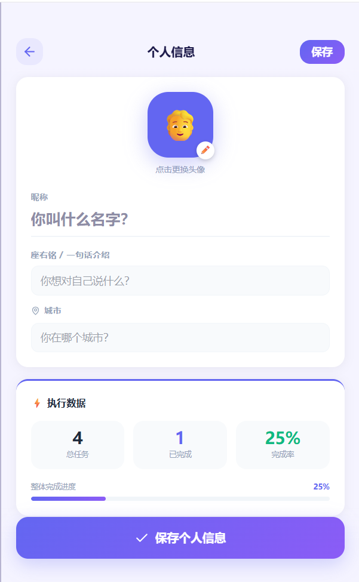

### 页面结构（从上到下）

1. 顶部返回与标题区：返回上一级、页面标题。
2. 头像与身份区：头像、昵称、基础标签。
3. 资料字段区：简介、城市、个性标签等可编辑字段。
4. 成果摘要区：轻量展示执行数据或个人成果。
5. 底部保存区：保存当前资料修改。

### 区块说明

- 顶部返回区：维持与 `Profile` 的层级关系。
- 头像与身份区：是页面最先被感知的个人信息区。
- 资料字段区：用于逐项完善资料内容。
- 成果摘要区：强化“这是个人主页”，而不仅是表单页面。
- 底部保存区：确保用户完成修改后能明确提交。

### 主要功能

- 编辑头像。
- 编辑昵称、简介、城市和标签等资料。
- 展示轻量个人成果信息。
- 保存后回写到 `Profile`。

### 交互流程图

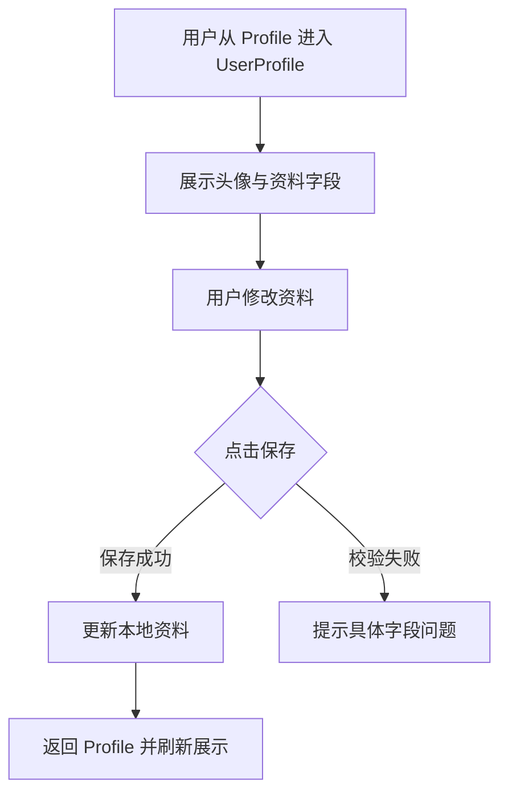
```mermaid
flowchart TD
    A["用户从 Profile 进入 UserProfile"] --> B["展示头像与资料字段"]
    B --> C["用户修改资料"]
    C --> D{"点击保存"}
    D -->|保存成功| E["更新本地资料"]
    E --> F["返回 Profile 并刷新展示"]
    D -->|校验失败| G["提示具体字段问题"]
```

### 详细交互说明

1. 用户从 `Profile` 进入 `UserProfile` 后，先看到头像、昵称和基础身份信息。
2. 页面向下展示可编辑字段，用户可依次修改简介、城市、标签等内容。
3. 页面下部可展示轻量成果摘要，让个人资料页既能编辑，也能体现使用积累。
4. 用户点击保存后，系统优先将资料写入本地，再返回 `Profile` 并刷新显示。
5. 若字段缺失或格式不符合要求，则在当前字段附近直接提示，不跳出笼统报错。

### 关键状态/异常情况

- 默认态：已有资料，允许编辑和保存。
- 空资料态：字段较少，突出补全内容。
- 校验失败态：在对应字段附近展示错误提示。
- 离线保存态：本地立即生效，后续再与服务端同步。

### 验收标准

- 用户能顺着页面从上到下完成资料编辑。
- 保存逻辑稳定，返回后最新资料即时可见。
- 页面兼具资料编辑与个人主页感，而不只是单纯表单。

---

## 8. 核心业务规则

### 8.1 计划结构

当前版本采用以下逻辑结构：

`Plan -> Phase -> Task -> TaskInstance`

说明：

- Plan：一条完整计划。
- Phase：计划中的阶段。
- Task：计划中的任务定义。
- TaskInstance：面向具体执行时刻的实例。

### 8.2 执行结果

任务执行结果至少包括：

- 完成
- 推迟
- 放弃

### 8.3 推迟规则

当前版本先定义为：

- 推迟默认只作用于当前任务实例。
- 不自动修改重复任务规则。
- 若后续需要支持“连带修改重复规则”，作为后续版本扩展。

### 8.4 登录与身份规则

当前版本无登录系统，默认用户以本地身份使用产品。

规则：

- 不出现注册、登录、登出页面。
- 本地资料与计划数据仅绑定当前设备。
- 后续可增加账号系统，但不影响本期核心流程。

### 8.6 离线与存储规则

当前版本采用“本地可用优先”的数据策略。

规则：

- 计划数据默认保存在前端本地。
- 本地数据至少覆盖：
  - 计划基本信息
  - 阶段信息
  - 任务信息
  - 任务实例状态
  - 用户本地资料与偏好
- 创建计划、编辑计划、查看计划、执行反馈都不能依赖后端实时返回才能完成。
- 如果接口调用失败，前端仍应保留本次操作结果，并标记为待同步。
- 后端存在时，接口负责：
  - 上传本地新增与更新数据
  - 拉取服务端最新数据
  - 处理本地与服务端的状态对齐

从长期产品角度看，本地存储不只服务于计划，也会成为未来笔记、想法、资料整理模块的基础能力。

### 8.7 数据同步原则

- 前端是当前版本的可用性保证层。
- 后端是数据同步、补偿更新和未来跨设备扩展的支撑层。
- 当前版本不要求强实时同步，但要求具备明确的同步机制预留。
- 同一条计划在前端完成修改后，应先本地生效，再等待与后端对齐。

长期扩展要求：

- 计划、笔记、资料、分类结构未来都应遵守“本地先可用，再多端同步”的原则。
- AI 自动整理结果也需要能够回写到本地结构，并在后续与服务端保持一致。

### 8.5 时区规则

当前版本默认使用设备时区。

说明：

- 所有当前时刻判断、日程定位和任务显示均以设备时区为准。
- 后续若增加账号体系，再扩展用户级时区配置。

---

## 9. 前后端交互说明

> 当前版本虽无登录系统，但仍保留前后端接口规划，用于后续 Flutter + Kotlin 实现。
> 需要强调：接口不是计划能力的前置依赖，前端在离线场景下也必须具备完整的本地计划能力。

### 9.1 统一接口约定

- 返回结构：`{ code, message, data }`
- `code = 0` 表示成功
- 失败时通过 `message` 提供可读提示

接口职责补充：

- 接口用于同步、更新、补偿和服务端持久化。
- 接口不可用时，前端不能因此失去本地计划能力。
- 前端需要维护本地数据版本，并在合适时机与后端对齐。

### 9.2 核心接口

| 模块 | 方法 | 路径 | 说明 |
|------|------|------|------|
| Now | GET | `/api/v1/now` | 获取当前应执行任务 |
| 执行反馈 | PATCH | `/api/v1/task-instances/{id}` | 更新任务实例状态 |
| 计划 | GET | `/api/v1/plans` | 获取计划列表 |
| 计划 | POST | `/api/v1/plans` | 创建计划 |
| 计划 | PUT | `/api/v1/plans/{id}` | 更新计划 |
| 计划 | DELETE | `/api/v1/plans/{id}` | 删除计划 |
| 日程 | GET | `/api/v1/plans/schedule` | 获取日/周视图数据 |
| 总览 | GET | `/api/v1/overview/battle-map` | 获取计划总体介绍数据 |
| 详情 | GET | `/api/v1/plans/{id}/timeline` | 获取单条计划时间线 |
| 对话 | GET | `/api/v1/chat/messages` | 获取对话历史 |
| 对话 | POST | `/api/v1/chat/messages` | 发送消息生成计划草稿 |
| 草稿应用 | POST | `/api/v1/chat/plan-drafts/apply` | 应用计划草稿 |
| 个人资料 | GET | `/api/v1/me/profile` | 获取个人信息 |
| 个人资料 | PUT | `/api/v1/me/profile` | 更新个人信息 |
| 偏好设置 | GET/PUT | `/api/v1/me/settings` | 获取/更新偏好 |

### 9.3 关键交互链路

#### 链路零：离线创建计划

1. 用户在无网络状态下进入 PlanEditor。
2. 用户填写计划并点击保存。
3. 前端先将计划写入本地存储。
4. Plan、BattleMap、TrackDetail、Now 立即基于本地数据更新。
5. 当网络恢复后，系统再将该计划同步到后端。

#### 链路一：获取当前执行任务

1. 用户进入 Now 页。
2. 若本地已有计划与任务实例，前端可先基于本地数据计算和展示当前任务。
3. 有网络时，前端可再请求 `GET /api/v1/now`` 以校对或补充最新状态。
4. 后端返回当前时间段匹配的任务实例后，前端按策略更新本地结果。

#### 链路二：执行反馈

1. 用户在 Now 页点击完成、推迟或放弃。
2. 前端先更新本地任务实例状态。
3. 若当前有网络，则请求 `PATCH /api/v1/task-instances/{id}`。
4. 后端更新成功后与本地状态对齐。
5. 若当前无网络，则本地保留该变更，待网络恢复后再同步。

#### 链路三：Chat 生成计划

1. 用户发送自然语言需求。
2. 前端请求 `POST /api/v1/chat/messages`。
3. 后端返回消息结果与计划草稿。
4. 用户确认后调用 `POST /api/v1/chat/plan-drafts/apply`。
5. 系统生成正式计划数据。

#### 链路四：PlanEditor 保存计划

1. 用户填写计划信息。
2. 前端先完成本地校验与本地保存。
3. 若有网络，则提交 `POST /api/v1/plans` 或 `PUT /api/v1/plans/{id}`。
4. 后端校验并保存后，与前端本地状态保持一致。
5. 即使接口暂不可用，前端也应允许用户先完成计划保存并继续使用。

### 9.4 前端本地数据要求

前端至少需要保存以下本地数据：

- 计划列表
- 计划详情
- 阶段与任务结构
- 任务实例状态
- 用户偏好和个人资料
- 待同步操作记录或待同步状态标记

未来应扩展保存：

- 笔记内容
- 想法碎片记录
- 资料归档信息
- AI 生成的分类建议与整理结果

前端本地数据能力目标：

- 首次创建后可在离线状态继续使用。
- 页面进入优先读本地，再决定是否请求接口刷新。
- 用户在弱网环境下不会因为单次接口失败而丢失已编辑内容。

---

## 10. 非功能需求

### 10.1 性能

- 首屏可交互时间目标小于 3 秒。
- 页面切换应保持流畅。
- 计划列表、时间线和主要卡片页面不应明显卡顿。

### 10.2 易用性

- 首次进入后无需复杂学习即可理解基本路径。
- 用户能从主框架快速判断产品的四个一级入口。
- 核心操作路径尽量控制在 3 步以内。

### 10.3 可扩展性

- 当前版本虽然不做登录系统，但数据模型和接口规划要保留后续接入空间。
- Chat、计划体系、执行反馈等核心模块要支持后续增强。
- 产品需要保留从“计划执行工具”演进为“多端个人助理”的空间。
- 页面结构、数据模型与命名应尽量避免只适配单一计划场景。
- 后续新增笔记、资料、复盘、AI 整理模块时，不应推翻当前已有核心结构。

### 10.4 离线可用性

- 断网情况下，核心页面仍可进入和使用。
- 计划创建、计划编辑、任务状态更新必须可本地完成。
- 本地操作结果不能因为接口失败而丢失。
- 网络恢复后应具备补偿同步能力。

### 10.5 数据安全

- 当前版本至少保证本地存储结构清晰可控。
- 后续接入后端时，敏感能力通过服务端统一处理。

---

## 11. 里程碑规划

| 阶段 | 内容 |
|------|------|
| MVP | Splash、主框架、Now、Chat、Plan、BattleMap、TrackDetail、PlanEditor、Profile、UserProfile |
| 二期 | 真正的 LLM、同步能力、推送提醒、更多执行分析、PC 版本准备 |
| 三期 | 登录系统、跨设备同步、笔记模块、资料整理、AI 自动分类 |
| 长期 | 多端个人助理、记录-整理-规划-执行-复盘一体化 |

---

## 12. 待确认项

- Chat 生成计划后是直接进入 PlanEditor 预填充，还是支持一键落库后再进入编辑。
- BattleMap 中是否需要默认示例主线数据，还是只展示真实用户数据。
- Profile 中执行统计的展示维度是否只保留轻量摘要。
- 产品正式名称是否继续沿用“执行力”，还是在进入多端个人助理阶段前完成更名。
- 长期信息架构中，笔记、资料、想法与计划之间采用何种主导航关系。
- AI 自动整理优先服务哪类内容：笔记、资料、灵感，还是全部统一处理。

---

## 附录 A：与参考资料对齐说明

- 路由结构与 `references/docs/执行力-产品文档-v1.1-2026-03-31.md` 保持一致。
- 页面视觉方向参考 `references/docs/执行力-颜色文档-v1.1.md` 与 UI 截图。
- 页面映射关系参考 `references/README.md` 中的图片索引。

## 附录 B：本轮修订重点

- 移除了当前版本对登录系统的依赖。
- 增加了整体 App 交互描述。
- 将页面级说明扩展为“配色方案 + 图标选择 + 功能 + 交互流程 + 验收标准”。
- 将文档表述调整为更适合作为商业化 App 产品文档的结构。
- 补充了离线优先、本地存储与同步补偿原则。
- 将产品长期定位扩展为多端个人助理，并为更名与 AI 自动整理能力预留空间。

## 附录 C：UI 素材与页面对照

当前 PRD 已接入现有 UI 素材，后续在评审、设计还原和开发拆解时，应优先按以下映射进行对照。

### C.1 主框架与一级页面

| 页面/模块 | 对应素材 |
|------|------|
| 底部导航栏 | `31-主页_执行力-底部导航栏.png` |
| Chat 页 | `27-主页_执行力-Chat 页.png` |
| Now 页 | `28-主页_执行力-Now 页.png` |
| Plan 页 | `29-主页_执行力-Plan 页.png` |
| Profile 页 | `30-主页_执行力-Profile 页.png` |
| 开屏页 | `26-开屏页面_执行力-开屏页.png` |

### C.2 计划相关页面

| 页面/模块 | 对应素材 |
|------|------|
| BattleMap | `18-计划_计划主页_执行力-作战地图1.png` |
| BattleMap | `19-计划_计划主页_执行力-作战地图2.png` |
| BattleMap 补充稿 | `25-计划_执行力-作战地图.png` |
| TrackDetail | `16-计划_计划详情_执行力-主线详情1.png` |
| TrackDetail | `17-计划_计划详情_执行力-主线详情2.png` |
| TrackDetail 补充稿 | `24-计划_执行力-主线详情.png` |

### C.3 PlanEditor 页面

| 页面/模块 | 对应素材 |
|------|------|
| PlanEditor 新建计划 | `13-计划_计划编辑_执行力-计划编辑器-新建计划1.png` |
| PlanEditor 新建计划 | `14-计划_计划编辑_执行力-计划编辑器-新建计划2.png` |
| PlanEditor 新建计划 | `15-计划_计划编辑_执行力-计划编辑器-新建计划3.png` |
| PlanEditor 编辑计划 | `04-计划_计划编辑_执行力-计划编辑器-编辑计划1.png` |
| PlanEditor 编辑计划 | `05-计划_计划编辑_执行力-计划编辑器-编辑计划2.png` |
| PlanEditor 编辑计划 | `06-计划_计划编辑_执行力-计划编辑器-编辑计划3.png` |
| 阶段目标编辑 | `07-计划_计划编辑_执行力-计划编辑器-编辑计划4-阶段目标.png` |
| 阶段目标编辑 | `08-计划_计划编辑_执行力-计划编辑器-编辑计划5-阶段目标.png` |
| 添加任务弹窗 | `09-计划_计划编辑_执行力-计划编辑器-编辑计划6-阶段目标-添加任务弹框.png` |
| 添加任务弹窗 | `10-计划_计划编辑_执行力-计划编辑器-编辑计划6-阶段目标-添加任务弹框2.png` |
| 添加任务弹窗 | `11-计划_计划编辑_执行力-计划编辑器-编辑计划7-阶段目标-添加任务弹框2.png` |
| PlanEditor 收尾状态 | `12-计划_计划编辑_执行力-计划编辑器-编辑计划8.png` |
| PlanEditor 散图补充 | `20-计划_执行力-计划编辑器.png` |
| PlanEditor 散图补充 | `21-计划_执行力-计划编辑器-编辑计划1.png` |
| PlanEditor 散图补充 | `22-计划_执行力-计划编辑器-编辑计划2.png` |
| PlanEditor 散图补充 | `23-计划_执行力-计划编辑器-编辑计划6-阶段目标-添加任务弹框2.png` |

### C.4 个人信息页面

| 页面/模块 | 对应素材 |
|------|------|
| UserProfile | `01-个人页面_执行力-个人信息页.png` |
| UserProfile | `02-个人页面_执行力-个人信息页1.png` |
| UserProfile | `03-个人页面_执行力-个人信息页2.png` |

### C.5 使用原则

- 页面说明与素材冲突时，优先以当前 PRD 的产品定义为准，再回头修正素材说明。
- 同一页面有多张素材时，应理解为状态变化、编辑步骤变化或设计迭代稿，不应机械视为完全独立页面。
- 后续新增 PC 版或笔记/资料模块时，建议沿用本附录结构继续追加素材映射。
