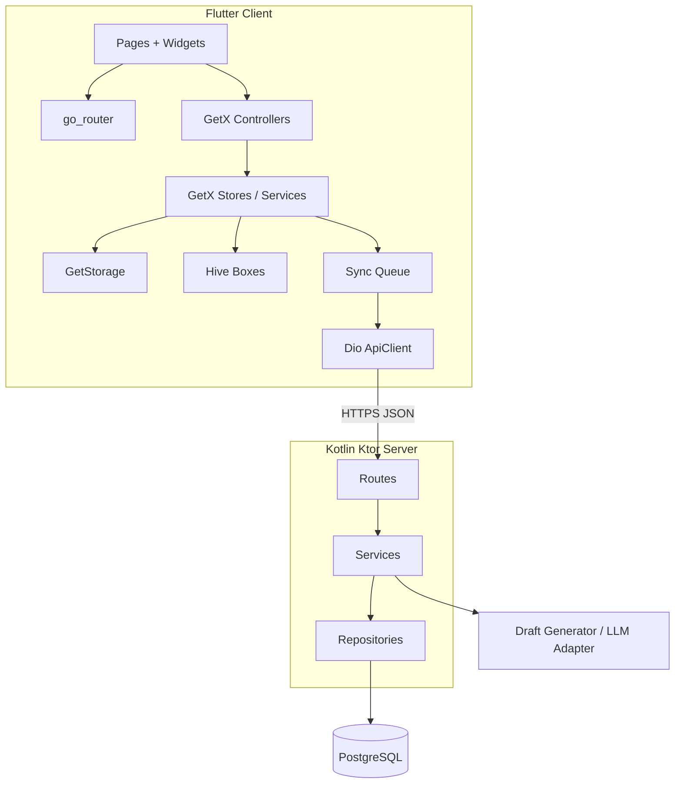

# 执行力 技术方案计划

> 版本：v1.3  
> 更新时间：2026-05-12  
> 关联需求文档：[../01-需求/requirements.md](../01-需求/requirements.md)  
> 关联产品文档：[../01-需求/references/docs/执行力-产品文档-v1.1-2026-03-31.md](../01-需求/references/docs/执行力-产品文档-v1.1-2026-03-31.md)  
> 关联设计计划：[../01-需求/figma-design-plan.md](../01-需求/figma-design-plan.md)

---

## 1. 系统架构概述

### 1.1 整体架构



当前版本采用“前端本地优先、后端同步补偿”的架构，不把后端当作当前版本首屏和主链路的前置依赖。

### 1.2 架构原则

- 本地优先：计划、任务、聊天、资料、笔记先写本地。
- 弱网可用：接口失败不回滚本地成功操作。
- 同步补偿：网络恢复后由同步队列重放待同步操作。
- 页面真源统一：PRD + Figma 设计计划 + 当前 Figma 设计稿三者一致后，再进入编码。
- 模块可扩展：当前版本已纳入 `Notes`，后续可继续扩展资料整理、复盘与 AI 自动整理。

### 1.3 技术栈选型

| 层级 | 技术 | 版本 | 选型理由 |
|------|------|------|---------|
| 前端 | Flutter | 3.24+ | 移动优先，后续可扩展桌面端 |
| 状态管理 | GetX | 4.7+ | 与当前工程组织一致，页面状态与服务边界清晰 |
| 路由 | go_router | 16.x | 统一一级页、二级页和参数路由 |
| 网络 | dio | 5.x | 拦截器、错误处理和统一请求头成熟 |
| 轻量存储 | GetStorage | 最新稳定版 | 保存安装实例、轻量设置、启动标记 |
| 结构化数据 | Hive | 2.x | 足够承载计划、聊天、资料和 Notes 结构 |
| 后端 | Kotlin + Ktor | Kotlin 2.x / Ktor 2.x | 轻量 REST 服务，便于模块化扩展 |
| 服务端 ORM | Exposed | 0.5x | 与 Kotlin 配合自然 |
| 服务端数据库 | PostgreSQL | 15+ | 结构化数据稳定，支持后续扩展 |
| 数据迁移 | Flyway | 10.x | 管理 schema 变更 |

### 1.4 当前版本关键技术决策

- Flutter 端唯一有效口径为 `GetX + GetStorage + Hive + Global.init()`。
- 当前版本没有登录系统，设备实例通过 `installation_id` 区分。
- `Chat` 草稿生成和 `Notes` 编辑都必须支持本地优先。
- `Notes` 已进入当前版本，不再作为长期规划功能。
- 设计与编码的公开路由以当前 PRD 为准：
  - `/`
  - `/chat`
  - `/plan`
  - `/notes`
  - `/profile`
  - `/plan/battle`
  - `/plan/battle/:trackId`
  - `/plan/editor`
  - `/plan/editor/:id`
  - `/profile/me`
  - `/notes/folder/:id`
  - `/notes/file/:id`

---

## 2. 数据设计

### 2.1 本地数据模型

| 实体 | 说明 | 关键字段 |
|------|------|---------|
| `local_profiles` | 本地个人资料 | `id`, `name`, `bio`, `city`, `tags_json`, `updated_at` |
| `local_settings` | 本地偏好 | `id`, `energy_level`, `mode`, `timezone`, `updated_at` |
| `plans` | 计划主表 | `id`, `title`, `type`, `start_date`, `end_date`, `updated_at`, `sync_state` |
| `plan_phases` | 阶段表 | `id`, `plan_id`, `title`, `sort_order`, `objective`, `status` |
| `plan_tasks` | 任务定义表 | `id`, `plan_id`, `phase_id`, `title`, `task_type`, `priority` |
| `task_instances` | 执行实例表 | `id`, `task_id`, `scheduled_at`, `status`, `resolution`, `updated_at` |
| `chat_messages` | Chat 消息表 | `id`, `role`, `content`, `draft_payload`, `created_at` |
| `plan_drafts` | 计划草稿表 | `id`, `source`, `draft_json`, `status`, `created_at` |
| `note_folders` | 笔记文件夹表 | `id`, `name`, `parent_id`, `updated_at`, `sync_state` |
| `note_files` | 笔记文件表 | `id`, `title`, `folder_id`, `format`, `content`, `updated_at`, `sync_state` |
| `sync_operations` | 待同步操作队列 | `id`, `entity_type`, `entity_id`, `op_type`, `payload_json`, `retry_count`, `status` |

### 2.2 服务端数据模型

| 实体 | 说明 | 关键字段 |
|------|------|---------|
| `device_installations` | 设备实例 | `installation_id`, `platform`, `app_version`, `last_seen_at` |
| `profiles` | 设备级资料 | `installation_id`, `name`, `bio`, `city`, `tags_json` |
| `settings` | 设备级偏好 | `installation_id`, `energy_level`, `mode`, `timezone` |
| `plans` | 服务端计划主表 | `id`, `installation_id`, `title`, `version`, `updated_at` |
| `plan_phases` | 服务端阶段表 | `id`, `plan_id`, `sort_order`, `objective`, `status` |
| `plan_tasks` | 服务端任务定义 | `id`, `plan_id`, `phase_id`, `task_type`, `priority` |
| `task_instances` | 服务端执行实例 | `id`, `task_id`, `scheduled_at`, `status`, `resolution`, `version` |
| `chat_messages` | 对话历史 | `id`, `installation_id`, `role`, `content`, `draft_payload` |
| `note_folders` | 服务端笔记文件夹 | `id`, `installation_id`, `parent_id`, `name`, `version`, `updated_at` |
| `note_files` | 服务端笔记文件 | `id`, `installation_id`, `folder_id`, `title`, `format`, `content`, `version`, `updated_at` |

### 2.3 实体关系

- `plans` 1 对多 `plan_phases`
- `plan_phases` 1 对多 `plan_tasks`
- `plan_tasks` 1 对多 `task_instances`
- `device_installations` 1 对 1 `profiles`
- `device_installations` 1 对 1 `settings`
- `device_installations` 1 对多 `plans`
- `device_installations` 1 对多 `chat_messages`
- `device_installations` 1 对多 `note_folders`
- `device_installations` 1 对多 `note_files`
- `note_folders` 1 对多 `note_folders`（父子层级）
- `note_folders` 1 对多 `note_files`

### 2.4 同步字段设计

所有核心实体都应具备以下同步辅助字段：

- `updated_at`
- `version` 或 `local_version`
- `sync_state`：`local_only / pending_sync / synced / sync_failed`
- `deleted_at`：软删除，可选

### 2.5 Notes 结构规则

- 当前版本支持 `NoteFolder -> NoteFolder -> NoteFile` 层级。
- `NoteFile.format` 当前仅支持：
  - `document`
  - `markdown`
- `NoteFile` 采用同页 `编辑 / 预览` 切换，不单独拆“编辑页”和“预览页”。

---

## 3. API 接口规划

### 3.1 统一接口规范

- 返回结构：`{ code, message, data }`
- 成功：`code = 0`
- 请求头：
  - `X-Installation-Id`
  - `X-App-Version`
  - `X-Timezone`
- 当前版本不做用户鉴权，不引入账号令牌

### 3.2 MVP 接口列表

| 模块 | 方法 | 路径 | 描述 |
|------|------|------|------|
| Now | GET | `/api/v1/now` | 获取服务端校对后的当前任务 |
| 执行反馈 | PATCH | `/api/v1/task-instances/{id}` | 更新任务实例状态 |
| 计划 | GET | `/api/v1/plans` | 获取计划列表 |
| 计划 | POST | `/api/v1/plans` | 创建计划 |
| 计划 | PUT | `/api/v1/plans/{id}` | 更新计划 |
| 计划 | DELETE | `/api/v1/plans/{id}` | 删除计划 |
| 日程 | GET | `/api/v1/plans/schedule` | 获取日/周视图数据 |
| 总览 | GET | `/api/v1/overview/battle-map` | 获取作战地图数据 |
| 详情 | GET | `/api/v1/plans/{id}/timeline` | 获取单条计划时间线 |
| 对话 | GET | `/api/v1/chat/messages` | 获取对话历史 |
| 对话 | POST | `/api/v1/chat/messages` | 发送消息并生成草稿 |
| 草稿应用 | POST | `/api/v1/chat/plan-drafts/apply` | 应用计划草稿 |
| 笔记 | GET | `/api/v1/notes` | 获取根目录笔记结构 |
| 笔记 | POST | `/api/v1/notes/folders` | 创建文件夹或子文件夹 |
| 笔记 | POST | `/api/v1/notes/files` | 创建笔记文件 |
| 笔记 | PUT | `/api/v1/notes/files/{id}` | 更新文件标题、格式与内容 |
| 笔记 | DELETE | `/api/v1/notes/{id}` | 删除文件夹或文件 |
| 个人资料 | GET | `/api/v1/me/profile` | 获取个人信息 |
| 个人资料 | PUT | `/api/v1/me/profile` | 更新个人信息 |
| 偏好设置 | GET | `/api/v1/me/settings` | 获取偏好 |
| 偏好设置 | PUT | `/api/v1/me/settings` | 更新偏好 |

### 3.3 接口职责说明

- `GET` 接口用于拉取远端状态、校对本地数据和设备重装后的恢复预留。
- `POST / PUT / PATCH / DELETE` 接口用于上传本地新增或变更结果。
- Notes 接口只做结构与内容同步，不阻塞本地浏览、创建与编辑。
- 接口不可用时，前端继续依赖本地数据工作。

### 3.4 关键链路技术实现

#### 链路 A：离线创建计划

1. `PlanEditor` 完成本地字段校验。
2. 写入 `plans / plan_phases / plan_tasks` 本地结构。
3. 生成 `sync_operations` 记录，状态为 `pending_sync`。
4. `Plan / BattleMap / TrackDetail / Now` 订阅本地数据变更并即时刷新。

#### 链路 B：Now 推荐

1. `NowService` 从本地读取计划、阶段、任务实例、用户状态。
2. 本地计算当前推荐任务、备用任务和推荐说明。
3. 有网络时调用 `/api/v1/now` 做校对或补充。

#### 链路 C：Chat 草稿

1. 前端提交消息到 `/api/v1/chat/messages`。
2. 服务端返回结构化草稿。
3. 前端把草稿写入 `plan_drafts` 本地结构。
4. 用户应用草稿后进入 `PlanEditor` 预填充。

#### 链路 D：Notes 创建与编辑

1. `Notes / NoteFolder` 先读取本地笔记结构。
2. 创建文件夹、子文件夹或笔记时，先写本地。
3. 进入 `NoteFile` 后在同页切换编辑与预览。
4. 有网络时按同步队列把文件夹和文件内容回写后端。

---

## 4. 前端模块划分（Flutter）

### 4.1 页面路由规划

| 路由 | 页面 | 说明 |
|------|------|------|
| `/splash` | SplashPage | 启动页 |
| `/` | NowPage | 默认一级页 |
| `/chat` | ChatPage | 一级入口进入的全屏页 |
| `/plan` | PlanPage | 一级页 |
| `/notes` | NotesPage | 一级页 |
| `/profile` | ProfilePage | 一级页 |
| `/plan/battle` | BattleMapPage | 二级页 |
| `/plan/battle/:trackId` | TrackDetailPage | 计划详情页 |
| `/plan/editor` | PlanEditorPage | 新建计划 |
| `/plan/editor/:id` | PlanEditorPage | 编辑计划 |
| `/profile/me` | UserProfilePage | 个人资料页 |
| `/notes/folder/:id` | NoteFolderPage | 子文件夹页 |
| `/notes/file/:id` | NoteFilePage | 文件页 |

### 4.2 核心模块列表

| 模块 | 功能描述 | 优先级 |
|------|---------|--------|
| AppShell | 主框架、5 Tab 导航、页面容器 | 高 |
| ThemeSystem | 颜色、字体、组件 Token 映射 | 高 |
| LocalStore | `GetStorage + Hive` 本地存储基座 | 高 |
| SyncEngine | 同步队列、重试、状态标记 | 高 |
| NowModule | 推荐任务计算、专注开始、换一个逻辑 | 高 |
| ChatModule | 对话消息、草稿管理、应用草稿 | 高 |
| PlanModule | 列表、概览、作战地图入口 | 高 |
| TrackModule | 详情、时间线、阶段与任务聚合 | 高 |
| PlanEditorModule | 计划、阶段、任务编辑与校验 | 高 |
| NotesModule | 文件夹、文件、Markdown 预览与本地同步 | 高 |
| ProfileModule | 资料、偏好、统计摘要 | 中 |

### 4.3 状态管理方案

- 页面状态：使用 `GetxController`
- 全局状态：使用 `GetxService` / `Store`
- 数据来源优先级：`Hive / GetStorage > Store 聚合态 > Remote refresh`
- 主壳页：`Now / Plan / Notes / Profile`
- Chat：占用一个导航入口，但进入后为独立沉浸页

### 4.4 前端目录建议

```text
lib/
├── apis/
├── models/
├── pages/
│   ├── splash/
│   ├── main/
│   ├── now/
│   ├── chat/
│   ├── plan/
│   ├── notes/
│   ├── note_folder/
│   ├── note_file/
│   ├── battle_map/
│   ├── track_detail/
│   ├── plan_editor/
│   ├── profile/
│   └── user_profile/
├── routes/
├── services/
├── store/
├── utils/
├── widgets/
├── global.dart
├── main.dart
└── theme.dart
```

---

## 5. 后端模块划分（Kotlin）

### 5.1 项目结构

```text
src/main/kotlin/
├── app/
├── config/
├── routes/
├── service/
├── repository/
├── model/
├── dto/
├── sync/
└── ai/
```

### 5.2 核心模块列表

| 模块 | 功能描述 | 优先级 |
|------|---------|--------|
| InstallationModule | 设备实例识别、请求上下文注入 | 高 |
| ProfileModule | 资料与偏好读写 | 高 |
| PlanModule | 计划、阶段、任务 CRUD | 高 |
| ScheduleModule | 日/周数据与时间线聚合 | 高 |
| NowModule | 服务端当前任务校对与推荐补充 | 中 |
| ChatModule | 消息存储、草稿生成、草稿应用 | 中 |
| NotesModule | 笔记文件夹、文件读写与同步 | 高 |
| SyncSupport | 版本比对、幂等处理、冲突兜底 | 高 |

### 5.3 服务端实现要点

- 以 `installation_id` 作为设备级数据隔离键。
- 所有写接口必须支持幂等重放。
- Notes 模块需支持文件夹树与文件内容分开存储、统一按设备隔离。
- `Now` 结果可以增强，但不能推翻客户端离线可用策略。

---

## 6. 开发任务拆分

### 6.1 前端任务（Flutter）

| 任务 | 描述 | 预估工作量 | 优先级 |
|------|------|----------|--------|
| T-F001 | 工程初始化、主题 Token、基础路由 | 2d | 高 |
| T-F002 | Splash + MainShell + 5 Tab 导航 | 2d | 高 |
| T-F003 | Plan 页面与 BattleMap 入口 | 2d | 高 |
| T-F004 | BattleMap + TrackDetail | 4d | 高 |
| T-F005 | PlanEditor 与本地保存链路 | 4d | 高 |
| T-F006 | Now 推荐与执行反馈 | 4d | 高 |
| T-F007 | Chat 页、草稿落本地、应用草稿 | 3d | 中高 |
| T-F008 | Notes / NoteFolder / NoteFile | 4d | 高 |
| T-F009 | Profile + UserProfile | 2d | 中 |
| T-F010 | 联调、异常态与 Figma 对照修正 | 3d | 高 |

### 6.2 后端任务（Kotlin）

| 任务 | 描述 | 预估工作量 | 优先级 |
|------|------|----------|--------|
| T-B001 | Ktor 工程骨架、配置、健康检查 | 1.5d | 高 |
| T-B002 | `installation_id` 上下文、统一响应结构 | 2d | 高 |
| T-B003 | Profile / Settings 接口 | 2d | 高 |
| T-B004 | Plan / Phase / Task CRUD 接口 | 4d | 高 |
| T-B005 | Timeline / Schedule / BattleMap 聚合接口 | 3d | 高 |
| T-B006 | TaskInstance 状态更新与幂等处理 | 2d | 高 |
| T-B007 | Chat 消息与草稿生成适配层 | 3d | 中 |
| T-B008 | Notes 文件夹与文件接口 | 3d | 高 |
| T-B009 | 同步辅助能力、版本比对、错误回写 | 2d | 中 |

---

## 7. 开发阶段规划

| 阶段 | 前端任务 | 后端任务 | 里程碑 |
|------|---------|---------|--------|
| 第一阶段（本地可用） | T-F001 ~ T-F006、T-F008、T-F009 | T-B001 ~ T-B006、T-B008 | 完成离线计划、离线笔记和主导航闭环 |
| 第二阶段（同步增强） | T-F007、T-F010 | T-B007、T-B009 | 完成 Chat 草稿、Notes 同步和异常态补偿 |
| 第三阶段（长期预留） | PC 适配、模块拆分 | 登录、多端同步、AI 整理 | 为个人助理型产品打基础 |

---

## 8. 风险与应对

| 风险 | 影响 | 应对方案 |
|------|------|---------|
| 文档口径与代码实现不一致 | 编码返工 | 先统一 PRD、Figma、技术方案和开发计划，再进入代码 |
| 离线与远端状态不一致 | 页面显示偏差 | 引入 `sync_state`、版本号和补偿同步 |
| Notes 层级与计划层级混淆 | 导航体验混乱 | 明确 `Notes` 是一级页，`NoteFolder / NoteFile` 是二级页 |
| Chat、Plan、Notes 三条链路相互引用过早 | 状态复杂度上升 | 当前版本先解耦，后续再做互链 |
| Markdown 预览实现质量不稳定 | 文件页体验下降 | 当前只覆盖标题、段落、列表的基础渲染 |

---

## 9. 结论

当前版本技术方案已经明确：

- Flutter 端以 `GetX + GetStorage + Hive + dio` 为核心，承担本地数据源职责。
- Kotlin 端以 `Ktor + Exposed + PostgreSQL` 为核心，承担同步与远端持久化职责。
- MVP 已正式纳入 `Notes`，并与 `Plan / Now / Chat / Profile` 并列成为当前版本能力。
- 后续可以在不推翻当前结构的前提下扩展到 PC、登录、多端同步和 AI 整理能力。

---

*本方案已与当前 PRD、Figma 设计计划、产品文档和 Flutter 实现路线对齐。*
