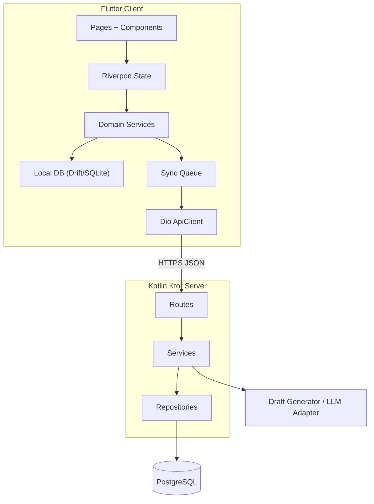

# 执行力 技术方案计划

> 版本：v1.2  
> 创建日期：2026-04-02  
> 关联需求文档：[../01-需求/requirements.md](../01-需求/requirements.md)  
> 关联需求清单：[../01-需求/requirements-list.md](../01-需求/requirements-list.md)

---

## 1. 系统架构概述

### 1.1 整体架构



本方案采用“前端本地优先、后端同步补偿”的架构，不把后端当作当前版本的主数据源。

- Flutter 端负责页面展示、本地存储、推荐计算、离线可用性与待同步队列。
- Kotlin 后端负责远端持久化、同步校对、草稿生成能力封装与后续多端扩展。
- 当前版本不做登录系统，也不做真实多设备同步，服务端数据以设备安装实例为边界。

### 1.2 架构原则

- 本地优先：计划、阶段、任务、任务实例、资料与偏好先写本地。
- 弱网可用：接口失败不回滚已完成的本地操作。
- 同步补偿：网络恢复后由同步队列重放未完成操作。
- 可扩展：为后续登录、跨端同步、笔记与资料模块预留统一数据基座。

### 1.3 技术栈选型

| 层级 | 技术 | 版本 | 选型理由 |
|------|------|------|---------|
| 前端 | Flutter | 3.24+ | 跨端一致性好，后续可扩展到移动端与桌面端 |
| 状态管理 | Riverpod | 3.x | 依赖注入清晰，适合离线优先与模块拆分 |
| 路由 | go_router | 14.x | 路由声明清晰，适合一级页和二级页混合导航 |
| 网络 | dio | 5.x | 拦截器、重试、统一响应处理成熟 |
| 本地数据库 | drift + SQLite | drift 2.x | 结构化数据能力强，适合离线存储和查询 |
| 本地缓存 | shared_preferences / secure_storage | 最新稳定版 | 保存轻量偏好、设备标识与敏感配置 |
| 后端 | Kotlin + Ktor | Kotlin 2.x / Ktor 2.x | 轻量 REST 服务，适合模块化扩展 |
| 服务端 ORM | Exposed | 0.5x | 与 Kotlin 配合自然，适合中小型业务建模 |
| 服务端数据库 | PostgreSQL | 15+ | 结构化数据稳定，支持后续扩展与分析 |
| 数据迁移 | Flyway | 10.x | 管理 schema 变更，便于后续迭代 |
| 任务调度 | WorkManager / server cron | 最新稳定版 | 客户端负责补偿同步，服务端负责周期任务预留 |

### 1.4 当前版本关键技术决策

- 不引入登录、JWT、Refresh Token。
- 客户端生成 `installation_id` 作为当前设备实例标识，并通过请求头上送。
- Chat 在 MVP 可先走“服务端草稿生成适配层”，底层可先接规则生成器或 mock，实现接口不变。
- Now 推荐优先由本地推荐引擎生成，服务端接口只作为校对和后续增强入口。

---

## 2. 数据设计

### 2.1 本地数据模型

| 实体 | 说明 | 关键字段 |
|------|------|---------|
| `local_profiles` | 本地个人资料 | `id`, `name`, `bio`, `city`, `tags_json`, `updated_at` |
| `local_settings` | 本地偏好 | `id`, `energy_level`, `mode`, `timezone`, `updated_at` |
| `plans` | 计划主表 | `id`, `title`, `type`, `start_date`, `end_date`, `status`, `updated_at`, `sync_state` |
| `plan_phases` | 阶段表 | `id`, `plan_id`, `title`, `sort_order`, `objective`, `status` |
| `plan_tasks` | 任务定义表 | `id`, `plan_id`, `phase_id`, `title`, `task_type`, `estimate_minutes`, `priority` |
| `task_instances` | 执行实例表 | `id`, `task_id`, `scheduled_at`, `status`, `resolution`, `updated_at` |
| `chat_messages` | Chat 消息表 | `id`, `role`, `content`, `draft_payload`, `created_at` |
| `plan_drafts` | 临时草稿表 | `id`, `source`, `draft_json`, `status`, `created_at` |
| `sync_operations` | 待同步操作队列 | `id`, `entity_type`, `entity_id`, `op_type`, `payload_json`, `retry_count`, `status` |

### 2.2 服务端数据模型

| 实体 | 说明 | 关键字段 |
|------|------|---------|
| `device_installations` | 设备实例 | `installation_id`, `platform`, `app_version`, `last_seen_at` |
| `profiles` | 设备级资料 | `installation_id`, `name`, `bio`, `city`, `tags_json` |
| `settings` | 设备级偏好 | `installation_id`, `energy_level`, `mode`, `timezone` |
| `plans` | 服务端计划主表 | `id`, `installation_id`, `title`, `type`, `version`, `updated_at` |
| `plan_phases` | 服务端阶段表 | `id`, `plan_id`, `sort_order`, `objective`, `status` |
| `plan_tasks` | 服务端任务定义 | `id`, `plan_id`, `phase_id`, `task_type`, `priority` |
| `task_instances` | 服务端执行实例 | `id`, `task_id`, `scheduled_at`, `status`, `resolution`, `version` |
| `chat_messages` | 对话历史 | `id`, `installation_id`, `role`, `content`, `draft_payload` |

### 2.3 实体关系

- `plans` 1 对多 `plan_phases`
- `plans` 1 对多 `plan_tasks`
- `plan_phases` 1 对多 `plan_tasks`
- `plan_tasks` 1 对多 `task_instances`
- `device_installations` 1 对 1 `profiles`
- `device_installations` 1 对 1 `settings`
- `device_installations` 1 对多 `plans`
- `device_installations` 1 对多 `chat_messages`

### 2.4 同步字段设计

所有核心实体都应具备以下同步辅助字段：

- `updated_at`：最近更新时间
- `version` 或 `local_version`：版本号
- `sync_state`：`local_only / pending_sync / synced / sync_failed`
- `deleted_at`：软删除时间，可选

### 2.5 冲突处理策略

- 当前版本默认单设备使用，冲突概率低，但仍保留统一规则。
- 计划和资料类实体采用“最新更新时间优先 + 服务端回写规范化结果”。
- `task_instances` 以最后一次明确操作时间为准。
- 同步失败时保留本地结果，并把实体标记为 `sync_failed`，由客户端继续重试。

---

## 3. API 接口规划

### 3.1 统一接口规范

- 返回结构：`{ code, message, data }`
- 成功：`code = 0`
- 请求头：
  - `X-Installation-Id`：设备安装实例标识
  - `X-App-Version`：客户端版本
  - `X-Timezone`：设备时区
- 当前版本不做用户鉴权，不引入账号令牌

### 3.2 MVP 接口列表

| 模块 | 方法 | 路径 | 描述 |
|------|------|------|------|
| Now | GET | `/api/v1/now` | 获取服务端校对后的当前任务 |
| 执行反馈 | PATCH | `/api/v1/task-instances/{id}` | 更新任务实例状态 |
| 计划 | GET | `/api/v1/plans` | 获取计划列表 |
| 计划 | POST | `/api/v1/plans` | 创建计划 |
| 计划 | PUT | `/api/v1/plans/{id}` | 更新计划 |
| 计划 | DELETE | `/api/v1/plans/{id}` | 删除计划 |
| 日程 | GET | `/api/v1/plans/schedule` | 获取日/周视图数据 |
| 总览 | GET | `/api/v1/overview/battle-map` | 获取作战地图数据 |
| 详情 | GET | `/api/v1/plans/{id}/timeline` | 获取单条计划时间线 |
| 对话 | GET | `/api/v1/chat/messages` | 获取对话历史 |
| 对话 | POST | `/api/v1/chat/messages` | 发送消息并生成草稿 |
| 草稿应用 | POST | `/api/v1/chat/plan-drafts/apply` | 应用计划草稿 |
| 个人资料 | GET | `/api/v1/me/profile` | 获取个人信息 |
| 个人资料 | PUT | `/api/v1/me/profile` | 更新个人信息 |
| 偏好设置 | GET | `/api/v1/me/settings` | 获取偏好 |
| 偏好设置 | PUT | `/api/v1/me/settings` | 更新偏好 |

### 3.3 接口职责说明

- `GET` 接口用于拉取远端状态、校对本地数据和设备重装后的恢复预留。
- `POST / PUT / PATCH / DELETE` 接口用于上传本地新增或变更结果。
- 接口不可用时，前端继续依赖本地数据工作，不将异常暴露成主流程阻断。

### 3.4 关键链路技术实现

#### 链路 A：离线创建计划

1. `PlanEditor` 完成本地字段校验。
2. 写入 `plans / plan_phases / plan_tasks` 本地表。
3. 生成一条 `sync_operations` 记录，状态为 `pending_sync`。
4. `Plan / BattleMap / TrackDetail / Now` 订阅本地数据变更并即时刷新。
5. 网络恢复后由同步任务发起 `POST / PUT / plans`。

#### 链路 B：Now 推荐

1. `NowRecommendationService` 从本地读取计划、阶段、任务实例、用户状态。
2. 本地计算当前推荐任务、备用任务和推荐文案。
3. 有网络时调用 `/api/v1/now` 对结果做校对或补充。
4. 若远端结果返回，与本地按版本策略合并。

#### 链路 C：执行反馈

1. 用户点击完成、推迟或放弃。
2. 客户端先更新 `task_instances` 与相关推荐结果。
3. 客户端写入同步队列。
4. 后台同步成功后更新 `sync_state` 为 `synced`。

#### 链路 D：Chat 草稿

1. 前端提交消息到 `/api/v1/chat/messages`。
2. 服务端调用草稿生成适配层，返回消息与结构化草稿。
3. 前端把草稿写入 `plan_drafts` 本地表。
4. 用户应用草稿后进入 `PlanEditor` 预填充。

---

## 4. 前端模块划分（Flutter）

### 4.1 页面路由规划

| 路由 | 页面 | 说明 |
|------|------|------|
| `/splash` | SplashPage | 启动页 |
| `/home/now` | NowPage | 默认一级页 |
| `/home/chat` | ChatPage | 一级页 |
| `/home/plan` | PlanPage | 一级页 |
| `/home/profile` | ProfilePage | 一级页 |
| `/plan/battle-map` | BattleMapPage | 二级页 |
| `/plan/:id` | TrackDetailPage | 计划详情页 |
| `/plan/editor` | PlanEditorPage | 新建计划 |
| `/plan/editor/:id` | PlanEditorPage | 编辑计划 |
| `/profile/me` | UserProfilePage | 个人资料页 |

### 4.2 核心模块列表

| 模块 | 功能描述 | 优先级 |
|------|---------|--------|
| AppShell | 主框架、底部导航、页面容器 | 高 |
| ThemeSystem | 颜色、字体、组件 Token 映射 | 高 |
| LocalStore | Drift 表定义、DAO、迁移 | 高 |
| SyncEngine | 同步队列、重试、状态标记 | 高 |
| NowEngine | 推荐任务计算、专注开始、换一个逻辑 | 高 |
| ChatModule | 对话消息、草稿管理、应用草稿 | 高 |
| PlanModule | 列表、概览、作战地图入口 | 高 |
| TrackModule | 详情、时间线、阶段与任务聚合 | 高 |
| PlanEditorModule | 计划、阶段、任务编辑与校验 | 高 |
| ProfileModule | 资料、偏好、统计摘要 | 中 |

### 4.3 状态管理方案

- 全局状态：主题、设备信息、网络状态、同步状态、当前安装实例。
- 领域状态：按 `Now / Chat / Plan / Profile` 分域 Provider 管理。
- 页面状态：表单输入、弹框状态、滚动位置等使用局部状态或 `StateNotifier`。
- 数据来源优先级：`Local DB > In-memory derived state > Remote refresh`。

### 4.4 前端目录建议

```text
lib/
├── app/
├── core/
│   ├── network/
│   ├── storage/
│   ├── sync/
│   ├── theme/
│   └── utils/
├── features/
│   ├── splash/
│   ├── shell/
│   ├── now/
│   ├── chat/
│   ├── plan/
│   ├── track/
│   ├── plan_editor/
│   └── profile/
└── shared/
```

---

## 5. 后端模块划分（Kotlin）

### 5.1 项目结构

```text
src/main/kotlin/
├── app/
├── config/
├── routes/
├── service/
├── repository/
├── model/
├── dto/
├── sync/
└── ai/
```

### 5.2 核心模块列表

| 模块 | 功能描述 | 优先级 |
|------|---------|--------|
| InstallationModule | 设备实例识别、请求上下文注入 | 高 |
| ProfileModule | 资料与偏好读写 | 高 |
| PlanModule | 计划、阶段、任务 CRUD | 高 |
| ScheduleModule | 日/周数据与时间线聚合 | 高 |
| NowModule | 服务端当前任务校对与推荐补充 | 中 |
| ChatModule | 消息存储、草稿生成、草稿应用 | 中 |
| SyncSupport | 版本比对、幂等处理、冲突兜底 | 高 |

### 5.3 服务端实现要点

- 以 `installation_id` 作为设备级数据隔离键。
- 所有写接口必须支持幂等重放，适应客户端补偿同步。
- `Now` 结果可以根据服务端规则增强，但不能推翻客户端离线可用策略。
- Chat 模块抽象为 `DraftGenerator` 接口，便于从 mock 过渡到真实 LLM。

---

## 6. 开发任务拆分

### 6.1 前端任务（Flutter）

| 任务 | 描述 | 预估工作量 | 优先级 |
|------|------|----------|--------|
| T-F001 | Flutter 工程初始化、主题 Token、基础路由 | 2d | 高 |
| T-F002 | Drift 本地数据库、DAO、迁移 | 3d | 高 |
| T-F003 | 同步队列、网络监听、待同步状态 | 3d | 高 |
| T-F004 | Splash + 主框架 + 底部导航 | 2d | 高 |
| T-F005 | Now 页、推荐引擎、开始专注、换一个逻辑 | 4d | 高 |
| T-F006 | Chat 页、草稿落本地、应用草稿 | 3d | 高 |
| T-F007 | Plan 页 + BattleMap 入口 + 列表刷新 | 3d | 高 |
| T-F008 | TrackDetail 时间线与阶段展示 | 3d | 高 |
| T-F009 | PlanEditor 表单、阶段任务编辑、校验 | 5d | 高 |
| T-F010 | Profile + UserProfile | 2d | 中 |

### 6.2 后端任务（Kotlin）

| 任务 | 描述 | 预估工作量 | 优先级 |
|------|------|----------|--------|
| T-B001 | Ktor 工程骨架、配置、健康检查 | 1.5d | 高 |
| T-B002 | installation_id 上下文、统一响应结构 | 2d | 高 |
| T-B003 | Profile / Settings 接口 | 2d | 高 |
| T-B004 | Plan / Phase / Task CRUD 接口 | 4d | 高 |
| T-B005 | Timeline / Schedule / BattleMap 聚合接口 | 3d | 高 |
| T-B006 | TaskInstance 状态更新与幂等处理 | 2d | 高 |
| T-B007 | Chat 消息与草稿生成适配层 | 3d | 中 |
| T-B008 | 同步辅助能力、版本比对、错误回写 | 2d | 中 |

---

## 7. 开发阶段规划

| 阶段 | 前端任务 | 后端任务 | 里程碑 |
|------|---------|---------|--------|
| 第一阶段（MVP 本地可用） | T-F001 ~ T-F009 | T-B001 ~ T-B006 | 完成离线创建、离线编辑、Now 执行闭环 |
| 第二阶段（同步增强） | T-F003、T-F010 优化 | T-B007 ~ T-B008 | 完成 Chat 草稿能力与同步补偿 |
| 第三阶段（长期预留） | PC 适配、模块拆分 | 登录、多端同步、AI 扩展 | 为个人助理型产品打基础 |

---

## 8. 风险与应对

| 风险 | 影响 | 应对方案 |
|------|------|---------|
| 离线与远端状态不一致 | 页面显示和远端数据偏差 | 引入 `sync_state`、版本号、补偿同步和幂等接口 |
| Now 推荐逻辑过于分散 | 难以维护和测试 | 单独抽象 `NowRecommendationService`，先本地统一计算 |
| 计划结构嵌套较深 | 编辑和保存逻辑复杂 | 前端分层表单建模，后端采用事务写入 |
| Chat 没有真实 LLM | 体验与最终形态有差距 | 先抽象 `DraftGenerator`，用 mock 或规则引擎保持接口稳定 |
| 后续扩展到笔记资料模块时模型冲突 | 重构成本高 | 统一本地存储、同步队列和 installation 级命名方式 |

---

## 9. 结论

当前版本技术方案已经明确：

- Flutter 端以 `Riverpod + Drift + Dio` 为核心，承担本地数据源职责。
- Kotlin 端以 `Ktor + Exposed + PostgreSQL` 为核心，承担同步与远端持久化职责。
- MVP 不做登录，不把后端作为主流程前置依赖。
- 后续可以在不推翻当前结构的前提下扩展到 PC、登录、多端同步与 AI 整理模块。

---

*本方案已与当前 PRD 的离线优先、无登录 MVP、页面级交互和长期个人助理方向对齐。*
