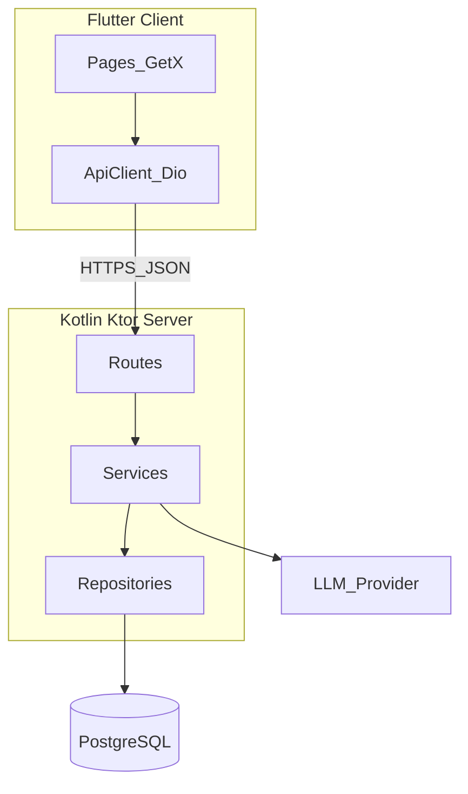

# 执行力 技术方案计划

> 版本：v1.1  
> 创建日期：2026-04-01  
> 关联需求文档：[../01-需求/requirements.md](../01-需求/requirements.md)  
> 关联需求清单：[../01-需求/requirements-list.md](../01-需求/requirements-list.md)

---

## 1. 系统架构概述

### 1.1 整体架构



- **前后端分离**：Flutter 调 Ktor REST；Chat 可选 **SSE**。
- **鉴权**：JWT + Refresh；LLM Key 仅服务端。

### 1.2 技术栈选型

| 层级 | 技术 | 说明 |
|------|------|------|
| 前端 | Flutter 3.24+ | GetX；dio |
| 后端 | Kotlin Ktor 2.x | |
| 数据库 | PostgreSQL 15+ | JSONB |
| 迁移 | Flyway / Liquibase | |

---

## 2. 数据库设计

### 2.1 核心表（MVP）

| 表名 | 说明 |
|------|------|
| `users` | 账号、密码哈希 |
| `refresh_tokens` | 刷新令牌 |
| `user_settings` | energy/mode/ai_model/timezone |
| `user_profiles` | 资料、tags JSONB |
| `master_plans` | 总体计划 |
| `plans` | 计划；`master_plan_id`；`plan_archetype`；可选 `is_template` |
| `plan_phases` | 阶段 |
| `plan_tasks` | 任务定义；`task_kind`：scheduled_block / recurring_checkin |
| `task_instances` | 执行实例；resolution |
| `chat_messages` | 对话；可选 plan_draft_json |
| `plan_drafts`（可选） | 待应用草案 |

### 2.2 ER（文字）

- users 1—1 settings/profiles；users 1—N master_plans、plans、messages、task_instances  
- master_plans 1—N plans  
- plans 1—N phases、plan_tasks；plan_tasks 1—N task_instances  

---

## 3. API 接口规划

| 模块 | 方法 | 路径 | 描述 |
|------|------|------|------|
| 认证 | POST | `/api/v1/auth/register` | 注册 |
| 认证 | POST | `/api/v1/auth/login` | 登录 |
| 认证 | POST | `/api/v1/auth/refresh` | 刷新 |
| 认证 | POST | `/api/v1/auth/logout` | 登出 |
| 用户 | GET/PUT | `/api/v1/me/settings` | 设置 |
| 用户 | GET/PUT | `/api/v1/me/profile` | 资料 |
| 用户 | POST | `/api/v1/me/purge` | 清空数据 |
| Now | GET | `/api/v1/now` | `at`、`tz` |
| 实例 | PATCH | `/api/v1/task-instances/{id}` | 完成/推迟/放弃 |
| 总体 | GET/POST | `/api/v1/master-plans` | 列表/创建 |
| 计划 | GET/POST/PUT/DELETE | `/api/v1/plans`… | CRUD |
| 计划 | GET | `/api/v1/plans/{id}/timeline` | 时间线 |
| 排期 | GET | `/api/v1/plans/schedule` | scope=day/week |
| 概览 | GET | `/api/v1/overview/battle-map` | year 或 master_plan_id |
| 对话 | GET/POST | `/api/v1/chat/messages` | 历史/发送 |
| 对话 | POST | `/api/v1/chat/plan-drafts/apply` | 应用草案 |

### 3.2 规范

- 返回 `{ code, message, data }`；JWT Bearer；错误码见实现。

---

## 4. Flutter 模块

| 路由 | 页面 | 说明 |
|------|------|------|
| splash / login / register | — | |
| home + Tab | Now/Chat/Plan/Profile | |
| battleMap | BattleMapView | |
| trackDetail | TrackDetailView | **planId** |
| planEditor | PlanEditorView | 可选 planId |

---

## 5. Kotlin 包结构

```
routes/: AuthRoutes, UserRoutes, NowRoutes, PlanRoutes, OverviewRoutes, ChatRoutes
service/, repository/, model/, dto/
```

---

## 6. 任务拆分（摘要）

| 前端 | 后端 |
|------|------|
| T-F001 工程/主题/网络 | T-B001 Ktor 骨架 |
| T-F002 认证 | T-B002 用户+JWT |
| T-F005 Now+推迟放弃 | T-B003 instances+/now |
| T-F006 Plan schedule | T-B004 plans+master |
| T-F007 PlanEditor | T-B005 schedule+battle+timeline |
| T-F008 Battle+TrackDetail | T-B006 chat+apply |
| T-F010 Chat 草案 | T-B007 settings/profile |

---

## 7. 风险

- 实例数据量：懒生成、缓存、分区  
- LLM 成本：限流、缓存  
- 计划树事务：PUT 全量+校验  

---

## 8. 种子数据

- 可选 5 条目标型模板 `plans.is_template=true`，用户可 fork。

---

*与 PRD 同步迭代。*
