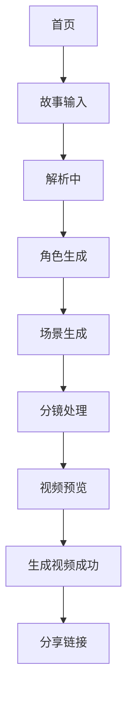

# 漫剧制作 App Figma 设计稿计划

> 版本：v1.0  
> 创建日期：2026-04-25  
> 状态：已按 375 x 812 生成 Figma UI 稿，并作为 Flutter UI 实现基准  
> 适用产品形态：手机 App  
> 输入文档：
> - `requirements.md`
> - `requirements-list.md`
> - `detection-report.md`
> - `references/README.md`
> - `references/images/`

---

## 1. 文档目的与适用范围

本文用于指导“漫剧制作 App”后续补齐 Figma 设计稿，明确需要出哪些手机端页面、关键状态、弹层、组件和交互原型。

当前 Figma 手机端设计稿已完成，后续 Flutter UI 编码必须以 Figma 设计稿为准。本文和 PRD 用于补充页面范围、业务规则和异常状态；原始宽屏截图只作为颜色、氛围和流程参考，不作为 Flutter 页面布局依据。

当前已有素材主要是宽屏视觉参考，颜色与流程方向基本可用，但不适合作为手机端最终尺寸标注稿。因此，Figma 出稿需要完成以下转换：

- 将宽屏三栏布局转换为手机端纵向页面、横向列表、底部弹层或分步页面。
- 保留深色背景、紫蓝渐变主按钮、卡片式内容区、流程进度条等视觉方向。
- 补齐当前缺失的故事输入页、场景生成页和关键异步状态。
- 明确每个核心页面的默认态、加载态、空态、失败态和操作反馈态。

本文服务于后续 Figma 设计、技术方案、Flutter 开发文档和编码实现。

---

## 2. 设计目标与视觉方向

### 2.1 设计目标

- 让用户在手机端顺畅完成“输入故事 -> AI 解析 -> 角色 / 场景 -> 分镜 -> 预览 -> 生成视频”。
- 每一步都有清晰的当前步骤、主操作、返回路径和跳过/重试路径。
- AI 生成耗时、失败、跳过等状态都要明确可见。
- 复杂编辑能力不能压垮手机屏幕，优先拆成底部弹层、折叠区、横向列表和二级设置页。

### 2.2 视觉方向

参考现有素材，设计应保持：

- 深色背景：偏黑紫 / 深蓝紫，营造 AI 创作与视频工作台氛围。
- 主色：紫蓝渐变，用于主按钮、流程高亮、选中边框。
- 强调色：亮紫、青绿、橙黄，用于状态标签、生成完成、草稿等状态。
- 卡片：深色卡片 + 细描边 + 轻微透明层次。
- 图标：线性图标，风格简洁，优先表达创作、生成、播放、分镜、角色、场景、音频。
- 图片：角色、场景、分镜封面应作为内容主体，避免被装饰压暗到无法识别。

### 2.3 移动端基准

建议 Figma 以以下尺寸优先出稿：

- 主设计尺寸：`375 x 812`。
- 补充检查尺寸：`390 x 844`、`430 x 932`。
- 底部固定操作区需考虑安全区。
- 页面内容需适配刘海屏、动态岛、底部手势区域。

---

## 3. 页面清单与优先级

| 优先级 | 页面 / 覆盖层 | 对应 PRD | 参考图片 | 高保真 | 交互稿 |
|--------|---------------|----------|----------|--------|--------|
| P0 | 首页 | 5.1 | `首页.png` | 必须 | 必须 |
| P0 | 故事输入 / 文本解析页 | 5.2 | 暂无 | 必须 | 必须 |
| P0 | 角色生成页 | 5.3 | `角色生成.png`、`角色生成-底部.png` | 必须 | 必须 |
| P0 | 场景生成页 | 5.4 | 复用角色生成结构 | 必须 | 必须 |
| P0 | 分镜处理页 | 5.5 | `分镜处理.png` | 必须 | 必须 |
| P0 | 分镜角色选择页 | 5.5 | 分镜参数派生 | 必须 | 必须 |
| P0 | 分镜场景选择页 | 5.5 | 分镜参数派生 | 必须 | 必须 |
| P0 | 视频预览页 | 5.6 | `预览页面.png` | 必须 | 必须 |
| P0 | 生成任务状态覆盖层 | 6.3 / 9.3 | 各页面派生 | 必须 | 必须 |
| P1 | 新建角色底部弹层 | 5.3 | `角色生成.png` 派生 | 必须 | 建议 |
| P1 | 新建场景底部弹层 | 5.4 | 角色生成结构派生 | 必须 | 建议 |
| P1 | 风格选择底部弹层 | 5.5 | `分镜处理.png` 派生 | 必须 | 必须 |
| P1 | 配音选择底部弹层 | 5.5 | `分镜处理.png` 派生 | 必须 | 必须 |
| P1 | 背景音效选择底部弹层 | 5.5 | `分镜处理.png` 派生 | 必须 | 必须 |
| P1 | 分享链接弹层 | 5.6 | `预览页面.png` 派生 | 必须 | 建议 |
| P2 | 新手教程页 / 弹窗 | 5.1 / 11 | `首页.png` 顶部入口 | 可选 | 可选 |
| P2 | 作品详情页 | 4 / 5.1 | 首页作品卡片派生 | 可并入预览页 | 可选 |

---

## 4. 页面到 PRD 章节 / 参考图映射

| 页面 | PRD 章节 | 当前参考表现 | 目标出稿要求 |
|------|----------|--------------|--------------|
| 首页 | 5.1 | 宽屏首页，包含品牌、主视觉、开始创作、作品列表 | 转为手机纵向滚动，首屏必须露出开始创作与部分作品/能力信息 |
| 故事输入 / 文本解析页 | 5.2 | 无现成素材 | 新增手机端页面，突出大文本输入框、解析按钮、解析中状态 |
| 角色生成页 | 5.3 | 宽屏角色卡片 + 底部确认区 | 转为手机端卡片流，底部固定“跳过 / 确认角色”操作 |
| 场景生成页 | 5.4 | 无现成素材，沿用角色页结构 | 以场景图片为主视觉，卡片内容改为场景名、氛围标签、描述 |
| 分镜处理页 | 5.5 | 宽屏左列表 + 中预览 + 右参数 | 转为加高手机页面：分镜横向条 + 当前预览 + 分镜描述 + 参数卡片 |
| 分镜角色选择页 | 5.5 | 分镜参数派生 | 独立选择页，支持多选角色并应用到当前分镜 |
| 分镜场景选择页 | 5.5 | 分镜参数派生 | 独立选择页，只能单选一个主场景并应用到当前分镜 |
| 视频预览页 | 5.6 | 宽屏播放器 + 右侧胶片列表 | 转为手机端：播放器 + 控制条 + 横向分镜胶片 + 生成 / 分享操作 |
| 生成任务状态 | 6.3 / 9.3 | 截图中有待生成、已完成等标签 | 统一设计待生成、排队中、生成中、失败、已完成、已跳过状态 |

---

## 5. 每页必出稿清单

## 5.1 首页

必须出稿：

- 首屏默认态：品牌、教程入口、主视觉文案、开始创作按钮。
- 有作品态：作品列表展示 3 到 5 个作品卡片。
- 无作品态：作品列表为空时的新建引导。
- 作品状态卡片：草稿、生成中、已完成、失败。
- 作品卡片点击反馈：按压态或进入态。
- 新手教程入口：入口样式即可，教程内容可后续补。

设计重点：

- 手机首屏不能只展示大标题，需要让“开始创作”足够靠前。
- 作品列表应适合纵向滑动，作品封面比例稳定。
- “我的作品”数量、全部作品入口和新建作品入口要保持清楚。

## 5.2 故事输入 / 文本解析页

必须出稿：

- 默认态：空文本框、提示文案、不可用主按钮。
- 输入态：已有文本、字数提示、可用主按钮。
- 解析中：按钮 loading、页面生成进度提示。
- 解析失败：错误提示、保留原文、重试按钮。
- 可选设置区：视频风格、预计时长、画幅比例的收起 / 展开表现。
- 键盘弹出态：底部按钮不能被遮挡。

设计重点：

- 文本框是核心，不要被装饰元素占据太多空间。
- 解析中状态要让用户知道正在“理解故事”，而不是普通加载。
- 如果提供辅助设置，默认保持轻量，避免用户在第一步被复杂配置阻断。

## 5.3 角色生成页

必须出稿：

- 默认态：角色卡片列表、流程进度、已解析角色数量。
- 选中态：角色卡片选中边框、勾选标记、底部已选数量。
- 未选态：角色卡片未选样式。
- 生成中：角色卡片骨架屏或占位。
- 生成失败：保留旧结果 + 重试入口。
- 无角色态：空状态 + 新建角色 + 跳过。
- 底部固定操作区：返回修改、跳过、确认角色。
- 新建角色底部弹层：名称、标签、描述、确认。
- 重新生成确认 / 生成中状态。

设计重点：

- 角色图片需要足够大，能成为卡片视觉中心。
- 标签、名字、描述三者层级要清楚。
- 跳过按钮视觉层级低于确认角色，但必须容易找到。

## 5.4 场景生成页

必须出稿：

- 默认态：场景卡片列表、流程进度、已解析场景数量。
- 选中态 / 未选态：与角色卡片一致但强调场景画面。
- 生成中：场景卡片骨架屏或占位。
- 生成失败：失败提示 + 重试。
- 无场景态：新增场景 + 跳过。
- 底部固定操作区：返回角色、跳过、确认场景。
- 新建场景底部弹层：场景名、氛围标签、描述、确认。

设计重点：

- 场景卡片要更突出画面氛围，文本密度低于角色卡片。
- 与角色生成页保持流程和操作一致，降低学习成本。
- 需要展示“跳过场景后仍可继续”的轻提示。

## 5.5 分镜处理页

必须出稿：

- 默认态：当前分镜预览、横向分镜条、分镜描述、参数入口、底部生成按钮。
- 分镜待生成态：预览占位 + 待生成标签。
- 分镜生成中态：进度提示 + 禁止重复点击。
- 分镜已生成态：展示生成图、状态标签。
- 分镜失败态：错误提示 + 重试按钮。
- 分镜切换态：横向分镜条选中样式。
- 分镜文本编辑态：标题/描述输入状态。
- 添加分镜入口：按钮或底部弹层。
- 一键生成全部确认态：说明影响范围。
- 参数设置入口：角色选择、场景选择、画面风格、角色配音、背景音效。
- 角色选择页：角色列表、已选态、未选态、多选确认按钮。
- 场景选择页：场景列表、当前选中态、单选确认按钮。
- 画面风格底部弹层：标签选项、多选/单选规则。
- 角色配音底部弹层：角色声线标签、试听入口可选。
- 背景音效底部弹层：音效标签、选中态。
- 进入预览按钮：顶部或底部次级主操作。

设计重点：

- 分镜处理是最复杂页面，优先保证“当前分镜预览 + 生成此分镜”清晰。
- 分镜列表不要占据过高空间，建议横向缩略图条。
- 参数设置建议折叠为紧凑入口，点击后用底部弹层展开。
- 文本编辑区域要足够清楚，避免用户误以为分镜描述不可编辑。

## 5.6 视频预览页

必须出稿：

- 默认预览态：视频画面、播放按钮、字幕、分幕标识。
- 播放态：播放按钮切换、进度条变化。
- 暂停态：暂停图标、控制条可见。
- 分镜胶片横向列表：当前分镜选中态。
- 预览未完成态：提示部分分镜待生成。
- 视频生成中态：生成进度、不可重复提交。
- 视频生成成功态：导出 / 分享入口。
- 视频生成失败态：失败提示 + 重试。
- 分享链接弹层：链接、复制按钮、关闭按钮。
- 返回编辑入口：顶部或次级按钮。

设计重点：

- 播放器比例稳定，字幕不能遮挡关键画面。
- 主操作“生成视频”要明显，分享链接为次级。
- 分镜胶片列表要能快速定位片段，但不能挤压播放器。

---

## 6. 组件与设计 Token 清单

### 6.1 复用组件

| 组件 | 使用页面 | 设计要求 |
|------|----------|----------|
| App 顶部栏 | 创作流程页、预览页 | 返回、品牌/标题、右侧操作，支持透明/实体背景 |
| 流程进度条 | 故事输入、角色、场景、分镜、预览 | 支持已完成、当前、未完成、跳过 |
| 主按钮 | 全流程 | 紫蓝渐变，支持默认、禁用、loading、按压 |
| 次级按钮 | 全流程 | 深色描边或半透明背景 |
| 跳过按钮 | 角色、场景 | 低视觉层级但可发现 |
| 内容卡片 | 首页、角色、场景、作品 | 深色卡片、细描边、圆角、图片区域稳定 |
| 角色卡片 | 角色生成 | 图片、标签、名称、描述、选中态 |
| 场景卡片 | 场景生成 | 场景图、名称、氛围标签、描述、选中态 |
| 作品卡片 | 首页 | 封面、标题、状态、时长/分镜数 |
| 分镜缩略项 | 分镜处理、预览 | 缩略图、序号、状态、选中态 |
| 状态标签 | 全流程 | 草稿、生成中、已完成、失败、已跳过 |
| 文本输入框 | 故事输入、分镜编辑 | 多行、字数提示、错误态 |
| 底部弹层 | 新建角色/场景、参数选择、分享 | 圆角顶部、标题、关闭、底部确认 |
| 空状态 | 首页、角色、场景、分镜 | 图标/文案/主操作 |
| 错误提示 | 生成失败、解析失败 | 错误文案、重试入口 |
| 播放控制 | 视频预览 | 播放/暂停、进度、上一幕/下一幕、音量 |

### 6.2 颜色 Token

需在 Figma 中定义语义 Token，而不是只贴色值：

- `color.bg.primary`：主背景深黑紫。
- `color.bg.surface`：卡片与面板背景。
- `color.bg.surfaceElevated`：弹层 / 浮层背景。
- `color.border.default`：普通描边。
- `color.border.active`：选中态紫色描边。
- `color.text.primary`：主文字。
- `color.text.secondary`：次级文字。
- `color.text.muted`：弱提示文字。
- `color.brand.primary`：主紫色。
- `color.brand.secondary`：蓝紫色。
- `color.brand.gradient`：主按钮渐变。
- `color.status.success`：完成 / 已生成。
- `color.status.warning`：草稿 / 待处理。
- `color.status.error`：失败。
- `color.status.info`：生成中 / 排队中。

### 6.3 字号 Token

建议补齐：

- 页面标题。
- 区块标题。
- 卡片标题。
- 正文。
- 辅助说明。
- 标签文字。
- 按钮文字。
- 视频字幕。

### 6.4 间距 / 圆角 / 阴影

建议补齐：

- 页面左右边距。
- 卡片内边距。
- 区块间距。
- 底部固定操作区高度。
- 底部安全区间距。
- 卡片圆角。
- 按钮圆角。
- 图片圆角。
- 弹层顶部圆角。
- 卡片阴影或发光描边。

### 6.5 图标风格

- 统一线性图标。
- 图标尺寸至少覆盖 16、20、24、32。
- 需要补齐：返回、教程、开始创作、生成、刷新、添加、勾选、播放、暂停、上一幕、下一幕、音量、设置、分享、复制、失败、加载。

---

## 7. 交互 / 原型清单

### 7.1 主路径原型

必须串联：

### 7.2 跳过路径原型

必须串联：

- 角色生成页点击跳过 -> 场景生成页。
- 场景生成页点击跳过 -> 分镜处理页。
- 跳过后分镜处理页展示默认资源 / 待生成占位提示。

### 7.3 失败与重试原型

必须覆盖：

- 文本解析失败 -> 保留文本 -> 重试。
- 角色生成失败 -> 保留旧结果 -> 重试。
- 场景生成失败 -> 保留旧结果 -> 重试。
- 单分镜生成失败 -> 重试。
- 视频生成失败 -> 重试。

### 7.4 返回与保留草稿原型

必须覆盖：

- 角色生成页返回故事输入页。
- 故事输入修改后提示重新解析会影响后续内容。
- 分镜处理页返回场景生成页后再进入，分镜草稿仍保留。
- 视频预览页返回编辑，回到分镜处理页当前分镜位置。

### 7.5 弹层原型

必须覆盖：

- 新建角色底部弹层。
- 新建场景底部弹层。
- 画面风格选择底部弹层。
- 分镜角色选择页，支持多选。
- 分镜场景选择页，支持单选。
- 角色配音选择底部弹层。
- 背景音效选择底部弹层。
- 分享链接弹层。

---

## 8. 设计验收标准

### 8.1 页面完整性

- P0 页面全部有手机端高保真稿。
- P0 页面至少覆盖默认态、加载态、失败态、关键操作反馈态。
- 当前没有素材的故事输入页和场景生成页必须补齐。
- 宽屏素材里的分镜处理和预览页面不能原样缩放到手机屏。

### 8.2 移动端可用性

- 主按钮位于底部安全区上方，触控区域足够。
- 列表、卡片、播放器、输入框在 375 宽度下不挤压。
- 长文本、长标题、长角色名有换行或截断策略。
- 底部弹层打开后不遮挡必须确认的信息。
- 键盘弹出时故事输入页仍能提交或收起键盘。

### 8.3 状态清晰度

- 用户能区分待生成、生成中、已完成、失败、已跳过。
- 跳过不是失败状态，视觉上不能用错误色表达。
- 失败态必须有重试入口。
- 生成中不能允许重复提交同一个任务。

### 8.4 视觉一致性

- 深色背景、紫蓝主色、卡片描边、渐变主按钮与参考素材一致。
- 角色、场景、分镜、作品卡片共享同一套卡片语言。
- 图标线条、圆角、标签样式统一。
- 视觉层级清楚，主操作不被装饰元素干扰。

### 8.5 可开发性

- 每个组件需能抽象为 Flutter 复用组件。
- 设计稿需标注关键间距、圆角、字号、颜色 Token。
- 弹层、列表、输入、播放器控制区需要给出明确状态。
- 图片比例与容器尺寸要稳定，避免开发时出现布局跳动。

---

## 9. 已确认项与待确认项

已确认：

- Figma 按 `375 x 812` 作为主设计尺寸。
- Flutter UI 实现必须按照已完成 Figma 手机端设计稿执行。
- 故事输入页采用独立页面。
- 场景生成页复用角色生成页的核心结构，但内容换成场景图、场景名、氛围标签和描述。
- 分镜处理页采用单页纵向滚动结构；如内容不足可按 Figma 加高页面。
- 分镜角色选择采用独立多选页面；分镜场景选择采用独立单选页面。

待确认：

- 分镜参数选择是否全部使用底部弹层，或部分参数直接在分镜处理页以 chip 形式编辑。
- 跳过角色 / 场景后，分镜页提示语和默认资源策略如何表达。
- 视频导出是否需要展示下载、本地保存、平台比例、水印等设置。
- 新手教程是独立页面、弹窗引导，还是外链。

---

## 10. 推荐出稿顺序

1. 先建立颜色、字号、间距、圆角、按钮、卡片、标签等基础 Token。
2. 出首页默认态、有作品态、无作品态。
3. 出故事输入页默认态、输入态、解析中、失败态。
4. 出角色生成页默认态、选中态、新建角色弹层、跳过路径。
5. 复制并调整为场景生成页。
6. 出分镜处理页默认态、生成中、失败态、参数弹层。
7. 出视频预览页默认态、生成视频中、成功、失败、分享弹层。
8. 串联主路径原型、跳过路径原型、失败重试原型。

---

## 11. 推进说明

本设计计划生成后，需要先补齐或确认 Figma 设计稿范围。

若暂时不补 Figma 高保真稿，也需要明确确认“可按本设计计划继续”，再进入技术方案阶段。否则后续技术方案和 Flutter 开发文档会缺少手机端布局依据，尤其是分镜处理页和视频预览页。
