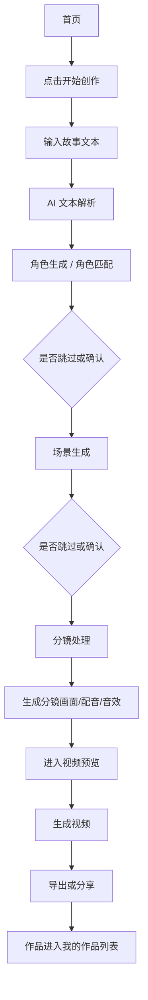

# 需求清单 - 漫剧制作 App

> 状态：需求分析初稿，等待确认后可生成 PRD。  
> 项目路径：`projects/漫剧制作/`  
> 参考素材：`01-需求/references/images/`

## 1. 项目概述

“漫剧制作 App”是一款面向故事文本生成漫剧视频的手机端 AI 创作工具。用户从首页开始创作，输入故事后，系统自动解析文本并生成角色、场景、分镜，用户可以对关键环节进行选择、调整或跳过，最后进入视频预览、生成、导出与分享。

当前版本的业务主线较清晰，重点是把手机端“从文本到视频”的流程做顺，并保证每一步都有可返回、可跳过、可确认的操作。现有素材主要用于确认颜色、视觉氛围、页面模块和业务流程，尺寸与横向布局不作为移动端最终约束。

核心主张：

> 输入故事文本 -> AI 解析 -> 角色 / 场景匹配 -> 分镜处理 -> 视频预览与导出

## 2. 目标用户

- 有故事文本、短剧脚本、小说片段，希望快速生成漫剧视频的创作者。
- 不具备完整动画制作能力，但希望通过 AI 辅助完成角色、场景、分镜和视频生成的用户。
- 需要批量生成短视频内容、试验剧情视觉化效果的内容团队或个人创作者。
- 想从已有作品中继续编辑、复用或导出视频的用户。

## 3. 当前版本范围

### 3.1 本期核心页面

| 页面 | 说明 | 参考素材 |
|------|------|----------|
| 首页 | 展示品牌、开始制作入口、能力介绍、作品列表，移动端以纵向滚动为主 | `首页.png` |
| 故事输入 / 文本解析页 | 输入故事文本，触发 AI 解析，进入角色/场景生成流程 | 暂无单独素材 |
| 角色生成页 | 展示 AI 解析出的角色，支持选择、重新生成、新建、确认或跳过，移动端底部固定主操作 | `角色生成.png`、`角色生成-底部.png` |
| 场景生成页 | 展示 AI 解析出的场景，交互结构与角色生成页相近，支持跳过 | 暂无单独素材，沿用角色生成结构 |
| 分镜处理页 | 管理分镜列表，编辑单个分镜的画面、角色、音效与生成状态，移动端需拆分宽屏三栏 | `分镜处理.png` |
| 预览页面 | 播放生成视频，查看分镜胶片，导出视频或分享链接，移动端以播放器 + 下方分镜列表/操作面板组织 | `预览页面.png` |

### 3.2 本期明确不做 / 暂不展开

- 不展开复杂账号体系，除非后续明确需要登录、云端作品库或多端同步。
- 不做专业级视频剪辑器，不提供复杂时间线、多轨编辑和精细转场控制。
- 不做多人协作。
- 不要求用户手动完成完整角色建模、场景建模或音频制作。

## 4. 核心功能

### 4.1 首页与作品列表

- 展示品牌名称、顶部“新手教程”入口。
- 展示主视觉区，包括口号、说明文案和“开始创作”按钮。
- 展示能力卖点：秒级生成、电影级画质、多风格切换等。
- 展示“我的作品”列表，包括新建入口、作品封面、作品标题、状态标签。
- 支持从作品列表继续进入已有作品的编辑或预览。

### 4.2 开始创作与文本解析

- 用户点击“开始创作”后进入故事输入 / 文本解析流程。
- 用户输入故事文本、剧情梗概或脚本。
- 系统解析出角色、场景和初始分镜结构。
- 解析完成后进入角色生成页。
- 若解析失败，应允许用户返回修改文本并重新解析。

### 4.3 角色生成 / 角色匹配

- 展示顶部流程进度：文本解析、角色匹配、分镜编辑、视频预览。
- 展示 AI 解析出的角色卡片，包含角色图、角色标签、角色名和描述。
- 用户可选择需要出现在漫剧中的角色。
- 支持新增角色、重新生成角色、返回修改文本。
- 底部展示 AI 解析出的角色描述摘要。
- 底部显示已选角色数量和“确认角色”主按钮。
- 允许用户跳过角色生成，直接进入后续流程。

### 4.4 场景生成

- 页面结构与角色生成页保持一致。
- 展示 AI 解析出的场景卡片，包含场景图、场景名、氛围或用途描述。
- 用户可选择需要使用的场景。
- 支持新增场景、重新生成场景、返回修改文本。
- 允许用户跳过场景生成，直接进入分镜处理。
- 若跳过，后续分镜可使用默认场景、纯文本分镜或待生成占位状态。

### 4.5 分镜处理

- 宽屏素材中的左侧分镜列表，在手机端可改为顶部/底部横向分镜条或独立分镜列表页。
- 宽屏素材中的中间预览区，在手机端作为页面核心区域展示当前分镜大图、分幕标签、风格标签、已关联角色/场景。
- 支持编辑当前分镜标题和描述。
- 宽屏素材中的右侧生成参数，在手机端可改为底部弹层、折叠面板或二级设置页：
  - 画面风格
  - 角色配音
  - 背景音效
- 支持“一键生成全部”。
- 支持单独生成当前分镜。
- 支持添加新分镜。
- 支持进入预览页面。

### 4.6 视频预览与导出

- 展示作品标题、分镜数量和预计视频时长。
- 中央大视频区域支持播放/暂停。
- 视频区叠加当前幕标题和字幕/旁白文案。
- 宽屏素材中的右侧分镜胶片列表，在手机端可改为视频下方横向分镜条或可展开列表。
- 底部展示播放进度、时间、上一幕/下一幕、音量和设置入口。
- 支持生成视频。
- 支持分享链接。
- 支持返回编辑，回到分镜处理页继续调整。

## 5. 关键流程

补充规则：

- 角色生成和场景生成都不是强阻断步骤，用户可直接跳过。
- 分镜处理是当前流程的核心编辑页，用户最终要在这里完成整体分镜确认。
- 预览页面既用于播放检查，也用于生成视频、分享和返回编辑。

## 6. 数据与同步要求

### 6.1 核心数据对象

| 对象 | 说明 |
|------|------|
| Work / Project | 用户的一次漫剧作品，包含标题、状态、封面、时长、创建时间 |
| StoryText | 用户输入的故事文本或脚本 |
| Character | AI 解析或用户新增的角色 |
| Scene | AI 解析或用户新增的场景 |
| Storyboard | 分镜数据，包括序号、标题、描述、画面、角色、场景、音频配置 |
| VideoPreview | 预览播放状态、分镜胶片、字幕和进度 |
| ExportTask | 视频生成、导出、分享相关任务状态 |

### 6.2 状态要求

- 作品至少包含：草稿、生成中、已完成、失败。
- 角色、场景、分镜、视频生成都可能是异步任务，需要有加载态、成功态、失败态和可重试入口。
- 用户返回上一步时，应保留已生成和已选择的内容。
- 如果用户跳过角色或场景生成，需要记录跳过状态，避免后续误判为生成失败。

### 6.3 存储与同步

- 本期可以优先按本地草稿 + 服务端生成任务的方式设计。
- 首页作品列表需要能恢复用户已创建作品。
- AI 生成结果应能被用户二次编辑并保存。
- 视频导出结果需要和作品绑定，便于从作品列表继续访问。

## 7. 非功能要求

- 页面风格参考素材：深色背景、紫蓝主色、卡片式内容区、清晰的顶部流程进度。
- 产品形态明确为手机 App，后续设计和开发需要按移动端屏幕重新组织信息密度、触控尺寸和底部操作区。
- 当前素材尺寸不足以直接作为移动端标注稿，只作为颜色、流程、模块关系和视觉方向参考。
- 核心按钮状态要明确，尤其是“开始创作”“确认角色”“生成此分镜”“进入预览”“生成视频”。
- AI 生成耗时不可让用户误以为卡死，需要展示进度、占位图或任务状态。
- 分镜列表与参数区需要支持较多内容，移动端应避免同屏堆叠过多横向信息，优先使用分步、折叠、底部面板或抽屉。
- 预览页播放控制应接近常见视频播放器交互。
- 移动端优先，重点保证单手操作、底部主按钮、返回路径和生成任务反馈清晰。

## 8. 假设与待确认项

- “故事输入 / 文本解析页”是否需要单独页面设计，还是放在开始创作弹窗/首页下方。
- 角色生成和场景生成的先后顺序是否固定为“角色 -> 场景”，还是允许用户在流程中自由切换。
- 场景生成页是否完全复用角色生成页结构，还是需要独立的场景布局与筛选方式。
- 宽屏素材中的三栏结构在手机端最终采用“单页折叠”“底部弹层”还是“分步页面”。
- 角色/场景“跳过”后，分镜生成时是否使用默认资源，还是只生成文字分镜。
- 作品列表是否需要真实账号登录和云端同步，还是 MVP 先本地/单设备保存。
- 视频生成后是否需要下载本地文件、发布平台适配、比例选择或水印设置。
- 新手教程是独立页面、弹窗引导，还是外链文档。

## 9. 下一步建议

确认本需求清单后，进入“需求文档生成”阶段，输出完整 PRD：

- 固定页面结构
- 页面级详细需求
- 关键交互流程
- 业务规则
- 前后端交互说明
- 验收标准
