# 漫剧制作 App 产品需求文档（PRD）

> 版本：v1.0  
> 创建日期：2026-04-25  
> 状态：已确认，已进入技术方案  
> 产品形态：手机 App  
> 参考资料：
> - `01-需求/requirements-list.md`
> - `01-需求/references/README.md`
> - `01-需求/references/images/`

---

## 1. 产品概述

### 1.1 产品名称

当前工作名：漫剧制作 App

### 1.2 产品定位

漫剧制作 App 是一款面向手机端的 AI 漫剧视频创作工具。用户输入故事文本、剧情梗概或脚本后，系统自动解析角色、场景与分镜，用户可以在关键步骤中选择、调整或跳过，最终生成可预览、导出和分享的漫剧视频。

当前版本不追求专业级剪辑工具的复杂度，而是优先打通“输入故事 -> 生成可看视频”的主流程，让普通创作者也能快速完成从文字到漫剧视频的转换。

### 1.3 核心主张

> 输入故事文本 -> AI 解析 -> 角色 / 场景匹配 -> 分镜处理 -> 视频预览与导出

产品强调：

- 流程简单：用户不需要理解复杂视频制作概念。
- AI 辅助：角色、场景、分镜和视频生成由系统承担主要工作。
- 可控编辑：关键节点允许用户选择、修改、重新生成或跳过。
- 移动端优先：页面按手机屏幕重新组织，不直接照搬宽屏素材尺寸。

### 1.4 目标用户

- 有故事文本、短剧脚本、小说片段，希望快速生成漫剧视频的个人创作者。
- 不具备动画制作能力，但希望通过 AI 完成角色、场景、分镜和视频生成的用户。
- 需要批量验证剧情视觉效果的短视频内容团队。
- 想从已有作品中继续编辑、预览或导出视频的用户。

---

## 2. 当前版本范围

### 2.1 本期范围（MVP）

本期聚焦手机端主创作链路：

- 首页与作品列表
- 故事输入 / 文本解析
- 角色生成 / 角色匹配
- 场景生成 / 场景匹配
- 分镜处理
- 视频预览
- 视频生成、导出与分享

### 2.2 明确不做

- 不做专业级多轨视频剪辑器。
- 不做复杂时间线、关键帧、转场曲线、音轨混剪等能力。
- 不做多人协作。
- 不展开完整账号体系，除非后续确认作品云端同步是 MVP 必须项。
- 不要求用户手动完成完整角色建模、场景建模或音频制作。

### 2.3 参考素材使用说明

当前素材主要用于确认：

- 深色背景、紫蓝主色、卡片式内容区等视觉方向。
- 首页、角色生成、分镜处理、预览页面的流程关系。
- 关键按钮、状态标签、流程进度条和内容卡片的氛围。

当前素材不直接作为移动端尺寸标注稿。宽屏素材中的三栏结构，在手机端需要拆分为上下结构、横向列表、底部弹层、抽屉或分步页面。

---

## 3. 整体流程

### 3.1 主流程

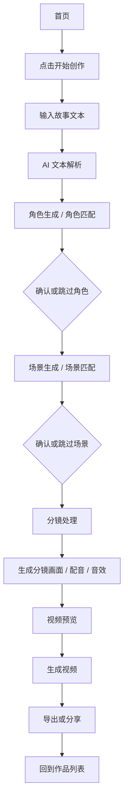

### 3.2 流程说明

1. 用户从首页点击“开始创作”。
2. 用户输入故事文本，系统进行 AI 解析。
3. 系统先进入角色生成页，展示解析出的角色。
4. 用户可以确认角色，也可以跳过角色生成。
5. 系统进入场景生成页，展示解析出的场景。
6. 用户可以确认场景，也可以跳过场景生成。
7. 系统进入分镜处理页，用户查看分镜、编辑描述、选择风格、配音和音效。
8. 用户生成分镜内容后，进入视频预览页。
9. 用户检查视频效果，生成最终视频并导出或分享。
10. 完成后的作品回到首页作品列表展示。

### 3.3 关键流程规则

- 角色生成和场景生成不是强阻断步骤，必须支持跳过。
- 跳过角色或场景后，系统需要记录跳过状态，而不是当作生成失败。
- 分镜处理是主编辑节点，用户最终在这里完成整体分镜确认。
- 预览页面既是播放检查页面，也是生成视频、导出、分享和返回编辑的入口。
- 用户从后续页面返回前一步时，已生成内容、已选内容和文本修改都应保留。

---

## 4. 信息架构 / 页面结构

| 层级 | 页面 | 路径建议 | 说明 |
|------|------|----------|------|
| 一级 | 首页 | `/` | 开始创作与作品列表 |
| 二级 | 故事输入 / 文本解析 | `/create/story` | 输入文本并触发 AI 解析 |
| 二级 | 角色生成 | `/create/characters` | 选择、生成、跳过角色 |
| 二级 | 场景生成 | `/create/scenes` | 选择、生成、跳过场景 |
| 二级 | 分镜处理 | `/create/storyboards` | 分镜编辑与单镜头生成 |
| 二级 | 分镜角色选择 | `/create/storyboards/:id/characters` | 为当前分镜多选出场角色 |
| 二级 | 分镜场景选择 | `/create/storyboards/:id/scene` | 为当前分镜单选主场景 |
| 二级 | 视频预览 | `/create/preview` | 播放预览、生成视频、导出分享 |
| 二级 | 作品详情 | `/works/:id` | 进入已有作品的编辑或预览，MVP 可并入预览页 |
| 辅助 | 新手教程 | `/tutorial` | 新手教程入口，形式待确认 |

### 4.1 移动端导航原则

- 首页作为一级入口，不设置复杂底部 Tab。
- 创作流程页使用顶部返回 + 流程进度条。
- 关键主按钮优先固定在底部安全区上方。
- 长内容页面使用纵向滚动，局部列表可使用横向滑动。
- 分镜参数、音效、配音等设置优先使用底部弹层或折叠面板，避免同屏堆叠过多内容。

---

## 5. 页面级详细需求

## 5.1 首页

### 页面定位

首页是 App 的启动后的主入口，用于展示产品品牌、开始创作按钮、能力卖点和用户作品列表。

### 参考素材

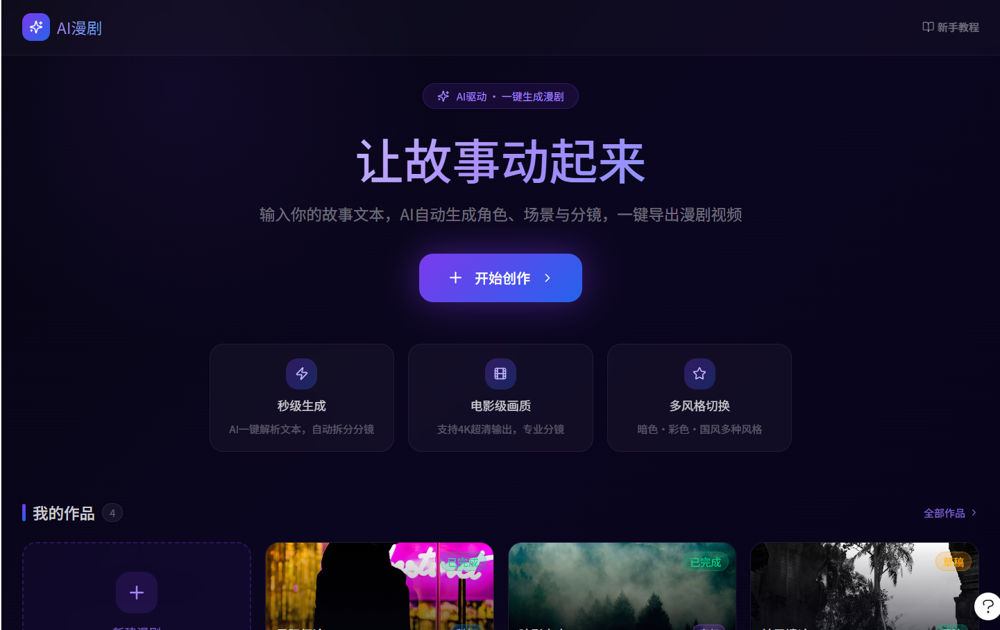

### 页面结构（从上到下）

1. 顶部导航区：品牌 Logo / 名称、新手教程入口。
2. 主视觉区：核心口号、说明文案、开始创作按钮。
3. 能力说明区：展示 AI 生成、画面质量、风格切换等卖点。
4. 我的作品区：作品数量、新建入口、作品卡片列表。
5. 悬浮帮助入口：可选，用于问题反馈或教程。

### 区块说明

- 顶部导航区：建立品牌识别，提供新手教程入口。
- 主视觉区：作为首页最重要操作区，用户应一眼看到“开始创作”。
- 能力说明区：解释产品能做什么，信息量要克制。
- 我的作品区：承载已创建作品，支持继续编辑或查看预览。

### 主要功能

- 点击“开始创作”进入故事输入 / 文本解析页。
- 点击作品卡片进入对应作品的编辑或预览。
- 点击新建作品入口，也进入故事输入流程。
- 点击新手教程入口，打开教程页或教程弹窗。

### 交互流程图

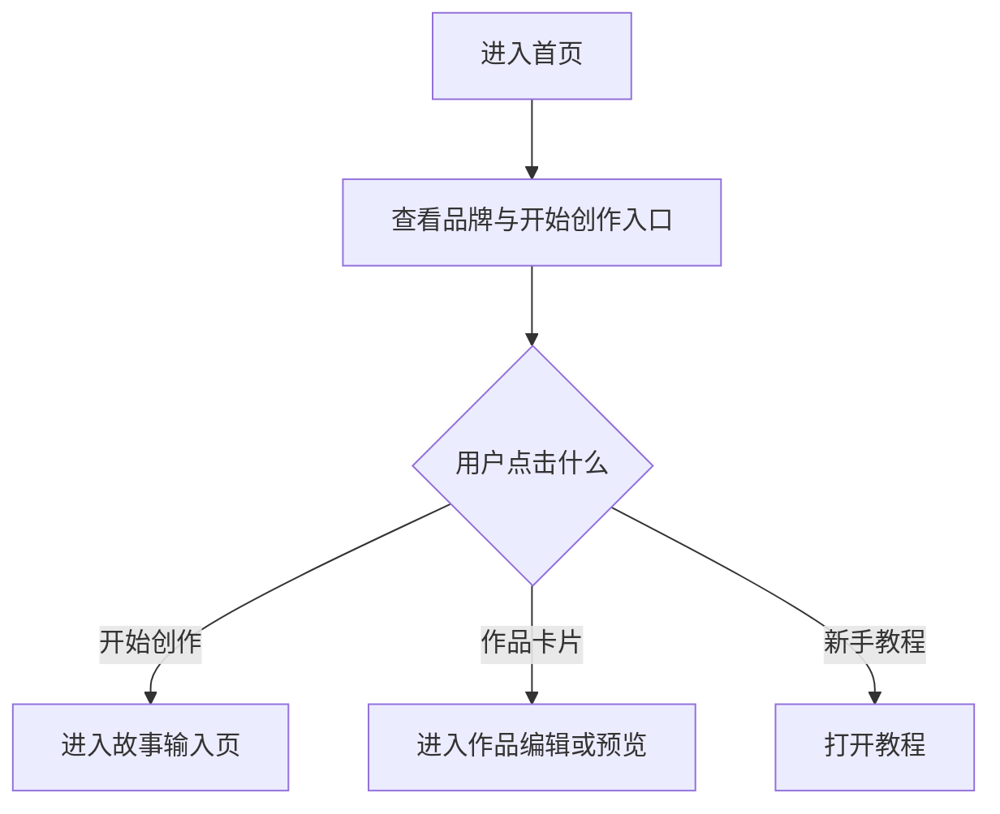

### 详细交互说明

1. 用户打开 App 后进入首页。
2. 页面顶部展示品牌与新手教程入口。
3. 用户点击“开始创作”，进入故事输入页。
4. 若用户已有作品，首页下方展示作品列表。
5. 用户点击作品卡片后，根据作品状态进入分镜处理页或视频预览页：
   - 草稿：进入最近编辑步骤。
   - 生成中：进入任务状态页或对应步骤。
   - 已完成：进入视频预览页。
   - 失败：进入可重试的最近步骤。

### 关键状态 / 异常情况

- 无作品态：展示新建作品入口与空状态提示。
- 有作品态：展示作品列表、封面、标题、状态。
- 作品生成中：作品卡片展示生成中标签。
- 作品失败：作品卡片展示失败状态和重试入口。

### 验收标准

- 用户能在首页快速找到开始创作入口。
- 作品列表能展示作品状态。
- 手机端纵向滚动自然，不依赖宽屏三栏。

## 5.2 故事输入 / 文本解析页

### 页面定位

用于承接用户输入的故事文本，并触发 AI 文本解析，为后续角色、场景和分镜生成提供基础。

### 参考素材

暂无单独素材。视觉风格沿用首页与流程页：深色背景、紫蓝主按钮、顶部流程进度。

### 页面结构（从上到下）

1. 顶部返回区：返回首页。
2. 流程进度区：当前处于“文本解析”。
3. 标题说明区：提示用户输入故事文本。
4. 文本输入区：大文本框，支持多行输入。
5. 辅助设置区：可选，如视频风格、预计时长、画幅比例。
6. 底部操作区：开始解析按钮。

### 区块说明

- 文本输入区是页面核心，应占据主要空间。
- 辅助设置区不应喧宾夺主，MVP 可只保留必要配置。
- 底部操作区固定主按钮，方便单手操作。

### 主要功能

- 输入或粘贴故事文本。
- 清空文本。
- 触发 AI 文本解析。
- 解析完成后进入角色生成页。
- 解析失败时允许修改文本并重试。

### 交互流程图

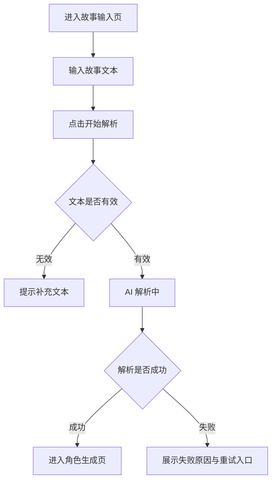

### 详细交互说明

1. 用户从首页进入故事输入页。
2. 用户输入故事文本，主按钮从不可用变为可用。
3. 用户点击“开始解析”后，页面展示解析中状态。
4. 解析成功后，系统生成角色、场景和初始分镜数据，并进入角色生成页。
5. 解析失败时，页面保留原文本并提示用户重试。

### 关键状态 / 异常情况

- 空文本态：主按钮不可用。
- 输入态：显示字数或文本长度提示。
- 解析中：按钮进入 loading，禁止重复提交。
- 解析失败：保留原输入，显示重试入口。

### 验收标准

- 用户能完成故事文本输入并触发解析。
- 解析失败不会丢失已输入文本。
- 页面在手机端输入体验稳定，键盘弹出不遮挡主操作。

## 5.3 角色生成页

### 页面定位

用于展示 AI 从故事中解析出的角色，用户可选择要保留的角色、新增角色、重新生成角色、确认进入下一步或跳过。

### 参考素材

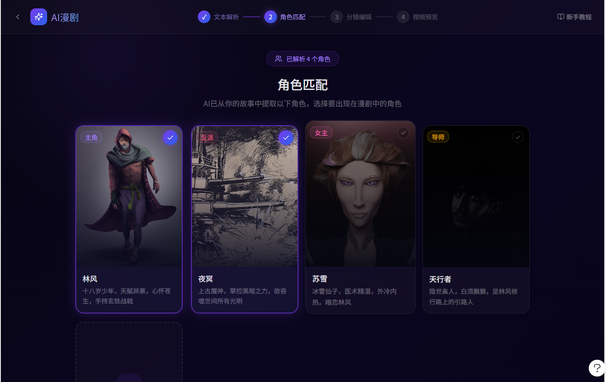

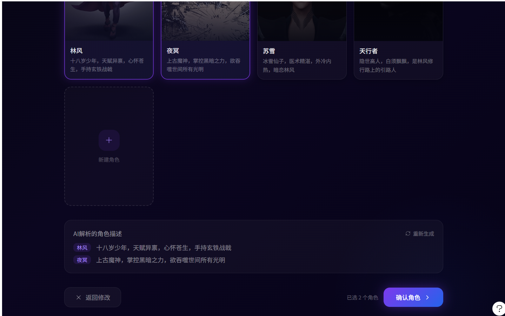

### 页面结构（从上到下）

1. 顶部返回区：返回故事输入页。
2. 流程进度区：文本解析完成，当前处于角色匹配。
3. 页面标题区：角色匹配、已解析角色数量。
4. 角色卡片区：角色图、标签、角色名、描述、选中状态。
5. 新建角色入口：用于补充缺失角色。
6. AI 解析描述区：展示角色摘要。
7. 底部操作区：返回修改、跳过、确认角色。

### 区块说明

- 角色卡片区在手机端可使用两列网格或单列大卡。
- 底部操作区需要固定在安全区上方。
- AI 解析描述区可作为折叠区，避免占用过多首屏空间。

### 主要功能

- 选择 / 取消选择角色。
- 新增角色。
- 重新生成角色。
- 查看 AI 解析出的角色描述。
- 返回修改故事文本。
- 跳过角色生成。
- 确认角色并进入场景生成页。

### 交互流程图

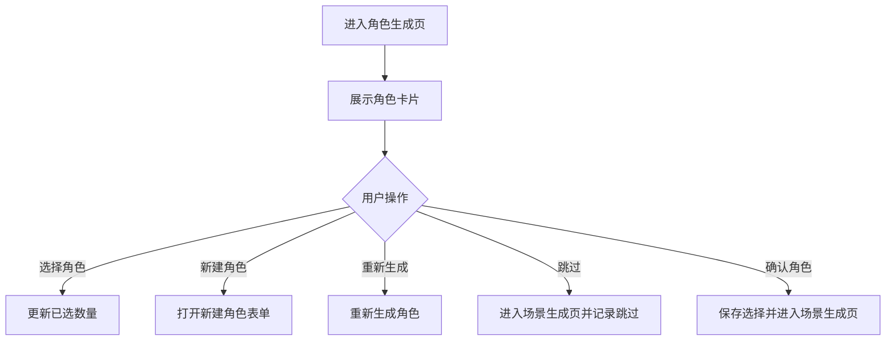

### 详细交互说明

1. 页面进入后展示 AI 解析出的角色卡片。
2. 默认可根据 AI 推荐预选关键角色。
3. 用户点击角色卡片后，卡片切换选中状态，底部同步显示已选数量。
4. 用户点击“新建角色”，打开表单或底部弹层，填写名称、描述、标签。
5. 用户点击“重新生成”，系统重新生成角色图片或角色候选。
6. 用户点击“跳过”，系统记录 `charactersSkipped = true`，进入场景生成页。
7. 用户点击“确认角色”，系统保存已选角色并进入场景生成页。

### 关键状态 / 异常情况

- 生成中：角色卡片展示占位图或骨架屏。
- 无角色：展示空状态和手动新增入口。
- 重新生成失败：保留原角色结果，并允许再次重试。
- 未选择角色：允许确认但需明确提示“将不指定角色生成”或引导跳过。

### 验收标准

- 用户能选择角色并进入下一步。
- 用户能跳过角色生成，流程不被阻断。
- 返回故事输入页后，已生成角色数据仍被保留。

## 5.4 场景生成页

### 页面定位

用于展示 AI 从故事中解析出的场景，用户可选择需要保留的场景、新增场景、重新生成场景、确认进入分镜处理或跳过。

### 参考素材

暂无单独素材。页面结构与角色生成页一致，卡片内容由角色改为场景。

### 页面结构（从上到下）

1. 顶部返回区：返回角色生成页。
2. 流程进度区：角色匹配完成，当前处于场景匹配。
3. 页面标题区：场景匹配、已解析场景数量。
4. 场景卡片区：场景图、场景名、氛围标签、描述、选中状态。
5. 新建场景入口：用于补充缺失场景。
6. AI 解析描述区：展示场景摘要。
7. 底部操作区：返回修改、跳过、确认场景。

### 区块说明

- 场景卡片以画面氛围为核心，应突出场景图。
- 标签可包括室内、森林、城市、夜晚、战斗、回忆等。
- 移动端可采用两列卡片或横向滑动卡片。

### 主要功能

- 选择 / 取消选择场景。
- 新增场景。
- 重新生成场景。
- 返回角色生成页。
- 跳过场景生成。
- 确认场景并进入分镜处理页。

### 交互流程图

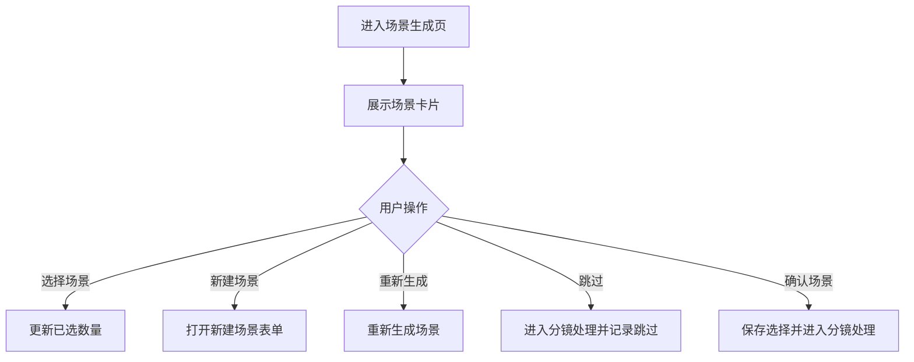

### 详细交互说明

1. 用户从角色生成页进入场景生成页。
2. 页面展示 AI 解析出的场景卡片。
3. 用户可选择本次作品需要使用的场景。
4. 用户点击“跳过”，系统记录 `scenesSkipped = true`，进入分镜处理页。
5. 用户点击“确认场景”，系统保存场景选择并进入分镜处理页。

### 关键状态 / 异常情况

- 无场景：展示空状态，允许跳过或新增。
- 生成失败：保留已有场景，展示重试入口。
- 跳过场景：后续分镜使用默认场景、待生成占位或纯文本分镜。

### 验收标准

- 场景生成页与角色生成页交互一致，学习成本低。
- 用户能跳过场景生成并进入分镜处理。
- 跳过状态能被后续分镜逻辑正确识别。

## 5.5 分镜处理页

### 页面定位

分镜处理页是核心编辑页，用于管理分镜列表、查看当前分镜、编辑分镜文本、配置画面风格、角色配音和背景音效，并触发分镜生成。

### 参考素材

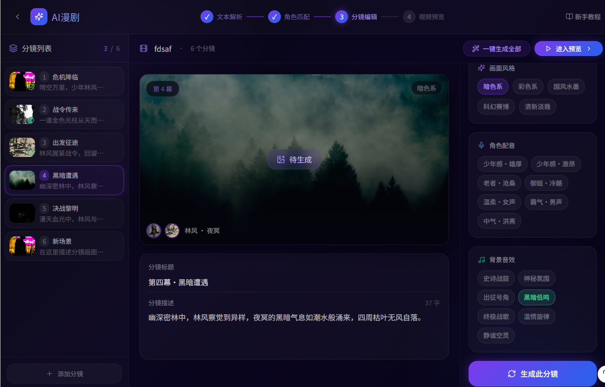

### 页面结构（移动端从上到下）

1. 顶部流程区：返回、当前步骤、进入预览按钮。
2. 分镜快速导航区：横向分镜条或可展开分镜列表。
3. 当前分镜预览区：画面预览、分幕标签、状态标签、角色/场景标识。
4. 分镜文本区：分镜描述。
5. 参数设置区：角色选择、场景选择、画面风格、角色配音、背景音效。
6. 底部操作区：生成此分镜、一键生成全部、添加分镜。

### 区块说明

- 宽屏素材中的左侧分镜列表，在手机端改为横向分镜条或可展开列表。
- 宽屏素材中的中间预览区，在手机端作为页面核心视觉区。
- 宽屏素材中的右侧参数区，在手机端改为折叠面板或底部弹层。
- 底部主按钮优先放“生成此分镜”，次级操作放入更多菜单或折叠区。

### 主要功能

- 查看所有分镜。
- 切换当前分镜。
- 编辑当前分镜描述。
- 选择画面风格。
- 选择当前分镜出现的角色，支持多选。
- 选择当前分镜使用的主场景，只能单选。
- 选择角色配音。
- 选择背景音效。
- 生成当前分镜。
- 一键生成全部分镜。
- 添加新分镜。
- 进入视频预览页。

### 交互流程图

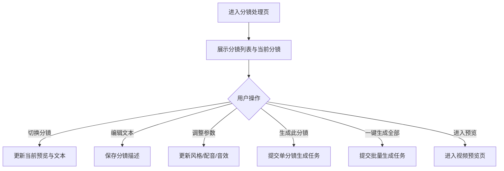

### 详细交互说明

1. 用户进入分镜处理页后，首先看到当前分镜预览和分镜导航。
2. 用户点击分镜条中的任一分镜，页面切换当前分镜。
3. 用户可直接编辑分镜描述，编辑后自动保存到草稿。
4. 用户点击角色选择，进入角色选择页，可多选后应用到当前分镜。
5. 用户点击场景选择，进入场景选择页，只能选择一个主场景。
6. 用户点击画面风格、角色配音、背景音效等区域，打开底部弹层进行选择。
7. 用户点击“生成此分镜”，当前分镜进入生成中状态。
8. 用户点击“一键生成全部”，未生成或需要重生成的分镜依次进入生成任务。
9. 用户点击“进入预览”，进入视频预览页。

### 关键状态 / 异常情况

- 待生成：预览区显示占位图和待生成提示。
- 生成中：显示进度或 loading，禁止重复提交同一分镜。
- 已生成：展示生成后的画面和状态。
- 生成失败：展示失败原因和重试入口。
- 空分镜：展示添加分镜入口。
- 参数未选：使用默认风格、默认配音或默认音效。
- 角色未选：允许生成，但使用分镜描述中的角色文本提示或默认角色占位。
- 场景未选：允许生成，但使用默认场景、待生成场景或分镜文本描述。

### 验收标准

- 用户能在手机端顺畅切换分镜。
- 用户能编辑分镜文本并生成当前分镜。
- 参数设置不挤压核心预览区。
- 用户能明确识别每个分镜的生成状态。

## 5.6 视频预览页

### 页面定位

视频预览页用于播放已生成的漫剧视频或分镜预览，用户可检查效果、切换分镜、生成最终视频、分享链接或返回编辑。

### 参考素材

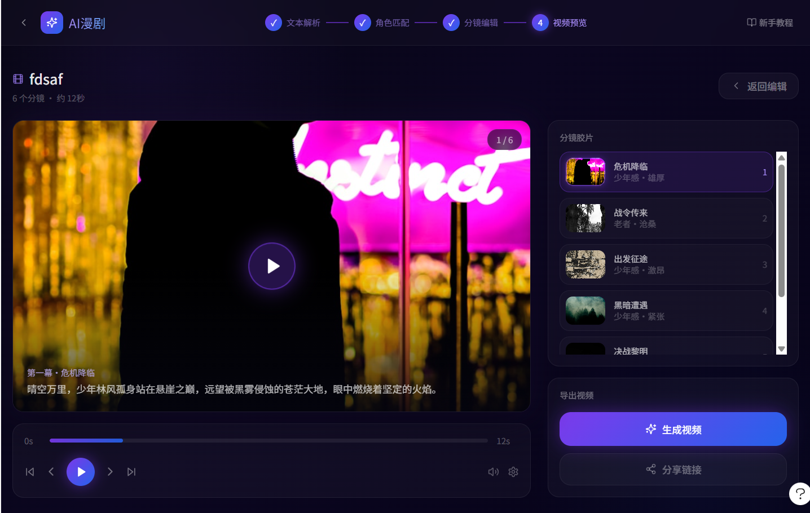

### 页面结构（移动端从上到下）

1. 顶部导航区：返回、作品标题、返回编辑入口。
2. 视频播放区：当前视频画面、播放按钮、分幕标识、字幕/旁白文案。
3. 播放控制区：进度条、时间、上一幕/下一幕、音量、设置。
4. 分镜胶片区：横向分镜条或可展开列表。
5. 导出操作区：生成视频、分享链接。

### 区块说明

- 视频播放区是页面核心，应优先保证比例和可读性。
- 宽屏素材中的右侧胶片列表，在手机端改为视频下方横向列表。
- “生成视频”是主操作，分享链接是次级操作。
- 返回编辑入口应明确，但不抢主按钮视觉层级。

### 主要功能

- 播放 / 暂停预览。
- 拖动进度条。
- 切换上一幕 / 下一幕。
- 点击分镜胶片切换当前片段。
- 生成最终视频。
- 分享链接。
- 返回分镜处理页继续编辑。

### 交互流程图

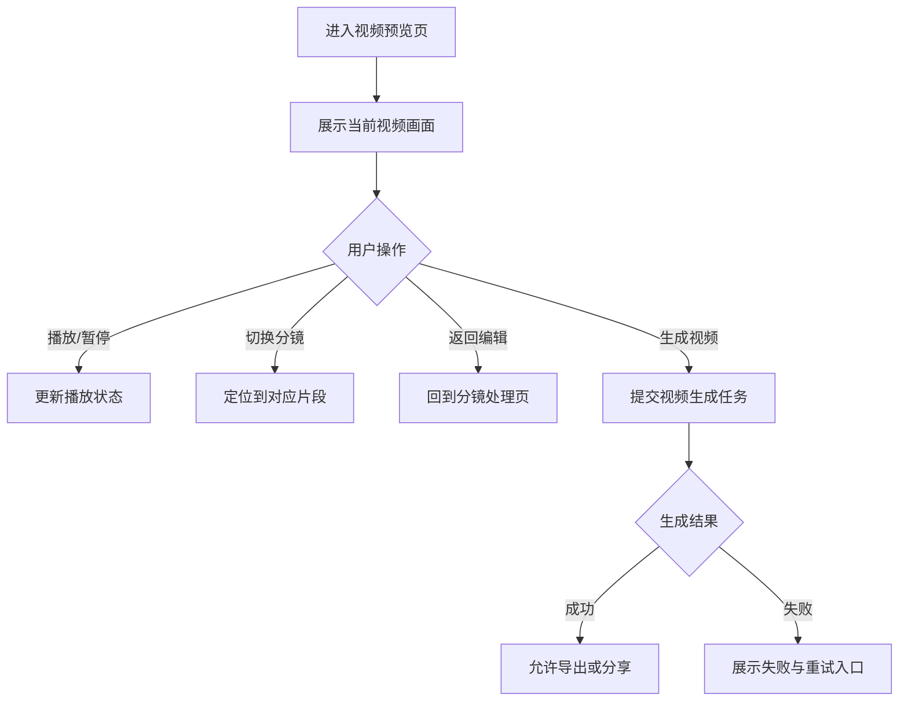

### 详细交互说明

1. 用户从分镜处理页进入视频预览页。
2. 页面展示作品标题、分镜数量、预计时长和当前视频画面。
3. 用户点击播放按钮后，视频开始播放。
4. 用户点击分镜胶片后，视频跳转到对应分镜。
5. 用户点击“返回编辑”，回到分镜处理页并保留当前编辑数据。
6. 用户点击“生成视频”，系统提交最终视频生成任务。
7. 生成成功后，用户可以导出或分享链接。

### 关键状态 / 异常情况

- 预览未生成：展示分镜级预览和生成视频按钮。
- 视频生成中：展示生成进度，不允许重复提交。
- 视频生成成功：展示导出和分享入口。
- 视频生成失败：展示失败提示和重试入口。
- 分镜缺失：提示先返回分镜处理页生成必要内容。

### 验收标准

- 用户能播放预览并切换分镜。
- 用户能从预览页返回编辑。
- 视频生成状态清晰，失败可重试。
- 移动端播放控制不遮挡字幕和主画面。

---

## 6. 数据与同步

### 6.1 核心数据对象

| 对象 | 说明 |
|------|------|
| Work | 用户的一次漫剧作品，包含标题、封面、状态、时长、创建时间 |
| StoryText | 用户输入的故事文本、脚本或剧情梗概 |
| Character | AI 解析或用户新增的角色 |
| Scene | AI 解析或用户新增的场景 |
| Storyboard | 分镜数据，包含序号、描述、画面、角色、场景和音频配置 |
| GenerationTask | AI 生成任务，覆盖角色、场景、分镜、视频 |
| VideoPreview | 预览播放数据、字幕、胶片列表和进度 |
| ExportTask | 视频导出与分享任务 |

### 6.2 作品状态

| 状态 | 说明 |
|------|------|
| 草稿 | 已创建但未完成生成 |
| 解析中 | 正在进行文本解析 |
| 编辑中 | 已进入角色、场景或分镜编辑 |
| 生成中 | 正在生成分镜或视频 |
| 已完成 | 视频已生成，可预览、导出、分享 |
| 失败 | 最近一次关键生成任务失败 |

### 6.3 生成任务状态

| 状态 | 说明 |
|------|------|
| 待生成 | 有输入但尚未生成 |
| 排队中 | 已提交任务，等待执行 |
| 生成中 | 任务正在执行 |
| 已完成 | 任务成功完成 |
| 失败 | 任务执行失败，可重试 |
| 已跳过 | 用户主动跳过，不视为错误 |

### 6.4 存储要求

- 用户输入的故事文本需要保存为草稿。
- AI 生成的角色、场景、分镜结果需要与作品绑定。
- 用户手动修改的内容优先级高于 AI 初始结果。
- 跳过角色或场景需要记录为状态。
- 作品列表需要能恢复最近作品及其状态。
- 视频生成结果需要与作品绑定，便于再次查看、导出和分享。

---

## 7. 核心业务规则

### 7.1 跳过规则

- 角色生成和场景生成都允许跳过。
- 跳过后，系统进入下一步，不弹出阻断确认弹窗。
- 跳过状态需要写入作品数据。
- 后续生成分镜时，如果缺少角色或场景，系统使用默认资源、文本描述或待生成占位。

### 7.2 返回规则

- 从任一创作步骤返回上一步时，当前步骤的数据不丢失。
- 返回故事输入页修改文本后，系统需要提示用户：重新解析可能影响已生成角色、场景和分镜。
- 若重新解析，旧数据应保留为可恢复草稿，避免直接覆盖。

### 7.3 重新生成规则

- 重新生成角色、场景或分镜时，原结果不应立即删除。
- 生成成功后再替换或让用户选择是否替换。
- 生成失败时保留原结果。

### 7.4 分镜规则

- 每个作品至少应有 1 个分镜。
- 分镜支持分镜描述、画面、关联角色、关联场景、风格、配音、背景音效。
- 分镜关联角色支持多选。
- 分镜关联场景只能选择一个主场景。
- 分镜顺序影响视频播放顺序。
- 添加新分镜后，默认处于待生成状态。

### 7.5 视频生成规则

- 视频生成前需要检查是否存在可用分镜。
- 若部分分镜未生成，可提示用户继续生成或使用占位预览。
- 视频生成成功后，作品状态更新为已完成。
- 视频生成失败时，作品保留在编辑中或失败状态，允许重试。

---

## 8. 前后端交互说明

> 当前 PRD 先定义业务交互边界，具体技术栈在后续技术方案中确认。

### 8.1 统一接口约定

建议接口返回结构：

```json
{
  "code": 0,
  "message": "success",
  "data": {}
}
```

### 8.2 核心接口建议

| 模块 | 方法 | 路径 | 说明 |
|------|------|------|------|
| 作品 | GET | `/api/v1/works` | 获取作品列表 |
| 作品 | POST | `/api/v1/works` | 创建作品 |
| 作品 | GET | `/api/v1/works/{id}` | 获取作品详情 |
| 作品 | PUT | `/api/v1/works/{id}` | 更新作品基础信息 |
| 文本解析 | POST | `/api/v1/works/{id}/parse` | 解析故事文本 |
| 角色 | POST | `/api/v1/works/{id}/characters/generate` | 生成角色 |
| 角色 | PUT | `/api/v1/works/{id}/characters` | 保存角色选择与编辑 |
| 场景 | POST | `/api/v1/works/{id}/scenes/generate` | 生成场景 |
| 场景 | PUT | `/api/v1/works/{id}/scenes` | 保存场景选择与编辑 |
| 分镜 | GET | `/api/v1/works/{id}/storyboards` | 获取分镜列表 |
| 分镜 | PUT | `/api/v1/works/{id}/storyboards/{storyboardId}` | 更新单个分镜 |
| 分镜 | POST | `/api/v1/works/{id}/storyboards/{storyboardId}/generate` | 生成单个分镜 |
| 分镜 | POST | `/api/v1/works/{id}/storyboards/generate-all` | 批量生成分镜 |
| 视频 | POST | `/api/v1/works/{id}/video/generate` | 生成最终视频 |
| 视频 | GET | `/api/v1/works/{id}/video` | 获取视频预览与导出信息 |
| 分享 | POST | `/api/v1/works/{id}/share` | 创建分享链接 |
| 任务 | GET | `/api/v1/tasks/{taskId}` | 查询异步任务状态 |

### 8.3 关键交互链路

#### 链路一：创建作品与文本解析

1. 前端创建本地草稿。
2. 用户输入故事文本并点击开始解析。
3. 前端调用创建作品或更新作品接口。
4. 前端调用文本解析接口。
5. 后端返回角色、场景和初始分镜结构。
6. 前端进入角色生成页。

#### 链路二：跳过角色或场景

1. 用户点击跳过。
2. 前端更新作品步骤状态。
3. 前端保存 `charactersSkipped` 或 `scenesSkipped`。
4. 页面进入下一步。
5. 后续生成分镜时，后端按缺省资源或文本描述处理。

#### 链路三：生成单个分镜

1. 用户在分镜处理页点击生成此分镜。
2. 前端保存当前分镜文本和参数。
3. 前端提交单分镜生成任务。
4. 页面展示生成中状态。
5. 任务成功后刷新分镜画面。
6. 任务失败后展示重试入口，保留旧内容。

#### 链路四：生成视频

1. 用户在预览页点击生成视频。
2. 前端检查分镜可用性。
3. 前端提交视频生成任务。
4. 页面展示生成进度。
5. 任务成功后展示视频、导出和分享入口。
6. 任务失败后允许重试。

---

## 9. 非功能要求

### 9.1 移动端体验

- 手机 App 优先，布局不能直接照搬宽屏素材。
- 关键按钮尽量固定在底部安全区上方。
- 操作控件需要满足触控尺寸要求。
- 分镜列表、风格选择、音效选择等复杂内容优先使用底部弹层、折叠面板或横向列表。
- 键盘弹出时，故事输入页不能遮挡核心操作。

### 9.2 性能

- 首页首屏可交互目标小于 3 秒。
- 页面切换流畅，无明显白屏。
- 图片列表需要懒加载。
- 生成任务轮询或推送不能造成明显卡顿。

### 9.3 生成反馈

- 所有 AI 生成任务都必须有明确状态。
- 生成耗时较长时，需要展示进度、占位、提示或任务状态。
- 失败状态必须提供可重试路径。
- 重试不能丢失用户已编辑内容。

### 9.4 易用性

- 主流程不超过 5 个核心步骤。
- 用户可以随时返回上一页。
- 跳过入口需要清晰，但视觉层级低于主确认按钮。
- 文案避免专业剪辑术语，优先使用创作者能直接理解的表达。

### 9.5 可扩展性

- 后续可扩展账号体系、云端作品库、多设备同步。
- 后续可扩展视频比例、平台模板、水印设置、字幕样式。
- 后续可扩展更多角色风格、场景风格、配音风格和音效库。

---

## 10. 里程碑

| 阶段 | 内容 |
|------|------|
| MVP | 首页、故事输入、角色生成、场景生成、分镜处理、视频预览、生成视频、分享链接 |
| 二期 | 账号登录、云端作品库、更多模板、视频比例选择、导出设置 |
| 三期 | 高级分镜编辑、字幕样式、配音细调、平台发布适配 |
| 长期 | 完整 AI 漫剧创作工作台，多作品管理和团队协作 |

---

## 11. 待确认项

- 故事输入 / 文本解析页是否需要单独设计稿，还是在首页中以弹窗或新建流程承载。
- 角色生成和场景生成的顺序是否固定为“角色 -> 场景”。
- 场景生成页是否完全复用角色生成页结构。
- 角色 / 场景跳过后，分镜生成默认使用何种资源策略。
- 作品列表是否必须支持账号登录与云端同步。
- 视频生成后是否需要下载本地文件、平台比例选择、水印设置。
- 新手教程是独立页面、弹窗引导，还是外链文档。
- 分镜处理页在手机端最终采用“单页折叠”“底部弹层”还是“分步页面”。

---

## 附录 A：UI 素材与页面对照

| 页面 / 模块 | 对应素材 |
|-------------|----------|
| 首页 | `references/images/首页.png` |
| 角色生成 | `references/images/角色生成.png` |
| 角色生成底部操作区 | `references/images/角色生成-底部.png` |
| 分镜处理 | `references/images/分镜处理.png` |
| 视频预览 | `references/images/预览页面.png` |

## 附录 B：素材使用原则

- 现有素材确认颜色、流程、模块和氛围。
- 现有素材不作为手机端最终尺寸标注。
- 宽屏三栏在手机端需要拆分为更适合触控的页面结构。
- 后续 Figma 设计稿应基于手机尺寸重新排版。
