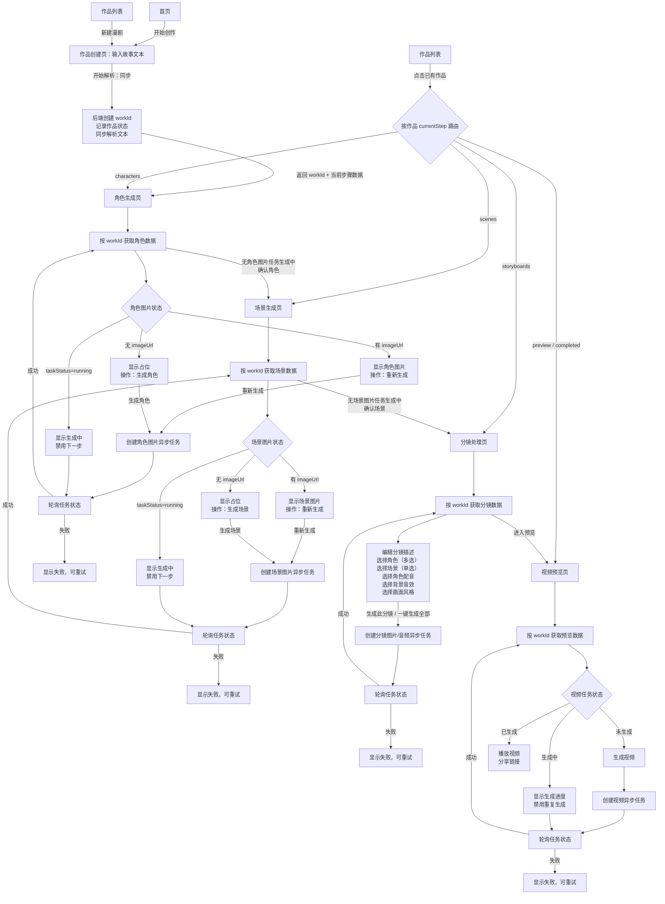

# 漫剧制作 App 整体业务流程图

> 本文先用于确认业务流程。确认后再继续生成前端/后端开发文档。

## 核心规则

- 文本解析是同步任务：点击「开始解析」后，后端创建作品 ID、记录作品状态、同步解析文本，并返回当前步骤需要的数据。
- 作品 ID 只在「开始解析」成功后产生；后续所有步骤都通过作品 ID 获取对应步骤数据。
- 图片与视频是异步任务：创建任务后，前端循环查询任务状态，直到成功或失败。
- 角色/场景不显示「已生成」文案：有图片就是已生成，没有图片就是未生成；生成中时不能进入下一步。
- 后端不需要每次返回作品全量数据，可以按步骤返回角色、场景、分镜、预览所需的数据。

## 主流程

## 作品状态路由

| currentStep | 入口页面 | 页面数据来源 | 下一步条件 |
| --- | --- | --- | --- |
| `draft` | 作品创建页 | 无 workId 或本地草稿 | 点击开始解析并成功创建 workId |
| `characters` | 角色生成页 | workId 获取角色列表 | 没有角色图片生成中 |
| `scenes` | 场景生成页 | workId 获取场景列表 | 没有场景图片生成中 |
| `storyboards` | 分镜处理页 | workId 获取分镜列表与参数 | 分镜数据满足预览条件 |
| `preview` | 视频预览页 | workId 获取视频与分镜预览数据 | 视频未生成时可创建视频任务 |
| `completed` | 视频预览页 | workId 获取最终视频数据 | 可播放、分享、再次编辑 |

## 异步任务轮询规则

| 任务类型 | 触发位置 | 轮询结果 | UI 约束 |
| --- | --- | --- | --- |
| 角色图片 | 角色生成页 | 成功后角色出现 imageUrl | 任一相关角色生成中时，不能确认进入场景页 |
| 场景图片 | 场景生成页 | 成功后场景出现 imageUrl | 任一相关场景生成中时，不能确认进入分镜页 |
| 分镜资源 | 分镜处理页 | 成功后分镜补齐图片/音频资源 | 单个分镜可重试，一键生成时需显示批量进度 |
| 视频 | 视频预览页 | 成功后出现 videoUrl | 生成中不能重复创建视频任务 |

## 待确认点

- 角色页进入下一步时，是要求「全部角色」没有生成中，还是仅要求「已选择角色」没有生成中。
- 场景页进入下一步时，是要求「全部场景」没有生成中，还是仅要求「已选择场景」没有生成中。
- 分镜进入预览时，是否允许部分分镜资源未生成完成。
