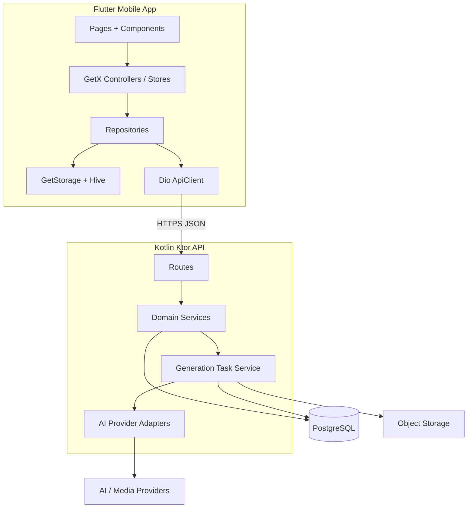
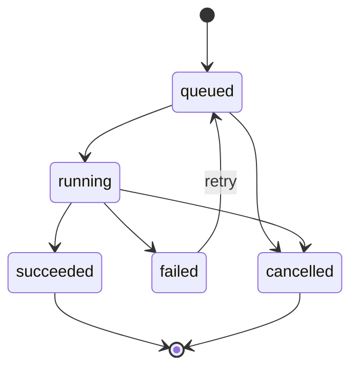

# 漫剧制作 App 技术方案计划

> 版本：v1.0  
> 创建日期：2026-04-25  
> 关联需求文档：[../01-需求/requirements.md](../01-需求/requirements.md)  
> 关联需求清单：[../01-需求/requirements-list.md](../01-需求/requirements-list.md)  
> 关联设计计划：[../01-需求/figma-design-plan.md](../01-需求/figma-design-plan.md)  
> Figma 状态：已完成 375 x 812 手机端 UI 设计稿，分镜处理页按内容加高

---

## 1. 系统架构概述

### 1.1 整体架构



本方案采用“手机端创作流程 + 服务端异步生成”的架构。

- Flutter 端负责移动端页面、草稿编辑、状态展示、任务轮询和本地缓存。
- Kotlin 后端负责作品结构化数据、AI 生成任务编排、素材文件存储、视频生成结果与分享链接。
- 文本、角色、场景、分镜、视频生成都按异步任务处理，前端通过任务状态刷新 UI。
- MVP 暂不强依赖账号体系，可使用 `installation_id` 标识设备；后续如需要云端同步，再升级为登录账号体系。

### 1.2 架构原则

- 移动端优先：所有页面按 375 x 812 设计稿实现，复杂参数拆成独立页面或底部弹层。
- 草稿不丢失：用户输入文本、选择角色、编辑分镜描述和参数时，先写入本地草稿，再提交服务端。
- 任务可恢复：生成任务可轮询恢复，页面返回或重进后仍能看到任务状态。
- 生成失败不覆盖：角色、场景、分镜重新生成失败时保留旧结果。
- 跳过不是失败：角色和场景跳过要保存为业务状态，不进入错误链路。

### 1.3 技术栈选型

| 层级 | 技术 | 版本建议 | 选型理由 |
|------|------|----------|---------|
| 前端 | Flutter / Dart | Flutter 3.24+ / Dart 3.x | 跨平台移动端一致性好，适合后续扩展 iOS / Android |
| 状态管理 | GetX | 4.x | 与参考工程一致，页面 Controller、全局 Store 和响应式状态组织成熟 |
| 路由 | go_router | 14.x+ | 声明式路由，适合流程页和二级选择页 |
| 网络 | dio | 5.x | 拦截器、重试、统一响应封装成熟 |
| 本地存储 | GetStorage + Hive | GetStorage 2.x / Hive 2.x | 与参考工程一致，轻量设置和结构化草稿缓存边界清晰 |
| 图片缓存 | cached_network_image | 稳定版 | 支撑角色、场景、分镜封面懒加载 |
| 播放 | video_player | 稳定版 | 支撑预览页基础视频播放 |
| 后端 | Kotlin + Ktor | Kotlin 2.x / Ktor 3.x | 轻量 REST API，适合异步任务和模块化服务 |
| 数据库 | PostgreSQL | 15+ | 结构化作品、分镜和任务数据可靠 |
| ORM | Exposed / jOOQ | 稳定版 | Kotlin 生态匹配度高 |
| 对象存储 | S3 Compatible / MinIO | 稳定版 | 存储角色图、场景图、分镜图、视频文件 |
| 任务编排 | DB Task Queue + Coroutine Worker | MVP | MVP 可先用数据库任务表，后续再接 Redis / MQ |
| 部署 | Docker Compose | MVP | 前后端服务、数据库、对象存储可快速部署 |

### 1.4 当前版本关键技术决策

- MVP 使用设备级身份：客户端生成并保存 `installation_id`，请求头上送。
- 作品数据以服务端为主，本地保留草稿和最近访问缓存。
- 所有 AI 生成接口返回 `taskId`，不阻塞 HTTP 请求等待生成完成。
- 角色选择支持多选；场景选择在单个分镜内只能选择一个主场景。
- 分镜文字字段统一为 `description`，不再设计独立 `title` 字段。

---

## 2. 数据设计

### 2.1 核心实体

| 实体 | 说明 | 关键字段 |
|------|------|---------|
| `works` | 漫剧作品 | `id`, `installation_id`, `name`, `status`, `current_step`, `cover_asset_id`, `duration_seconds`, `created_at`, `updated_at` |
| `story_texts` | 用户输入故事文本 | `id`, `work_id`, `content`, `parse_status`, `version`, `updated_at` |
| `characters` | 角色 | `id`, `work_id`, `name`, `role_tag`, `description`, `avatar_asset_id`, `source`, `selected`, `sort_order` |
| `scenes` | 场景 | `id`, `work_id`, `name`, `mood_tags_json`, `description`, `image_asset_id`, `source`, `selected`, `sort_order` |
| `storyboards` | 分镜 | `id`, `work_id`, `sort_order`, `description`, `scene_id`, `style`, `voice_preset`, `bgm_preset`, `image_asset_id`, `status` |
| `storyboard_characters` | 分镜角色关联 | `storyboard_id`, `character_id`, `sort_order` |
| `generation_tasks` | AI 生成任务 | `id`, `work_id`, `target_type`, `target_id`, `task_type`, `status`, `progress`, `error_message`, `result_json` |
| `assets` | 素材文件 | `id`, `work_id`, `asset_type`, `storage_key`, `url`, `width`, `height`, `duration_seconds`, `metadata_json` |
| `video_previews` | 视频预览结果 | `id`, `work_id`, `video_asset_id`, `subtitle_json`, `filmstrip_json`, `status` |
| `share_links` | 分享链接 | `id`, `work_id`, `token`, `expire_at`, `created_at` |

### 2.2 本地缓存表

Flutter 本地使用 GetStorage + Hive 建议保留以下 Box / Key：

| Box / Key | 用途 |
|----|------|
| `local_works` | 首页作品列表缓存、最近编辑作品 |
| `local_story_drafts` | 故事输入草稿 |
| `local_storyboard_drafts` | 分镜描述和参数草稿 |
| `local_generation_tasks` | 任务轮询恢复 |
| `local_assets_cache` | 图片、视频封面和 URL 元信息缓存 |
| `local_app_settings` | `installation_id`、音量、最近风格等偏好 |

### 2.3 状态枚举

#### 作品状态

| 状态 | 技术枚举 | 说明 |
|------|----------|------|
| 草稿 | `draft` | 已创建但未完成解析 |
| 解析中 | `parsing` | 文本解析任务进行中 |
| 编辑中 | `editing` | 角色、场景或分镜处理中 |
| 生成中 | `generating` | 分镜或视频生成中 |
| 已完成 | `completed` | 视频生成成功 |
| 失败 | `failed` | 最近一次关键任务失败 |

#### 生成任务状态

| 状态 | 技术枚举 | 说明 |
|------|----------|------|
| 待生成 | `pending` | 已创建任务但未开始 |
| 排队中 | `queued` | 等待 Worker 执行 |
| 生成中 | `running` | Worker 正在生成 |
| 已完成 | `succeeded` | 生成成功 |
| 失败 | `failed` | 生成失败，可重试 |
| 已取消 | `cancelled` | 用户取消或任务被替换 |
| 已跳过 | `skipped` | 用户主动跳过 |

### 2.4 实体关系

- `works` 1 对 1 `story_texts`
- `works` 1 对多 `characters`
- `works` 1 对多 `scenes`
- `works` 1 对多 `storyboards`
- `storyboards` 多对多 `characters`，通过 `storyboard_characters` 关联
- `storyboards` 多对 1 `scenes`，单个分镜只允许一个 `scene_id`
- `works` 1 对多 `generation_tasks`
- `assets` 可被角色、场景、分镜和视频引用
- `works` 1 对多 `share_links`

### 2.5 数据更新策略

- 故事输入、分镜描述、参数选择先保存本地草稿，再调用服务端保存。
- 角色 / 场景确认后，前端提交完整选中集合，服务端以集合覆盖当前作品选择态。
- 分镜角色选择提交 `characterIds` 数组，允许为空。
- 分镜场景选择提交单个 `sceneId`，允许为空；为空时后端使用文本描述或默认场景。
- 重新生成成功前不覆盖旧资产；成功后更新目标实体的 `asset_id` 并保留历史任务记录。

---

## 3. API 接口规划

### 3.1 统一接口规范

```json
{
  "code": 0,
  "message": "success",
  "data": {}
}
```

请求头：

- `X-Installation-Id`：设备安装实例标识。
- `X-App-Version`：客户端版本。
- `X-Timezone`：设备时区。
- `Idempotency-Key`：创建任务、生成视频等关键 POST 请求建议传入。

### 3.2 MVP 接口列表

| 模块 | 方法 | 路径 | 描述 |
|------|------|------|------|
| 作品 | GET | `/api/v1/works` | 获取作品列表 |
| 作品 | POST | `/api/v1/works` | 创建作品 |
| 作品 | GET | `/api/v1/works/{id}` | 获取作品详情 |
| 作品 | PUT | `/api/v1/works/{id}` | 更新作品基础信息 |
| 作品 | DELETE | `/api/v1/works/{id}` | 删除作品，MVP 可软删除 |
| 文本解析 | POST | `/api/v1/works/{id}/parse` | 提交文本解析任务 |
| 角色 | POST | `/api/v1/works/{id}/characters/generate` | 生成角色 |
| 角色 | PUT | `/api/v1/works/{id}/characters` | 保存角色选择与编辑 |
| 场景 | POST | `/api/v1/works/{id}/scenes/generate` | 生成场景 |
| 场景 | PUT | `/api/v1/works/{id}/scenes` | 保存场景选择与编辑 |
| 分镜 | GET | `/api/v1/works/{id}/storyboards` | 获取分镜列表 |
| 分镜 | POST | `/api/v1/works/{id}/storyboards` | 新增分镜 |
| 分镜 | PUT | `/api/v1/works/{id}/storyboards/{storyboardId}` | 更新单个分镜描述和参数 |
| 分镜 | DELETE | `/api/v1/works/{id}/storyboards/{storyboardId}` | 删除分镜 |
| 分镜 | POST | `/api/v1/works/{id}/storyboards/{storyboardId}/generate` | 生成单个分镜 |
| 分镜 | POST | `/api/v1/works/{id}/storyboards/generate-all` | 批量生成分镜 |
| 视频 | POST | `/api/v1/works/{id}/video/generate` | 生成最终视频 |
| 视频 | GET | `/api/v1/works/{id}/video` | 获取视频预览与导出信息 |
| 分享 | POST | `/api/v1/works/{id}/share` | 创建分享链接 |
| 任务 | GET | `/api/v1/tasks/{taskId}` | 查询异步任务状态 |
| 任务 | POST | `/api/v1/tasks/{taskId}/retry` | 重试失败任务 |

### 3.3 关键请求结构

#### 更新分镜

```json
{
  "description": "林风察觉异样，黑暗气息逼近。",
  "characterIds": ["char_1", "char_2"],
  "sceneId": "scene_1",
  "style": "dark",
  "voicePreset": "young_deep",
  "bgmPreset": "epic_drums"
}
```

#### 生成任务返回

```json
{
  "taskId": "task_123",
  "status": "queued",
  "targetType": "storyboard",
  "targetId": "storyboard_123",
  "pollingIntervalMs": 2000
}
```

### 3.4 错误码建议

| 错误码 | 场景 | 前端处理 |
|--------|------|----------|
| `40001` | 参数校验失败 | 展示字段错误，不丢草稿 |
| `40401` | 作品不存在 | 返回首页并刷新作品列表 |
| `40901` | 任务重复提交 | 使用已有任务继续轮询 |
| `42201` | 分镜缺少可用内容 | 提示补充分镜描述或使用默认资源 |
| `50001` | AI 服务失败 | 展示失败态与重试入口 |
| `50301` | 生成服务繁忙 | 展示排队提示，延长轮询间隔 |

### 3.5 异步任务轮询策略

- 前端提交生成请求后立即进入生成中 UI。
- 前端按接口返回的 `pollingIntervalMs` 轮询 `/api/v1/tasks/{taskId}`。
- 任务完成后刷新目标实体详情或作品详情。
- App 进入后台后降低轮询频率；回到前台时主动拉取未完成任务。
- 失败任务保留 `error_message`、`retryable`、`retry_count`，前端据此展示重试入口。

---

## 4. 前端模块划分（Flutter）

### 4.1 页面路由规划

| 路由 | 页面 | 说明 |
|------|------|------|
| `/` | HomePage | 首页、开始创作、作品列表 |
| `/create/story` | StoryInputPage | 故事输入与文本解析 |
| `/create/characters` | CharacterGeneratePage | 角色生成、选择、跳过 |
| `/create/scenes` | SceneGeneratePage | 场景生成、选择、跳过 |
| `/create/storyboards` | StoryboardEditPage | 分镜处理，移动端长页面 |
| `/create/storyboards/:id/characters` | StoryboardCharacterSelectPage | 当前分镜角色多选 |
| `/create/storyboards/:id/scene` | StoryboardSceneSelectPage | 当前分镜场景单选 |
| `/create/preview` | VideoPreviewPage | 视频预览、生成、分享 |
| `/works/:id` | WorkEntryPage | 根据作品状态跳转编辑或预览 |
| `/tutorial` | TutorialPage | 新手教程，MVP 可只保留入口 |

### 4.2 前端模块列表

| 模块 | 功能 | 优先级 |
|------|------|--------|
| `app_shell` | App 启动、主题、路由、全局错误处理 | P0 |
| `design_system` | 颜色、字体、按钮、卡片、标签、底部弹层 | P0 |
| `home` | 首页、作品列表、作品状态卡片 | P0 |
| `story_input` | 文本输入、草稿保存、解析任务提交 | P0 |
| `characters` | 角色列表、选中态、新建角色、跳过 | P0 |
| `scenes` | 场景列表、选中态、新建场景、跳过 | P0 |
| `storyboards` | 分镜列表、描述编辑、参数、生成任务 | P0 |
| `preview` | 视频播放器、胶片列表、生成视频、分享 | P0 |
| `generation_tasks` | 任务轮询、重试、失败反馈 | P0 |
| `local_storage` | GetStorage / Hive 封装、草稿缓存、installation_id | P0 |
| `api_client` | dio 封装、错误码、重试、请求头 | P0 |

### 4.3 状态管理方案

采用 GetX 分层：

- `GetxController`：管理页面状态、表单校验、按钮 loading、任务轮询。
- `GetxService` / Store：管理全局状态，如当前作品、设备标识、任务中心、应用配置。
- `.obs` + `Obx`：承载角色多选、场景单选、分镜参数、生成状态等响应式 UI。
- `Service`：封装 API、Hive、GetStorage 和业务编排，页面不直接调用 dio。

页面状态统一通过 Controller / Service 层：

```text
Page -> GetxController -> Service -> Hive / GetStorage + ApiClient
```

### 4.4 设计实现约束

- Flutter UI 界面必须按照已完成 Figma 手机端设计稿实现，Figma 是页面布局、视觉层级、间距、字号、颜色、圆角、组件状态和交互反馈的第一真源。
- 主设计稿按 375 x 812；分镜处理页为长页面，需支持纵向滚动。
- 顶部栏、流程进度、主按钮、状态标签、卡片、底部弹层必须组件化。
- 角色和场景卡片需要稳定图片比例，避免图片加载导致列表跳动。
- 文本输入页需处理键盘弹出，底部按钮不能被键盘遮挡。
- 预览页播放器比例固定，字幕与控制条不能互相遮挡。
- 复杂参数优先以独立页面或底部弹层承载，避免分镜处理页过载。
- PRD 和原始宽屏参考图只用于确认业务、流程、颜色和氛围；实际 Flutter 布局不得脱离 Figma 自行重排。

---

## 5. 后端模块划分（Kotlin）

### 5.1 项目结构建议

```text
src/main/kotlin/com/manju/
  Application.kt
  config/
  routes/
    WorkRoutes.kt
    ParseRoutes.kt
    CharacterRoutes.kt
    SceneRoutes.kt
    StoryboardRoutes.kt
    VideoRoutes.kt
    TaskRoutes.kt
    ShareRoutes.kt
  service/
    WorkService.kt
    ParseService.kt
    CharacterService.kt
    SceneService.kt
    StoryboardService.kt
    VideoService.kt
    GenerationTaskService.kt
    AssetService.kt
  repository/
  model/
  dto/
  worker/
  ai/
  storage/
  util/
```

### 5.2 核心模块列表

| 模块 | 功能 | 优先级 |
|------|------|--------|
| Work | 作品创建、列表、详情、状态流转 | P0 |
| Parse | 故事文本解析，生成角色、场景、初始分镜结构 | P0 |
| Character | 角色生成、编辑、选择、跳过 | P0 |
| Scene | 场景生成、编辑、选择、跳过 | P0 |
| Storyboard | 分镜描述、参数、排序、单镜头生成 | P0 |
| Video | 视频预览、最终视频生成、导出信息 | P0 |
| GenerationTask | 任务创建、状态流转、重试、轮询查询 | P0 |
| Asset | 图片、音频、视频文件存储和 URL 签发 | P0 |
| Share | 分享链接创建和过期控制 | P1 |
| Installation | 设备级身份和请求追踪 | P0 |

### 5.3 AI 生成适配层

后端不要把具体 AI Provider 写死在业务服务中，统一通过适配器接口隔离。

| 接口 | 输入 | 输出 |
|------|------|------|
| `TextParseAdapter` | 故事文本 | 角色、场景、分镜结构 |
| `CharacterImageAdapter` | 角色描述、风格 | 角色图资产 |
| `SceneImageAdapter` | 场景描述、氛围标签 | 场景图资产 |
| `StoryboardImageAdapter` | 分镜描述、角色、场景、风格 | 分镜图资产 |
| `VoiceAdapter` | 分镜文本、声线预设 | 音频资产 |
| `BgmAdapter` | 音效预设、时长 | 音频资产 |
| `VideoComposeAdapter` | 分镜图、配音、音效、字幕 | 视频资产 |

MVP 可先使用 mock adapter 或规则生成器打通流程，再替换为真实 AI / 媒体服务。

### 5.4 任务状态机



任务服务职责：

- 创建任务时写入 `generation_tasks`。
- Worker 获取 `queued` 任务并改为 `running`。
- 生成中定期更新 `progress`。
- 成功后写入 `assets`，更新目标实体状态。
- 失败后保留错误信息，不覆盖旧资产。

---

## 6. 开发任务拆分

### 6.1 前端任务（Flutter）

| 任务 | 描述 | 预估工作量 | 优先级 |
|------|------|------------|--------|
| T-F001 | 初始化 Flutter 工程、主题、路由、基础依赖 | 1 天 | P0 |
| T-F002 | 建立设计系统组件：按钮、卡片、标签、顶部栏、底部弹层 | 2 天 | P0 |
| T-F003 | 实现 API Client、统一响应、错误处理、installation_id | 1.5 天 | P0 |
| T-F004 | 实现 GetStorage / Hive 本地封装与草稿缓存 | 2 天 | P0 |
| T-F005 | 首页与作品列表，包括空态、失败态、作品状态卡片 | 2 天 | P0 |
| T-F006 | 故事输入页，包括键盘适配、草稿、解析中和失败态 | 2 天 | P0 |
| T-F007 | 角色生成页，包括多选、新建角色、跳过、确认 | 2.5 天 | P0 |
| T-F008 | 场景生成页，包括单/多候选选择、新建场景、跳过、确认 | 2 天 | P0 |
| T-F009 | 分镜处理页，包括横向分镜条、预览区、分镜描述和生成按钮 | 3 天 | P0 |
| T-F010 | 分镜角色选择页，支持多选并应用到当前分镜 | 1.5 天 | P0 |
| T-F011 | 分镜场景选择页，支持单选并应用到当前分镜 | 1.5 天 | P0 |
| T-F012 | 分镜参数组件：画面风格、角色配音、背景音效 | 2 天 | P0 |
| T-F013 | 生成任务轮询、进度、重试、失败反馈 | 2 天 | P0 |
| T-F014 | 视频预览页：播放器、胶片列表、生成视频、分享弹层 | 3 天 | P0 |
| T-F015 | 移动端适配与视觉走查：375x812、390x844、430x932 | 1.5 天 | P0 |

### 6.2 后端任务（Kotlin）

| 任务 | 描述 | 预估工作量 | 优先级 |
|------|------|------------|--------|
| T-B001 | 初始化 Ktor 工程、配置、数据库连接、统一响应 | 1.5 天 | P0 |
| T-B002 | 建立 PostgreSQL schema、迁移和基础 repository | 2 天 | P0 |
| T-B003 | 作品接口：创建、列表、详情、更新、删除 | 1.5 天 | P0 |
| T-B004 | 文本解析接口和 mock adapter，返回角色、场景、分镜结构 | 2 天 | P0 |
| T-B005 | 角色接口：生成任务、保存选择、编辑、新建 | 2 天 | P0 |
| T-B006 | 场景接口：生成任务、保存选择、编辑、新建 | 2 天 | P0 |
| T-B007 | 分镜接口：列表、新增、更新描述与参数、删除 | 2 天 | P0 |
| T-B008 | 单分镜生成与批量生成任务 | 3 天 | P0 |
| T-B009 | 视频生成任务、视频预览信息和导出地址 | 3 天 | P0 |
| T-B010 | 任务服务：状态机、轮询查询、重试、失败记录 | 2 天 | P0 |
| T-B011 | 对象存储封装：上传、URL 签发、元信息保存 | 2 天 | P0 |
| T-B012 | 分享链接接口和过期控制 | 1 天 | P1 |
| T-B013 | 日志、请求追踪、错误码和基础监控 | 1.5 天 | P0 |

### 6.3 联调与验证任务

| 任务 | 描述 | 优先级 |
|------|------|--------|
| T-Q001 | 主流程联调：首页 -> 输入故事 -> 角色 -> 场景 -> 分镜 -> 预览 | P0 |
| T-Q002 | 跳过链路联调：跳过角色、跳过场景后仍可生成分镜 | P0 |
| T-Q003 | 分镜参数联调：角色多选、场景单选、配音、音效保存 | P0 |
| T-Q004 | 生成失败联调：保留旧内容、展示重试、不丢草稿 | P0 |
| T-Q005 | 视频生成联调：生成中、成功、失败、分享 | P0 |
| T-Q006 | 移动端视觉验收：逐页对齐 Figma 375 x 812 设计稿 | P0 |

---

## 7. 开发阶段规划

| 阶段 | 前端任务 | 后端任务 | 里程碑 |
|------|----------|----------|--------|
| 第 1 阶段：工程与基础能力 | T-F001 ~ T-F004 | T-B001 ~ T-B003 | App 可启动，作品可创建和缓存 |
| 第 2 阶段：文本解析到角色场景 | T-F005 ~ T-F008 | T-B004 ~ T-B006 | 能完成故事输入、解析、角色/场景选择或跳过 |
| 第 3 阶段：分镜编辑与参数 | T-F009 ~ T-F013 | T-B007 ~ T-B010 | 能编辑分镜描述、选择角色/场景/配音/音效并生成分镜 |
| 第 4 阶段：预览与视频生成 | T-F014 | T-B009、T-B011、T-B012 | 能预览、生成视频、分享链接 |
| 第 5 阶段：验收与打磨 | T-F015、T-Q001 ~ T-Q006 | T-B013、问题修复 | MVP 主流程可演示 |

---

## 8. 风险与应对

| 风险 | 影响 | 应对方案 |
|------|------|----------|
| AI 生成耗时长 | 用户等待焦虑，页面像卡住 | 所有生成走异步任务，展示排队、进度、失败和重试 |
| AI Provider 不稳定 | 角色、场景、分镜生成失败 | 适配层隔离 Provider，MVP 保留 mock / fallback 结果 |
| 移动端分镜处理页信息过多 | 页面拥挤、操作难找 | 当前分镜优先，参数用卡片入口、选择页和底部弹层拆分 |
| 视频文件较大 | 上传、加载、播放慢 | 使用对象存储、封面图、懒加载、分辨率分档 |
| 重新生成覆盖用户编辑 | 用户修改丢失 | 先写草稿，生成成功后再替换资产，不覆盖描述和参数 |
| 跳过角色/场景后生成质量下降 | 后续结果不稳定 | 后端对跳过状态使用默认资源、文本描述和占位策略 |
| 无账号导致跨设备不可恢复 | 数据只在设备级可用 | MVP 明确设备级作品，后续升级账号与云同步 |

---

## 9. 下一步文档产出

技术方案完成后，建议继续输出：

1. `projects/漫剧制作/03-前端/flutter-tech.md`：Flutter 详细技术文档。
2. `projects/漫剧制作/04-后端/kotlin-tech.md`：Kotlin 后端详细技术文档。
3. `projects/漫剧制作/03-前端/flutter-dev-plan.md`：Flutter 总体开发计划。

建议优先生成 Flutter 技术文档，因为当前 Figma UI 稿已经完成，前端页面结构和组件约束最明确。
