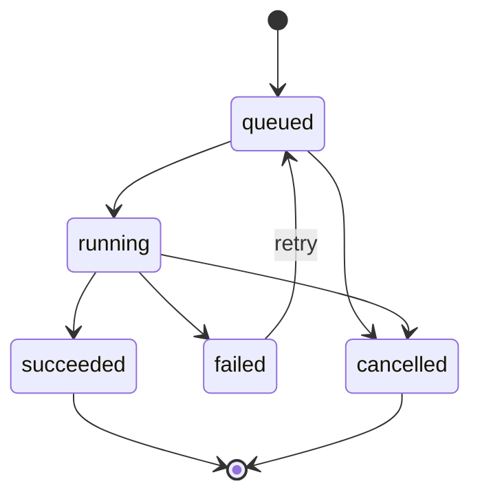

# 漫剧制作 App Kotlin 后端技术文档

> 版本：v1.1  
> 更新日期：2026-04-25  
> 关联流程图：[../02-技术方案/app-flow.md](../02-技术方案/app-flow.md)  
> 关联前端文档：[../03-前端/flutter-tech.md](../03-前端/flutter-tech.md)  
> 框架：Ktor  
> Kotlin：2.x  
> JVM：17  
> 数据库：PostgreSQL 15+  
> ORM：Exposed  
> 迁移：Flyway  
> 对象存储：S3 Compatible / MinIO

---

## 0. 文档定位

本文档用于指导漫剧制作 App 后端实现，重点明确：

- 文本解析是同步流程：`POST /api/v1/works/parse` 创建作品、生成 `workId`、同步解析文本并返回角色步骤数据。
- 图片、分镜资源、视频是异步任务：创建任务后由 Worker 执行，前端轮询任务状态。
- 后续页面都通过 `workId` 分步骤获取数据，不要求每次返回作品全量。
- 角色/场景状态不需要单独显示「已生成」字段：有图片资产即已生成，无图片资产即未生成，存在运行中任务则禁止进入下一步。
- MVP 不做账号体系，使用 `X-Installation-Id` 作为设备级数据边界。

---

## 1. 技术架构

```text
src/main/kotlin/com/manju/
├── Application.kt
├── plugins/
│   ├── Routing.kt
│   ├── Serialization.kt
│   ├── StatusPages.kt
│   ├── Monitoring.kt
│   ├── CORS.kt
│   └── Database.kt
├── routes/
│   ├── WorkRoutes.kt
│   ├── CharacterRoutes.kt
│   ├── SceneRoutes.kt
│   ├── StoryboardRoutes.kt
│   ├── VideoRoutes.kt
│   ├── TaskRoutes.kt
│   └── ShareRoutes.kt
├── services/
│   ├── InstallationService.kt
│   ├── WorkService.kt
│   ├── StoryParseService.kt
│   ├── CharacterService.kt
│   ├── SceneService.kt
│   ├── StoryboardService.kt
│   ├── VideoService.kt
│   ├── GenerationTaskService.kt
│   ├── AssetService.kt
│   └── ShareService.kt
├── repositories/
├── tables/
├── models/
│   ├── request/
│   ├── response/
│   ├── entity/
│   └── enums/
├── ai/
│   ├── TextParseAdapter.kt
│   ├── MediaGenerationAdapters.kt
│   ├── MockAdapters.kt
│   └── ProviderAdapters.kt
├── worker/
│   ├── GenerationWorker.kt
│   └── WorkerLauncher.kt
├── storage/
│   ├── ObjectStorageClient.kt
│   └── MinioObjectStorageClient.kt
└── utils/
    ├── ApiResponse.kt
    ├── RequestContext.kt
    ├── Errors.kt
    └── Idempotency.kt
```

分层职责：

| 层 | 职责 |
| --- | --- |
| Routes | 参数、Header、响应封装，不写业务规则 |
| Services | 事务、状态流转、任务编排、业务校验 |
| Repositories | Exposed 查询和持久化 |
| AI Adapters | 隔离文本解析、图片、音频、视频 Provider |
| Worker | 拉取异步任务并执行 |
| Storage | 资产上传、签名 URL、元信息 |

---

## 2. 核心枚举

### 2.1 作品步骤

```kotlin
enum class WorkStep {
    draft,
    characters,
    scenes,
    storyboards,
    preview,
    completed
}
```

### 2.2 作品状态

```kotlin
enum class WorkStatus {
    draft,
    editing,
    generating,
    completed,
    failed,
    deleted
}
```

### 2.3 任务状态

```kotlin
enum class GenerationTaskStatus {
    queued,
    running,
    succeeded,
    failed,
    cancelled
}
```

### 2.4 任务类型

```kotlin
enum class GenerationTaskType {
    character_image,
    scene_image,
    storyboard_asset,
    storyboard_batch,
    video
}
```

说明：文本解析不进入 `generation_tasks`，它是同步业务动作。

---

## 3. 数据库设计

### 3.1 表清单

| 表名 | 说明 |
| --- | --- |
| `device_installations` | 设备安装实例 |
| `works` | 作品 |
| `story_texts` | 作品故事文本 |
| `characters` | 角色 |
| `scenes` | 场景 |
| `storyboards` | 分镜 |
| `storyboard_characters` | 分镜角色多选关联 |
| `generation_tasks` | 图片、分镜资源、视频异步任务 |
| `assets` | 图片、音频、视频资产 |
| `video_previews` | 视频预览信息 |
| `share_links` | 分享链接 |
| `idempotency_keys` | 幂等请求记录 |

### 3.2 核心表

#### `works`

```sql
CREATE TABLE works (
    id UUID PRIMARY KEY,
    installation_id VARCHAR(64) NOT NULL REFERENCES device_installations(installation_id),
    name VARCHAR(128) NOT NULL,
    status VARCHAR(32) NOT NULL DEFAULT 'editing',
    current_step VARCHAR(32) NOT NULL DEFAULT 'characters',
    cover_asset_id UUID NULL,
    duration_seconds INT NULL,
    deleted_at TIMESTAMP NULL,
    created_at TIMESTAMP NOT NULL DEFAULT CURRENT_TIMESTAMP,
    updated_at TIMESTAMP NOT NULL DEFAULT CURRENT_TIMESTAMP
);

CREATE INDEX idx_works_installation_updated ON works(installation_id, updated_at DESC);
```

#### `story_texts`

```sql
CREATE TABLE story_texts (
    id UUID PRIMARY KEY,
    work_id UUID NOT NULL REFERENCES works(id) ON DELETE CASCADE,
    content TEXT NOT NULL,
    version INT NOT NULL DEFAULT 1,
    created_at TIMESTAMP NOT NULL DEFAULT CURRENT_TIMESTAMP,
    updated_at TIMESTAMP NOT NULL DEFAULT CURRENT_TIMESTAMP,
    UNIQUE(work_id)
);
```

#### `characters`

```sql
CREATE TABLE characters (
    id UUID PRIMARY KEY,
    work_id UUID NOT NULL REFERENCES works(id) ON DELETE CASCADE,
    name VARCHAR(64) NOT NULL,
    role_tag VARCHAR(32),
    description TEXT,
    image_asset_id UUID NULL REFERENCES assets(id),
    source VARCHAR(32) NOT NULL DEFAULT 'ai',
    selected BOOLEAN NOT NULL DEFAULT TRUE,
    sort_order INT NOT NULL DEFAULT 0,
    created_at TIMESTAMP NOT NULL DEFAULT CURRENT_TIMESTAMP,
    updated_at TIMESTAMP NOT NULL DEFAULT CURRENT_TIMESTAMP
);

CREATE INDEX idx_characters_work_sort ON characters(work_id, sort_order);
```

#### `scenes`

```sql
CREATE TABLE scenes (
    id UUID PRIMARY KEY,
    work_id UUID NOT NULL REFERENCES works(id) ON DELETE CASCADE,
    name VARCHAR(64) NOT NULL,
    description TEXT,
    tags_json JSONB NOT NULL DEFAULT '[]'::jsonb,
    image_asset_id UUID NULL REFERENCES assets(id),
    source VARCHAR(32) NOT NULL DEFAULT 'ai',
    selected BOOLEAN NOT NULL DEFAULT TRUE,
    sort_order INT NOT NULL DEFAULT 0,
    created_at TIMESTAMP NOT NULL DEFAULT CURRENT_TIMESTAMP,
    updated_at TIMESTAMP NOT NULL DEFAULT CURRENT_TIMESTAMP
);

CREATE INDEX idx_scenes_work_sort ON scenes(work_id, sort_order);
```

#### `storyboards`

```sql
CREATE TABLE storyboards (
    id UUID PRIMARY KEY,
    work_id UUID NOT NULL REFERENCES works(id) ON DELETE CASCADE,
    sort_order INT NOT NULL,
    description TEXT NOT NULL,
    scene_id UUID NULL REFERENCES scenes(id),
    style VARCHAR(64),
    voice_preset VARCHAR(64),
    bgm_preset VARCHAR(64),
    image_asset_id UUID NULL REFERENCES assets(id),
    voice_asset_id UUID NULL REFERENCES assets(id),
    bgm_asset_id UUID NULL REFERENCES assets(id),
    status VARCHAR(32) NOT NULL DEFAULT 'pending',
    created_at TIMESTAMP NOT NULL DEFAULT CURRENT_TIMESTAMP,
    updated_at TIMESTAMP NOT NULL DEFAULT CURRENT_TIMESTAMP
);

CREATE INDEX idx_storyboards_work_sort ON storyboards(work_id, sort_order);
```

注意：分镜文本字段统一为 `description`，不新增 `title` 字段。

#### `storyboard_characters`

```sql
CREATE TABLE storyboard_characters (
    storyboard_id UUID NOT NULL REFERENCES storyboards(id) ON DELETE CASCADE,
    character_id UUID NOT NULL REFERENCES characters(id) ON DELETE CASCADE,
    sort_order INT NOT NULL DEFAULT 0,
    PRIMARY KEY (storyboard_id, character_id)
);
```

#### `generation_tasks`

```sql
CREATE TABLE generation_tasks (
    id UUID PRIMARY KEY,
    work_id UUID NOT NULL REFERENCES works(id) ON DELETE CASCADE,
    task_type VARCHAR(32) NOT NULL,
    target_type VARCHAR(32) NOT NULL,
    target_id UUID NULL,
    status VARCHAR(32) NOT NULL DEFAULT 'queued',
    progress INT NOT NULL DEFAULT 0,
    retry_count INT NOT NULL DEFAULT 0,
    max_retry_count INT NOT NULL DEFAULT 2,
    error_message TEXT NULL,
    input_json JSONB NOT NULL DEFAULT '{}'::jsonb,
    result_json JSONB NOT NULL DEFAULT '{}'::jsonb,
    locked_at TIMESTAMP NULL,
    locked_by VARCHAR(64) NULL,
    created_at TIMESTAMP NOT NULL DEFAULT CURRENT_TIMESTAMP,
    updated_at TIMESTAMP NOT NULL DEFAULT CURRENT_TIMESTAMP
);

CREATE INDEX idx_generation_tasks_status_created ON generation_tasks(status, created_at);
CREATE INDEX idx_generation_tasks_target_running
    ON generation_tasks(work_id, task_type, target_type, target_id, status);
```

#### `assets`

```sql
CREATE TABLE assets (
    id UUID PRIMARY KEY,
    work_id UUID NULL REFERENCES works(id) ON DELETE CASCADE,
    asset_type VARCHAR(32) NOT NULL,
    storage_key TEXT NOT NULL,
    url TEXT NULL,
    width INT NULL,
    height INT NULL,
    duration_seconds INT NULL,
    metadata_json JSONB NOT NULL DEFAULT '{}'::jsonb,
    created_at TIMESTAMP NOT NULL DEFAULT CURRENT_TIMESTAMP
);
```

#### `video_previews`

```sql
CREATE TABLE video_previews (
    id UUID PRIMARY KEY,
    work_id UUID NOT NULL REFERENCES works(id) ON DELETE CASCADE,
    video_asset_id UUID NULL REFERENCES assets(id),
    subtitle_json JSONB NOT NULL DEFAULT '[]'::jsonb,
    filmstrip_json JSONB NOT NULL DEFAULT '[]'::jsonb,
    status VARCHAR(32) NOT NULL DEFAULT 'pending',
    created_at TIMESTAMP NOT NULL DEFAULT CURRENT_TIMESTAMP,
    updated_at TIMESTAMP NOT NULL DEFAULT CURRENT_TIMESTAMP,
    UNIQUE(work_id)
);
```

---

## 4. 统一响应、Header 与错误码

### 4.1 响应结构

```kotlin
@Serializable
data class ApiResponse<T>(
    val code: Int,
    val message: String,
    val data: T? = null
)
```

成功统一返回：

```json
{
  "code": 0,
  "message": "success",
  "data": {}
}
```

### 4.2 必要 Header

| Header | 说明 |
| --- | --- |
| `X-Installation-Id` | 设备级身份，业务接口必传 |
| `X-App-Version` | App 版本 |
| `X-Timezone` | 客户端时区 |
| `Idempotency-Key` | 关键 POST 建议必传 |

后端不自动生成 `installationId`，缺失时返回 `40101`。

### 4.3 错误码

| 错误码 | 含义 |
| --- | --- |
| `0` | 成功 |
| `40001` | 参数校验失败 |
| `40101` | 缺少设备标识 |
| `40401` | 作品不存在或无权限 |
| `40402` | 目标资源不存在 |
| `40901` | 幂等请求重复 |
| `40902` | 已有运行中任务，不能重复创建 |
| `40903` | 当前步骤不允许该操作 |
| `42201` | 分镜缺少必要内容 |
| `50001` | AI / 媒体服务失败 |
| `50301` | 生成服务繁忙 |

---

## 5. API 设计

### 5.1 首页作品列表

#### `GET /api/v1/works`

返回当前设备作品列表。

响应：

```json
{
  "items": [
    {
      "id": "workId",
      "name": "作品名",
      "status": "editing",
      "currentStep": "storyboards",
      "coverUrl": "https://...",
      "durationSeconds": 12,
      "updatedAt": "2026-04-25T12:00:00Z"
    }
  ],
  "nextCursor": null
}
```

### 5.2 同步创建作品并解析文本

#### `POST /api/v1/works/parse`

这是作品创建的核心入口。接口必须同步完成文本解析，成功后才返回 `workId`。

请求：

```json
{
  "content": "完整故事文本",
  "name": "可选作品名"
}
```

处理规则：

1. 校验 `content`。
2. 创建 `works`，生成 `workId`。
3. 写入 `story_texts`。
4. 调用 `TextParseAdapter.parseStory()` 同步解析角色、场景、分镜。
5. 写入 `characters / scenes / storyboards`。
6. 设置 `works.current_step = characters`，`works.status = editing`。
7. 返回角色生成页所需数据。

响应：

```json
{
  "work": {
    "id": "workId",
    "name": "作品名",
    "status": "editing",
    "currentStep": "characters"
  },
  "characters": [
    {
      "id": "characterId",
      "name": "林风",
      "roleTag": "主角",
      "description": "十八岁少年，天赋异禀",
      "imageUrl": null,
      "runningTaskId": null,
      "selected": true
    }
  ]
}
```

失败规则：

- 解析失败时事务回滚，不产生可继续编辑的正式作品。
- 前端保留本地草稿，用户可重新提交。

### 5.3 按步骤获取作品数据

#### `GET /api/v1/works/{workId}/step/{step}`

用于作品列表续作和页面刷新。`step` 可选：

- `characters`
- `scenes`
- `storyboards`
- `preview`

后端只返回该步骤需要的数据，不返回作品全量。

---

## 6. 角色接口

### 6.1 获取角色步骤数据

#### `GET /api/v1/works/{workId}/characters`

响应：

```json
{
  "work": {
    "id": "workId",
    "currentStep": "characters"
  },
  "characters": [
    {
      "id": "characterId",
      "name": "林风",
      "roleTag": "主角",
      "description": "十八岁少年",
      "imageUrl": "https://...",
      "runningTaskId": null,
      "selected": true
    }
  ],
  "hasRunningImageTask": false
}
```

状态口径：

- `imageUrl != null`：前端视为有图。
- `imageUrl == null`：前端视为无图。
- `runningTaskId != null` 或 `hasRunningImageTask=true`：前端禁用下一步。

### 6.2 创建角色图片任务

#### `POST /api/v1/works/{workId}/characters/{characterId}/image-task`

规则：

- 支持无图生成和有图重新生成。
- 如果同角色已有 `queued/running` 的 `character_image` 任务，直接返回已有任务。
- 新图生成成功前不能清空旧 `image_asset_id`。

响应：

```json
{
  "taskId": "taskId",
  "status": "queued",
  "pollingIntervalMs": 2000
}
```

### 6.3 保存角色选择并进入场景

#### `PUT /api/v1/works/{workId}/characters/selection`

请求：

```json
{
  "selectedCharacterIds": ["characterId1", "characterId2"]
}
```

规则：

- 如果当前作品存在角色图片运行中任务，返回 `40903`。
- 保存角色 `selected` 状态。
- 更新 `works.current_step = scenes`。
- 返回场景步骤数据或简单成功响应，前端可再调用场景接口刷新。

---

## 7. 场景接口

### 7.1 获取场景步骤数据

#### `GET /api/v1/works/{workId}/scenes`

响应字段与角色类似：

```json
{
  "work": {
    "id": "workId",
    "currentStep": "scenes"
  },
  "scenes": [
    {
      "id": "sceneId",
      "name": "黑暗密林",
      "description": "幽深密林，雾气弥漫",
      "tags": ["暗色系", "紧张"],
      "imageUrl": null,
      "runningTaskId": "taskId",
      "selected": true
    }
  ],
  "hasRunningImageTask": true
}
```

### 7.2 创建场景图片任务

#### `POST /api/v1/works/{workId}/scenes/{sceneId}/image-task`

规则与角色图片任务一致，任务类型为 `scene_image`。

### 7.3 保存场景选择并进入分镜

#### `PUT /api/v1/works/{workId}/scenes/selection`

请求：

```json
{
  "selectedSceneIds": ["sceneId1", "sceneId2"]
}
```

规则：

- 如果当前作品存在场景图片运行中任务，返回 `40903`。
- 保存作品级场景选择。
- 更新 `works.current_step = storyboards`。

说明：作品级场景可以多选，单个分镜只能选择一个 `sceneId`。

---

## 8. 分镜接口

### 8.1 获取分镜步骤数据

#### `GET /api/v1/works/{workId}/storyboards`

返回：

- `work`
- `storyboards`
- `characters`
- `scenes`
- `styleOptions`
- `voiceOptions`
- `bgmOptions`
- 当前运行中的分镜任务摘要

分镜字段：

```json
{
  "id": "storyboardId",
  "sortOrder": 4,
  "description": "幽深密林中，林风察觉到异样。",
  "characterIds": ["characterId"],
  "sceneId": "sceneId",
  "style": "dark",
  "voicePreset": "young_deep",
  "bgmPreset": "epic_drums",
  "imageUrl": null,
  "voiceUrl": null,
  "bgmUrl": null,
  "status": "pending",
  "runningTaskId": null
}
```

### 8.2 更新分镜

#### `PUT /api/v1/works/{workId}/storyboards/{storyboardId}`

请求：

```json
{
  "description": "幽深密林中，林风察觉到异样。",
  "characterIds": ["characterId1", "characterId2"],
  "sceneId": "sceneId",
  "style": "dark",
  "voicePreset": "young_deep",
  "bgmPreset": "epic_drums"
}
```

规则：

- `description` 必填，后端不接收 `title`。
- `characterIds` 可为空数组。
- `sceneId` 可为空。
- `characterIds` 和 `sceneId` 必须属于当前作品。
- 保存时重写 `storyboard_characters`。

### 8.3 新增与删除分镜

#### `POST /api/v1/works/{workId}/storyboards`

请求：

```json
{
  "description": "新的分镜描述",
  "insertAfterStoryboardId": "storyboardId"
}
```

#### `DELETE /api/v1/works/{workId}/storyboards/{storyboardId}`

规则：

- 删除后重排 `sort_order`。
- 至少保留 1 个分镜。

### 8.4 生成单个分镜

#### `POST /api/v1/works/{workId}/storyboards/{storyboardId}/generate`

规则：

- 创建 `storyboard_asset` 异步任务。
- 如果同分镜已有运行中任务，返回已有任务。
- 成功后写入 `image_asset_id / voice_asset_id / bgm_asset_id`。
- 成功前不覆盖旧资产。

### 8.5 一键生成全部

#### `POST /api/v1/works/{workId}/storyboards/generate-all`

规则：

- 创建 `storyboard_batch` 任务，或为每个待生成分镜创建子任务。
- 待生成范围：无图片、失败、或前端指定的分镜。
- 返回父任务 ID 和子任务摘要。

---

## 9. 视频与分享接口

### 9.1 获取视频预览

#### `GET /api/v1/works/{workId}/video`

返回：

```json
{
  "work": {
    "id": "workId",
    "currentStep": "preview"
  },
  "status": "pending",
  "videoUrl": null,
  "runningTaskId": null,
  "durationSeconds": 12,
  "subtitles": [],
  "filmstrip": []
}
```

### 9.2 生成视频

#### `POST /api/v1/works/{workId}/video/generate`

规则：

- 创建 `video` 异步任务。
- 如果已有运行中视频任务，返回已有任务。
- 成功后写入 `assets(asset_type=video)` 和 `video_previews`。
- 成功后更新 `works.current_step = completed`、`works.status = completed`。

### 9.3 分享链接

#### `POST /api/v1/works/{workId}/share`

请求：

```json
{
  "expireDays": 7
}
```

响应：

```json
{
  "url": "https://share.example.com/s/token",
  "token": "token",
  "expireAt": "2026-05-02T00:00:00Z"
}
```

---

## 10. 任务接口与 Worker

### 10.1 查询任务

#### `GET /api/v1/tasks/{taskId}`

响应：

```json
{
  "taskId": "taskId",
  "workId": "workId",
  "taskType": "character_image",
  "targetType": "character",
  "targetId": "characterId",
  "status": "running",
  "progress": 35,
  "errorMessage": null,
  "retryable": true,
  "pollingIntervalMs": 2000
}
```

### 10.2 重试任务

#### `POST /api/v1/tasks/{taskId}/retry`

规则：

- 仅 `failed` 且未超过最大重试次数可重试。
- 重试复用原 `input_json`。
- 状态改为 `queued`，`retry_count + 1`。

### 10.3 Worker 流程

1. 获取最早的 `queued` 任务。
2. 使用事务将任务改为 `running`，写入锁信息。
3. 按 `task_type` 调用对应 Adapter。
4. 过程中更新 `progress`。
5. 成功时上传资产并更新目标实体。
6. 失败时写入 `error_message`，保留旧资产。

状态机：



---

## 11. AI 与媒体适配

### 11.1 同步文本解析

```kotlin
interface TextParseAdapter {
    suspend fun parseStory(input: ParseStoryInput): ParseStoryResult
}
```

`StoryParseService` 在 `POST /works/parse` 请求内同步调用该 Adapter。MVP 可使用 Mock 返回固定结构：

- 角色列表。
- 场景列表。
- 分镜列表。

### 11.2 异步媒体生成

```kotlin
interface CharacterImageAdapter {
    suspend fun generate(input: CharacterImageInput): AssetResult
}

interface SceneImageAdapter {
    suspend fun generate(input: SceneImageInput): AssetResult
}

interface StoryboardAssetAdapter {
    suspend fun generate(input: StoryboardAssetInput): StoryboardAssetResult
}

interface VideoComposeAdapter {
    suspend fun compose(input: VideoComposeInput): AssetResult
}
```

约束：

- Service 不直接依赖具体 Provider。
- Provider 错误统一转换成 `GenerationException`。
- Provider 原始摘要可写入 `generation_tasks.result_json`，不要记录敏感 Key。

---

## 12. 对象存储

建议存储路径：

```text
works/{workId}/characters/{characterId}.png
works/{workId}/scenes/{sceneId}.png
works/{workId}/storyboards/{storyboardId}.png
works/{workId}/storyboards/{storyboardId}-voice.mp3
works/{workId}/storyboards/{storyboardId}-bgm.mp3
works/{workId}/videos/{videoPreviewId}.mp4
```

`AssetService` 职责：

- 上传 Provider 返回文件或二进制。
- 写入 `assets`。
- 生成可访问 URL 或短期签名 URL。
- 记录宽高、时长、Provider 元信息。

---

## 13. 事务与幂等

### 13.1 事务边界

| 操作 | 事务要求 |
| --- | --- |
| `POST /works/parse` | 创建作品、文本、解析结果必须在一个事务内提交；解析失败不产生正式作品 |
| 保存角色选择 | 校验运行中任务、保存选择、推进步骤必须原子 |
| 保存场景选择 | 校验运行中任务、保存选择、推进步骤必须原子 |
| 更新分镜 | 分镜字段和角色关联必须原子 |
| Worker 成功 | 资产写入、目标实体更新、任务成功必须原子 |

### 13.2 幂等规则

- 关键 POST 支持 `Idempotency-Key`。
- 同一设备、同一路径、同一 Key 返回首次响应。
- 同一 `workId + taskType + targetType + targetId` 已有 `queued/running` 时，直接返回已有任务。
- 视频、角色图片、场景图片、分镜生成必须防重复。

---

## 14. 安全与权限

- 所有作品级接口都必须校验 `installation_id`。
- 设备 A 不能通过作品 ID 访问设备 B 的作品。
- 分享链接只开放只读播放，不开放编辑接口。
- 日志不能记录完整故事文本、完整提示词、Provider Key。
- 生成失败错误只返回可读摘要，不暴露内部堆栈。

---

## 15. 测试计划

### 15.1 接口测试主链路

1. `POST /api/v1/works/parse` 同步返回 `workId` 和角色数据。
2. `GET /api/v1/works/{workId}/characters` 返回 `imageUrl / runningTaskId / hasRunningImageTask`。
3. `POST /api/v1/works/{workId}/characters/{characterId}/image-task` 创建图片任务。
4. `GET /api/v1/tasks/{taskId}` 查询任务。
5. 角色任务运行中时，`PUT /characters/selection` 返回状态冲突。
6. 角色无运行中任务时，保存选择并推进到 `scenes`。
7. 场景任务同样验证运行中禁止下一步。
8. 更新分镜 `description / characterIds / sceneId / style / voicePreset / bgmPreset`。
9. 创建单分镜生成任务和一键生成全部任务。
10. 创建视频任务并轮询到成功。

### 15.2 单元测试

- 同步解析事务回滚。
- 作品 `currentStep` 路由状态推进。
- 角色/场景运行中任务检测。
- 分镜角色多选关系重写。
- 分镜场景单选归属校验。
- 任务重复提交返回已有任务。
- Worker 成功不覆盖无关旧资产。
- Worker 失败保留旧资产。

---

## 16. 编码任务

| 编号 | 内容 |
| --- | --- |
| B-001 | 初始化 Ktor、Gradle、Serialization、StatusPages、日志 |
| B-002 | 接入 PostgreSQL、HikariCP、Exposed、Flyway |
| B-003 | 创建核心表迁移和索引 |
| B-004 | 实现 `RequestContext`、`InstallationService`、统一响应和错误码 |
| B-005 | 实现作品列表和按步骤获取接口 |
| B-006 | 实现 `POST /works/parse` 同步创建作品与文本解析 |
| B-007 | 实现角色查询、图片任务、选择保存和步骤推进 |
| B-008 | 实现场景查询、图片任务、选择保存和步骤推进 |
| B-009 | 实现分镜查询、更新、新增、删除、角色多选、场景单选 |
| B-010 | 实现任务创建、查询、重试、重复任务检测 |
| B-011 | 实现 Worker 和 Mock 媒体生成 |
| B-012 | 实现对象存储与 `AssetService` |
| B-013 | 实现单分镜生成与批量分镜生成 |
| B-014 | 实现视频生成、视频预览和分享链接 |
| B-015 | 补齐接口测试、服务测试、事务回滚测试 |
| B-016 | 整理本地环境、Docker Compose 和启动说明 |

---

## 17. 后续扩展

- 账号体系和 JWT。
- Redis / MQ 替换数据库轮询队列。
- 多设备云同步。
- 真实 AI Provider 接入。
- 视频比例、字幕样式、水印、导出质量参数。
- 分享页访问统计。
