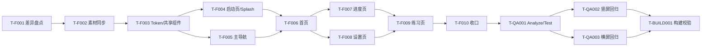

# 钢琴视奏 v1.2 工作时长评估

> 规则来源：`.cursor/rules/06-工作时长评估.mdc`  
> 用途：基于 `tech-plan.md` 的任务拆分，给出三点估计、关键路径与里程碑建议。  
> 维护规则：v1.0 是基线评估；每次 `change-log.md` 完成一条变更，追加一份评估增量 v1.x。

---

## 0. 评估版本

| 字段 | 内容 |
|------|------|
| 当前版本 | `v1.0` |
| 生成日期 | `2026-05-18` |
| 触发原因 | tech-plan 完成后的初始基线评估 |
| 关联技术方案 | `02-技术方案/tech-plan.md` |
| 关联设计计划 | `01-需求/figma-design-plan.md` |
| 关联源码 | `G:\code\soul\Solfeggio` |

---

## 1. 评估前提与假设

- 团队配置：1 名 Flutter 主开发 + 0 名 Java + 0.5 名 QA + 设计侧按需验收。
- 每日有效工时：6 小时。
- 估算单位：人天，最小颗粒 0.5 人天。
- 工作日：周一至周五，不计算额外节假日。
- 默认开工日：2026-05-19；若用户确认时间晚于该日期，里程碑顺延。
- 并行度：Flutter 编码以单人串行为主；QA 可在首页/进度/设置完成后提前做局部回归。
- 后端范围：本轮无 Java/后端任务，不改 MIDI、练习判定、统计计算或本地数据服务。
- 资源策略：默认采用 `tech-plan.md` 推荐的 SVG 转 PNG 多倍率资源方案；若改为直接接入 SVG，需追加依赖评估与测试工时。
- 工作区前提：源码当前存在未提交改动，尤其练习页和键盘相关文件；编码前必须先做差异盘点。

---

## 2. 任务粒度

`tech-plan.md` 未使用 `T-Fxxx` 编号，本次评估按第 8 章“推荐实施顺序”补齐任务 ID，并保持和影响文件清单对齐。

| 任务 ID | 名称 | 负责方向 | 备注 |
|---------|------|----------|------|
| T-F001 | 工作区差异盘点与编码边界确认 | Flutter | 读取 `git status`、目标文件 diff，避免覆盖用户改动 |
| T-F002 | v1.2 素材同步与 PNG 多倍率转换 | Flutter | 背景、Logo、页面图标接入 `assets/images/v12/` |
| T-F003 | v1.2 色彩 token 与共享 UI 基础组件 | Flutter | 背景、玻璃卡片、图标底座、渐变基础能力 |
| T-F004 | 启动页与 Native Splash 视觉更新 | Flutter | `onboarding/view.dart`、`flutter_native_splash` 配置 |
| T-F005 | 主导航与底部 Tab 图标更新 | Flutter | `main/view.dart` 与 tab 资源 |
| T-F006 | 首页 v1.2 UI 落地 | Flutter | 数据卡、CTA、练习模式、今日目标 |
| T-F007 | 进度页 v1.2 UI 落地 | Flutter | 周概览、柱状图、成就、目标卡 |
| T-F008 | 设置页 v1.2 UI 落地 | Flutter | 个人卡、列表项、版本信息、图标替换 |
| T-F009 | 练习页横屏 v1.2 UI 落地 | Flutter | 左侧统计、五线谱、键盘、右侧操作栏 |
| T-F010 | 版本号、文案与资源一致性收口 | Flutter | `1.2.0` 展示、asset 常量、缺失资源检查 |
| T-QA001 | 格式化、静态检查与单元测试 | QA/Flutter | `dart format`、`flutter analyze`、`flutter test` |
| T-QA002 | 竖屏页面视觉回归 | QA | 启动页、首页、进度页、设置页 |
| T-QA003 | 横屏练习页视觉与交互回归 | QA/Flutter | 812 x 375 横屏布局、MIDI 状态、开始/停止 |
| T-BUILD001 | 构建、Native Splash 生成与资源校验 | Flutter | 构建日志、缺失资源、splash 生成结果 |

---

## 3. 三点估计表

| 任务 ID | 名称 | 乐观 O | 最可能 M | 悲观 P | 期望 E=(O+4M+P)/6 | 标准差 σ=(P-O)/6 | 备注 |
|---------|------|--------|----------|--------|-------------------|-------------------|------|
| T-F001 | 工作区差异盘点与编码边界确认 | 0.5 | 0.5 | 1.0 | 0.58 | 0.08 | dirty worktree 必做 |
| T-F002 | v1.2 素材同步与 PNG 多倍率转换 | 1.0 | 1.5 | 2.5 | 1.58 | 0.25 | 若素材需重切会偏悲观 |
| T-F003 | v1.2 色彩 token 与共享 UI 基础组件 | 1.0 | 1.5 | 2.5 | 1.58 | 0.25 | 控制抽象规模 |
| T-F004 | 启动页与 Native Splash 视觉更新 | 1.0 | 1.5 | 2.5 | 1.58 | 0.25 | 含 native splash 生成验证 |
| T-F005 | 主导航与底部 Tab 图标更新 | 0.5 | 1.0 | 1.5 | 1.00 | 0.17 | 影响三主页面入口 |
| T-F006 | 首页 v1.2 UI 落地 | 1.5 | 2.0 | 3.5 | 2.17 | 0.33 | 保留现有数据与广告逻辑 |
| T-F007 | 进度页 v1.2 UI 落地 | 1.5 | 2.5 | 4.0 | 2.58 | 0.42 | 图表与成就图标较细 |
| T-F008 | 设置页 v1.2 UI 落地 | 1.5 | 2.5 | 4.0 | 2.58 | 0.42 | emoji 到图标替换面较广 |
| T-F009 | 练习页横屏 v1.2 UI 落地 | 2.5 | 4.0 | 6.5 | 4.17 | 0.67 | 最高风险，布局密度高且文件已修改 |
| T-F010 | 版本号、文案与资源一致性收口 | 0.5 | 1.0 | 1.5 | 1.00 | 0.17 | 包含 `1.2.0` 一致性 |
| T-QA001 | 格式化、静态检查与单元测试 | 0.5 | 1.0 | 2.0 | 1.08 | 0.25 | 依赖本地 Flutter 环境 |
| T-QA002 | 竖屏页面视觉回归 | 0.5 | 1.0 | 2.0 | 1.08 | 0.25 | 多机型时偏悲观 |
| T-QA003 | 横屏练习页视觉与交互回归 | 1.0 | 1.5 | 3.0 | 1.67 | 0.33 | 重点看溢出与交互 |
| T-BUILD001 | 构建、Native Splash 生成与资源校验 | 0.5 | 1.0 | 2.0 | 1.08 | 0.25 | Android/iOS 都做会增加 |

期望工时合计：23.7 人天，按排期取整为 24 人天。

---

## 4. 阶段汇总

| 阶段 | 任务范围 | 期望工时合计（人天） | 日历时长（工作日） | 关键里程碑 |
|------|----------|----------------------|--------------------|------------|
| 准备与基础 | T-F001 ~ T-F003 | 3.7 | 4 | 资源和 v1.2 基础样式就绪 |
| 开屏与导航 | T-F004 ~ T-F005 | 2.6 | 3 | 启动页、主导航可运行 |
| 竖屏主页面编码 | T-F006 ~ T-F008 | 7.3 | 8 | 首页、进度、设置完成 |
| 横屏练习页编码 | T-F009 | 4.2 | 5 | 练习页主布局完成 |
| 收口、测试与构建 | T-F010、T-QA001 ~ T-QA003、T-BUILD001 | 5.9 | 6 | Beta、RC |
| 后端编码 | 无 | 0 | 0 | 不涉及 |

无缓冲期望日历时长：约 24 个工作日。  
采用标准缓冲后：约 28.5 人天，排期按 29 个工作日管理。

---

## 5. 关键路径与并行度分析

关键路径：

1. `T-F001 → T-F002 → T-F003 → T-F004/T-F005 → T-F006 → T-F007/T-F008 → T-F009 → T-F010 → T-QA001 → T-QA003 → T-BUILD001`
2. 其中 `T-F009` 是最大单点风险，既是横屏密集 UI，又涉及已修改文件。

可并行项：

- 若增加第 2 名 Flutter，`T-F006`、`T-F007`、`T-F008` 可拆分并行。
- `T-QA002` 可在竖屏页面完成后提前开始，不必等待练习页全部完成。
- 设计侧验收可按页面分批进行：首页、进度、设置先验，练习页单独验。

不可提前项：

- `T-F002` 与 `T-F003` 是所有页面改造前置项。
- `T-F009` 必须在共享 token、资源、主导航和竖屏样式稳定后再做，否则返工概率高。
- `T-BUILD001` 必须等待 native splash 与资源校验完成。

---

## 6. 里程碑与日期建议

以下日期按 2026-05-19 开工、1 名 Flutter 主开发、标准 +20% 缓冲估算。

| 里程碑 | 含义 | 目标日期区间 | 验收标准 |
|--------|------|--------------|----------|
| Alpha | v1.2 主视觉链路可运行 | 2026-06-08 ~ 2026-06-09 | 启动页、首页、进度页、设置页可运行，底部导航正常 |
| Beta | 功能完整，内部回归 | 2026-06-16 ~ 2026-06-18 | 横屏练习页完成，主要视觉与交互问题已修复 |
| RC | 候选发布，构建可用 | 2026-06-23 ~ 2026-06-24 | `flutter analyze`、`flutter test` 通过，资源和 splash 无缺失 |
| GA | 正式交付/可发版 | 2026-06-25 ~ 2026-06-26 | v1.2 UI 验收通过，版本号与包资源一致 |

若不使用缓冲，最早 GA 约为 2026-06-19；考虑 dirty worktree 和横屏练习页风险，推荐按 2026-06-26 管理交付。

---

## 7. 风险缓冲

- 标准缓冲：总工时 +20%，即 23.7 人天 × 1.2 = 28.4 人天，排期取 28.5 人天。
- 本项目采用策略：标准缓冲 +20%。
- 采用原因：本轮无后端、无新算法、无新 MIDI SDK，仅为 UI 迭代；但存在 dirty worktree、横屏高密度布局、native splash 生成和资源转换风险，因此不建议无缓冲排期。
- 触发 +40% 强不确定性缓冲的条件：
  - 用户要求直接使用 SVG 并新增 `flutter_svg`，且出现兼容问题。
  - 练习页当前未提交改动与 v1.2 UI 修改大面积冲突。
  - 需要新增真实“和弦练习”或“练习统计详情”业务页面。
  - 要求同时完成 Android/iOS 商店截图、适配图或多端打包发布。

---

## 8. 资源/人力变化敏感性

| 调整 | 对总日历时长的影响 |
|------|---------------------|
| +1 名 Flutter | 竖屏页面和部分 QA 修复可并行，预计缩短 5 ~ 7 个工作日，GA 可提前到 2026-06-17 ~ 2026-06-19 |
| -1 名 Java | 无影响；本轮无 Java/后端任务 |
| QA 并行度从 0.5 提升到 1 | 预计缩短 2 ~ 3 个工作日，主要缩短 Beta 到 RC |
| 设计验收延迟 2 天 | 若反馈集中在练习页，会顺延 Beta/RC 约 1 ~ 3 个工作日 |
| 改为直接接入 SVG | 预计新增 1 ~ 2 人天；若依赖冲突或渲染差异明显，可能触发 +40% 缓冲 |

---

## 9. 评估版本与历史

| 版本 | 日期 | 触发原因 | 总工时（人天） | GA 目标日期变化 |
|------|------|----------|----------------|-----------------|
| v1.0 | 2026-05-18 | tech-plan 完成后的初始基线评估 | 23.7，含缓冲 28.5 | 初始建议 2026-06-25 ~ 2026-06-26 |

---

## 10. 待确认项

- [ ] 团队配置是否按 1 名 Flutter + 0.5 名 QA 执行。
- [ ] 是否确认采用 SVG 转 PNG 资源策略。
- [ ] 版本号是否使用 `1.2.0+120`。
- [ ] 设置页 MIDI 行是否保留当前 Switch 交互。
- [ ] 首页“和弦练习”是否只展示为即将上线，不启用真实模式。
- [ ] 练习页“统计”按钮是否跳转现有进度页，或暂不启用。
- [ ] 是否只做 Android 构建验证，还是 Android/iOS 都要验证。

---

## 评估增量历史（v1.x）

> 后续每次 `change-log.md` 完成一条变更后，在此追加增量评估。  
> 不覆盖 v1.0 基线，按版本号追加。

暂无增量评估。
